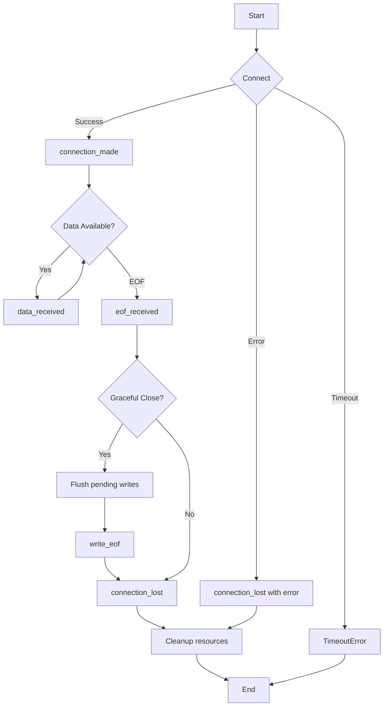

<spec>

# Protocol Lifecycle Management

## Overview

Implement protocol lifecycle management for proper resource initialization, graceful shutdown, and cleanup. Provides async-aware lifecycle hooks (on_connect, on_disconnect, on_error) and timeout handling for connection establishment and graceful close. Integrates with Python's asyncio protocol pattern.

## Requirements

### R1 - Lifecycle Trait

```yaml
id: R1
priority: high
status: draft
```

Define Protocol trait with async lifecycle methods: connection_made(), data_received(), connection_lost(), and eof_received().

### R2 - Graceful Shutdown

```yaml
id: R2
priority: high
status: draft
```

Implement write_eof() to signal end of data and wait for pending writes to complete before closing.

### R3 - Timeout Handling

```yaml
id: R3
priority: high
status: draft
```

Support configurable timeouts for connect, read, write, and close operations with proper cancellation.

### R4 - Error Recovery

```yaml
id: R4
priority: medium
status: draft
```

Provide error hooks for handling connection errors, allowing protocols to attempt recovery or cleanup.

### R5 - Resource Cleanup

```yaml
id: R5
priority: high
status: draft
```

Ensure all resources (buffers, handles, callbacks) are cleaned up even on error paths using RAII patterns.

## Acceptance Criteria

### Scenario: Normal connection lifecycle

- **GIVEN** Protocol implementation registered
- **WHEN** Connection established, data exchanged, then closed
- **THEN** All lifecycle hooks called in order: connection_made -> data_received -> connection_lost

### Scenario: Graceful shutdown

- **GIVEN** Active connection with pending data
- **WHEN** Call close() with graceful=true
- **THEN** Pending data flushed, write_eof sent, then connection closed

### Scenario: Timeout on connect

- **GIVEN** Connection timeout set to 5 seconds
- **WHEN** Remote host does not respond within 5 seconds
- **THEN** Connection attempt cancelled, TimeoutError raised

### Scenario: Error during data transfer

- **GIVEN** Active connection
- **WHEN** Network error occurs during read
- **THEN** connection_lost called with error, resources cleaned up

## Flow Diagram



</spec>
