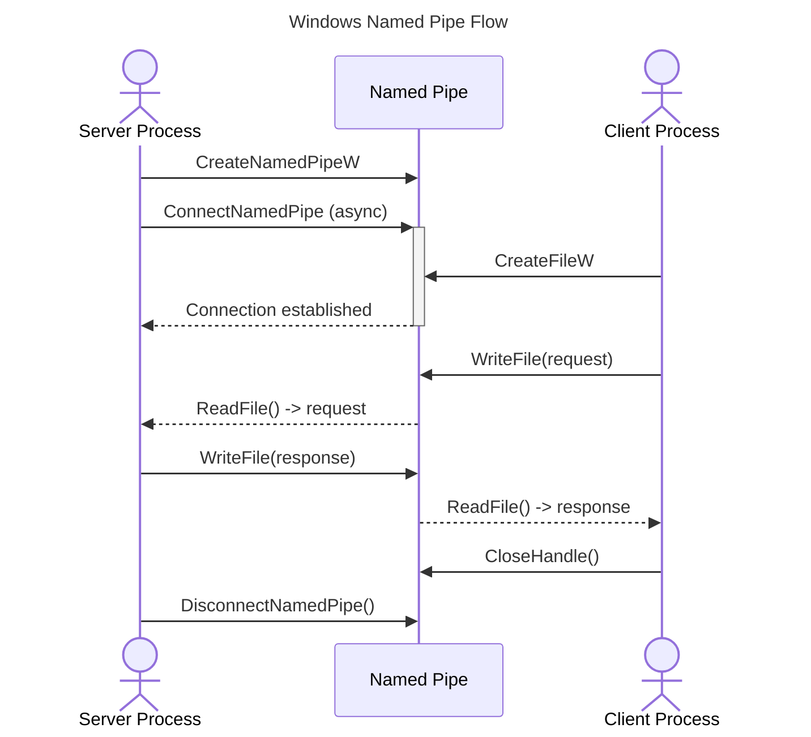

<spec>

# Windows Named Pipes Support

## Overview

Implement Windows named pipe support for inter-process communication. This module provides async read/write operations using Windows CreateNamedPipe and ConnectNamedPipe APIs, integrating with tokio's IOCP-based async I/O. Supports server (creates pipe) and client (connects to pipe) modes.

## Requirements

### R1 - Named Pipe Server

```yaml
id: R1
priority: high
status: draft
```

Create named pipe server using CreateNamedPipeW with configurable buffer sizes, max instances, and security attributes.

### R2 - Named Pipe Client

```yaml
id: R2
priority: high
status: draft
```

Connect to existing named pipe using CreateFileW with GENERIC_READ|GENERIC_WRITE access.

### R3 - Async I/O

```yaml
id: R3
priority: high
status: draft
```

Implement overlapped I/O using ReadFile/WriteFile with OVERLAPPED structures for async operations via tokio.

### R4 - Pipe Modes

```yaml
id: R4
priority: medium
status: draft
```

Support byte mode (PIPE_TYPE_BYTE) and message mode (PIPE_TYPE_MESSAGE) for different communication patterns.

### R5 - Connection Handling

```yaml
id: R5
priority: high
status: draft
```

Handle ConnectNamedPipe for server-side connection acceptance with async wait support.

## Acceptance Criteria

### Scenario: Create pipe server

- **GIVEN** No pipe exists at \\.\pipe\test
- **WHEN** Create server pipe with byte mode
- **THEN** Pipe handle is returned and ready for client connection

### Scenario: Client connects to server

- **GIVEN** Server pipe exists and is listening
- **WHEN** Client calls CreateFile on pipe path
- **THEN** Client handle is returned and connected to server

### Scenario: Bidirectional communication

- **GIVEN** Server and client are connected
- **WHEN** Server writes data, client reads
- **THEN** Data is transferred correctly in both directions

### Scenario: Handle pipe busy

- **GIVEN** All pipe instances are in use
- **WHEN** Client tries to connect
- **THEN** Returns ERROR_PIPE_BUSY, client can wait with WaitNamedPipe

## Flow Diagram



</spec>
