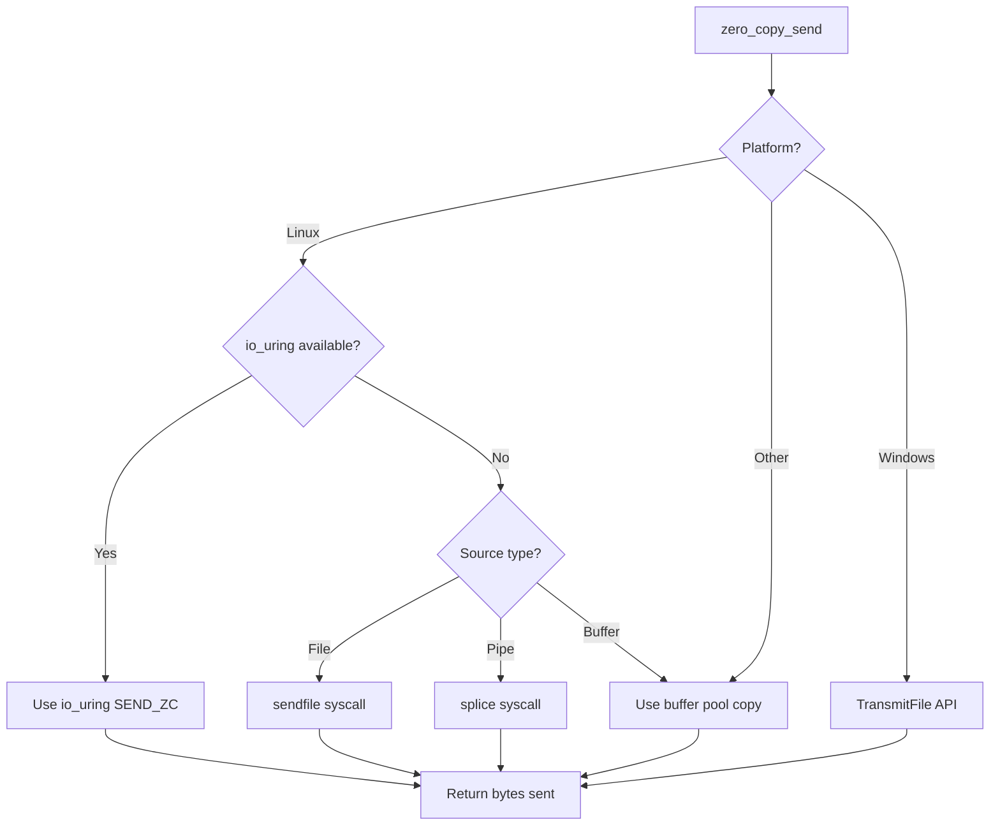

<spec>

# Zero-Copy Send/Recv APIs

## Overview

Implement zero-copy I/O APIs that minimize data copying between kernel and user space. Uses platform-specific mechanisms: splice/sendfile on Linux, TransmitFile on Windows. Falls back to buffer pool-based copying when zero-copy is not available. Integrates with io_uring for maximum performance on Linux.

## Requirements

### R1 - Zero-Copy Send

```yaml
id: R1
priority: high
status: draft
```

Implement sendfile_to() for file-to-socket transfer using sendfile (Linux) or TransmitFile (Windows) syscalls.

### R2 - Splice Support

```yaml
id: R2
priority: high
status: draft
```

Use splice() on Linux for pipe-to-socket and socket-to-pipe transfers without user-space copying.

### R3 - Buffer Pool Integration

```yaml
id: R3
priority: high
status: draft
```

When zero-copy not available, use buffer pool for efficient copying with minimal allocations.

### R4 - io_uring Integration

```yaml
id: R4
priority: medium
status: draft
```

Support io_uring registered buffers for zero-copy when io_uring backend is enabled.

### R5 - Fallback Strategy

```yaml
id: R5
priority: medium
status: draft
```

Automatically detect platform capabilities and fall back to copying when zero-copy unavailable.

## Acceptance Criteria

### Scenario: Send file to socket zero-copy

- **GIVEN** Open file and connected socket on Linux
- **WHEN** Call sendfile_to(file, socket, len)
- **THEN** Data transferred without copying to user space

### Scenario: Splice pipe to socket

- **GIVEN** Pipe with data and connected socket
- **WHEN** Call splice_to(pipe, socket)
- **THEN** Data moved from pipe to socket via kernel

### Scenario: Fallback to buffer copy

- **GIVEN** Platform without splice support
- **WHEN** Call splice_to()
- **THEN** Falls back to read+write with pooled buffer

### Scenario: io_uring registered buffer

- **GIVEN** io_uring enabled with registered buffers
- **WHEN** Perform read into registered buffer
- **THEN** Zero kernel-to-user copy using fixed buffers

## Flow Diagram



</spec>
