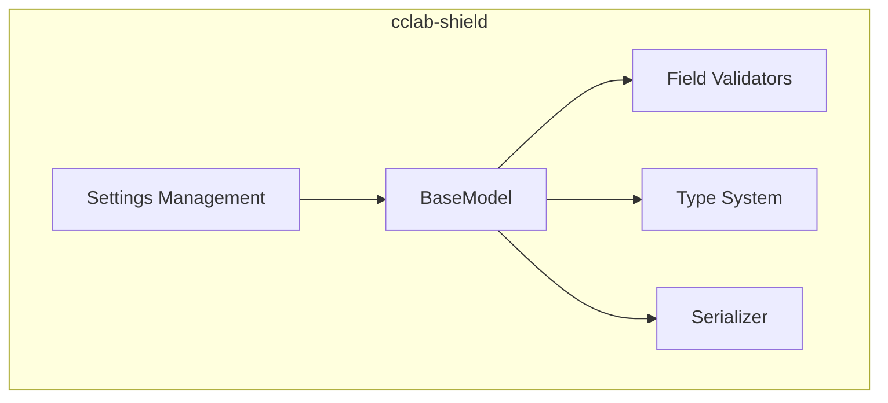
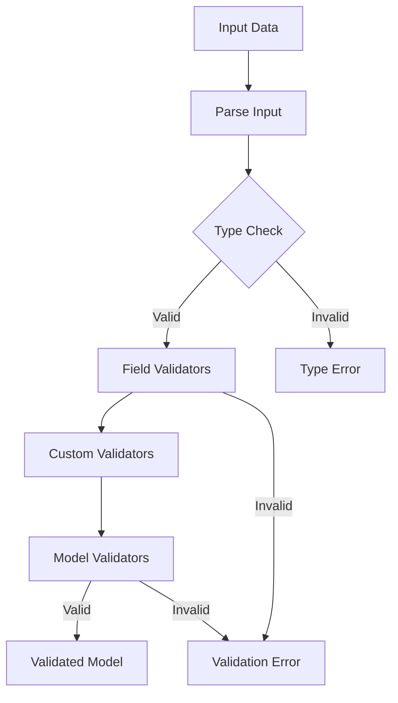

# cclab-shield Specs

Pydantic-like validation with Rust performance.

## Overview

Shield provides data validation compatible with Pydantic's API but with Rust-level performance.

## Architecture



## Validation Flow



## Type System (JSON Schema)

```json
{
  "$schema": "https://json-schema.org/draft/2020-12/schema",
  "title": "Shield Type System",
  "definitions": {
    "FieldInfo": {
      "type": "object",
      "properties": {
        "default": { "description": "Default value" },
        "default_factory": { "type": "string", "description": "Factory function name" },
        "alias": { "type": "string" },
        "title": { "type": "string" },
        "description": { "type": "string" },
        "gt": { "type": "number" },
        "ge": { "type": "number" },
        "lt": { "type": "number" },
        "le": { "type": "number" },
        "min_length": { "type": "integer" },
        "max_length": { "type": "integer" },
        "pattern": { "type": "string" }
      }
    },
    "ValidatorInfo": {
      "type": "object",
      "properties": {
        "mode": { "enum": ["before", "after", "wrap", "plain"] },
        "check_fields": { "type": "boolean" }
      }
    }
  }
}
```

## Specs

| File | Type | Description |
|------|------|-------------|
| shield-basemodel-api-enhancement.md | algorithm | BaseModel API improvements |
| shield-ergonomic-validators.md | algorithm | Ergonomic validator syntax |
| shield-settings-management.md | data-model | Settings/config management |
