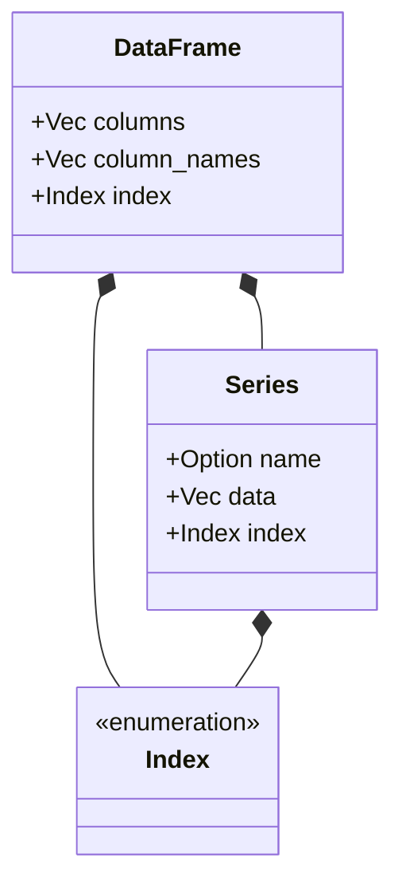

<spec>

# Core DataFrame Design Specification

## Overview

This specification formalizes the core design of the Pulsar DataFrame, a two-dimensional labeled data structure with columns of potentially different types. It serves as the primary data structure for the Pulsar data science ecosystem, providing NumPy-like performance with Pandas-like ergonomics for indexing, manipulation, and analysis.

## Requirements

### R1 - Core Data Storage

```yaml
id: R1
priority: high
status: draft
```

The DataFrame must manage an ordered collection of Series (columns) and a row Index. All columns must have the same length as the index.

### R2 - Dual Indexing System

```yaml
id: R2
priority: high
status: draft
```

Provide both label-based (loc) and positional (iloc) indexing for rows and columns.

### R3 - Data Manipulation

```yaml
id: R3
priority: medium
status: draft
```

Support filtering by boolean masks, selection of column subsets, and dynamic assignment of new columns.

### R4 - Missing Data Management

```yaml
id: R4
priority: medium
status: draft
```

Implement robust null-handling including detection (isna), filling (fillna), and removal (dropna) of missing values.

### R5 - Aggregation and Relational Ops

```yaml
id: R5
priority: medium
status: draft
```

Provide unified interfaces for grouping data (groupby) and combining multiple DataFrames (join/merge) using standard relational logic.

### R6 - Pure Rust Logic Isolation

```yaml
id: R6
priority: high
status: draft
```

Ensure core algorithms are implemented in pure Rust, isolated from Python-specific binding code to maintain performance and portability.

## Acceptance Criteria

### Scenario: Successful DataFrame Creation

- **WHEN** from_columns is called with two Series of length 2 and labels 'a', 'b'.
- **THEN** A DataFrame with 2 rows and 2 columns is created correctly with matching index length.

### Scenario: Positional Row Retrieval

- **WHEN** iloc_row(0) is called on a valid DataFrame.
- **THEN** A HashMap containing column names and values for the first row is returned.

### Scenario: Column Selection

- **WHEN** select(['age']) is called on a DataFrame with columns ['name', 'age'].
- **THEN** A new DataFrame containing only the 'age' column is returned.

## Diagrams

### DataFrame Class Structure



## API Specification (JSON Schema)

```yaml
properties:
  column_names:
    description: List of column names in order
    items:
      type: string
    type: array
  columns:
    description: List of Series objects representing columns
    items:
      properties:
        data:
          items:
            description: Dynamic value type (Null, Bool, Int, Float, String)
            type: object
          type: array
        index:
          description: Series-level row index
          type: object
        name:
          type: string
      type: object
    type: array
  index:
    description: DataFrame-level row index (Range, Int, or String labels)
    type: object
required:
- columns
- column_names
- index
type: object
```

</spec>
