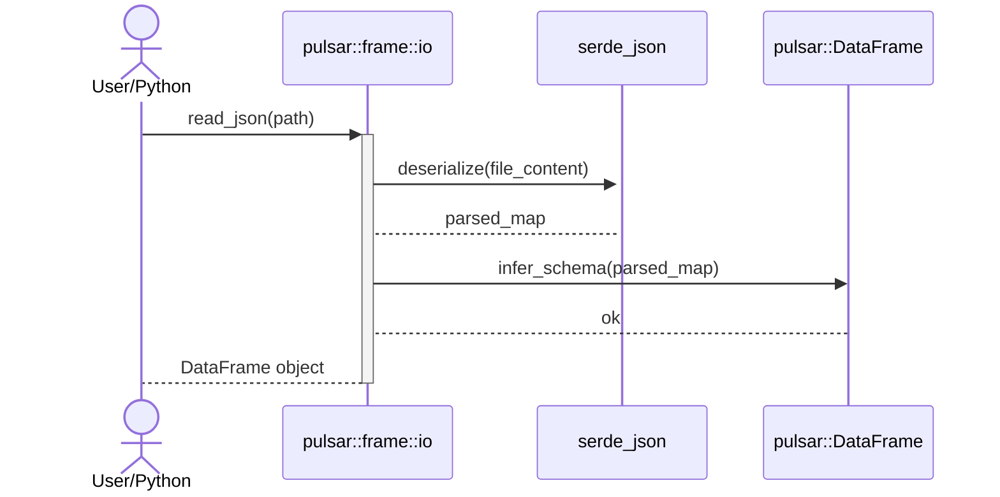

<spec>

# JSON I/O for DataFrames (io-extra)

## Overview

This specification defines the JSON I/O capabilities for Pulsar DataFrames. It enables reading from and writing to various JSON formats, including record-oriented and column-oriented structures, with support for nested object flattening and automatic type inference.

## Requirements

### R1 - JSON Deserialization

```yaml
id: R1
priority: high
status: draft
```

Implement functions to read JSON arrays of objects and convert them into DataFrames, inferring column names from object keys.

### R2 - JSON Serialization

```yaml
id: R2
priority: high
status: draft
```

Provide mechanisms to serialize DataFrames into JSON format, supporting 'records', 'columns', and 'values' orientations.

### R3 - Nested Structure Flattening

```yaml
id: R3
priority: medium
status: draft
```

Automatically flatten nested JSON objects into a flat column structure using dot-notation for column names (e.g., 'address.city').

### R4 - Feature Gating and Dependencies

```yaml
id: R4
priority: high
status: draft
```

Ensure JSON I/O implementation is gated behind the 'io-extra' feature and utilizes the workspace-approved 'serde_json' crate.

### R5 - Asynchronous I/O Support

```yaml
id: R5
priority: medium
status: draft
```

Provide asynchronous variants of read/write functions to prevent blocking the async runtime during large file operations.

### R6 - Logic Isolation

```yaml
id: R6
priority: high
status: draft
```

Maintain strict decoupling between pure-Rust I/O logic and binding code.

## Acceptance Criteria

### Scenario: Read Records JSON

- **WHEN** read_json is called with '[{"id": 1, "val": 10}, {"id": 2, "val": 20}]'.
- **THEN** A DataFrame with columns 'id' and 'val' is created.

### Scenario: Write Columns JSON

- **WHEN** to_json(orient='columns') is called on a DataFrame.
- **THEN** A column-oriented JSON string is produced.

### Scenario: Flatten Nested JSON

- **WHEN** read_json is called with '[{"meta": {"id": 1}}]'.
- **THEN** A DataFrame with column 'meta.id' is created.

## Diagrams

### JSON Read Sequence



## API Specification (JSON Schema)

```yaml
properties:
  orient:
    description: JSON orientation (records, columns, values)
    enum:
    - records
    - columns
    - values
    type: string
required:
- orient
type: object
```

</spec>
