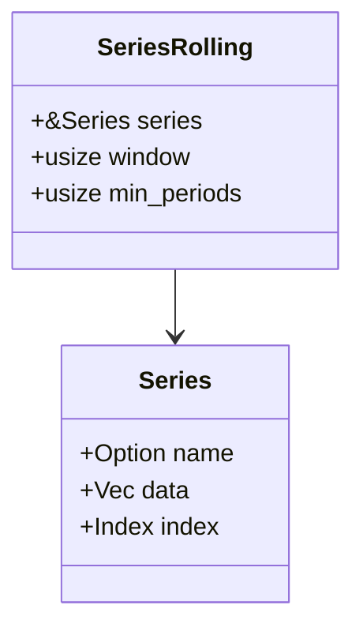

<spec>

# Core Series Design Specification

## Overview

This specification defines the design of the Pulsar Series, a one-dimensional labeled array. It provides the foundation for individual column operations within DataFrames, including numeric computation, missing data interpolation, and rolling window analysis.

## Requirements

### R1 - One-dimensional Storage

```yaml
id: R1
priority: high
status: draft
```

A Series must encapsulate an optional name, a contiguous vector of Values, and a row Index.

### R2 - Statistical Operations

```yaml
id: R2
priority: high
status: draft
```

Provide implementations for common statistical measures (sum, mean, std, var, median, quantile) with numerical stability.

### R3 - Null Handling and Interpolation

```yaml
id: R3
priority: medium
status: draft
```

Support pandas-style null handling (isna, fillna, dropna) and numeric interpolation (linear, nearest).

### R4 - Window and Shifting Ops

```yaml
id: R4
priority: medium
status: draft
```

Implement efficient rolling window operations and time-alignment functions (shift, diff, pct_change).

### R5 - Comparison and Selection

```yaml
id: R5
priority: medium
status: draft
```

Support set-based membership (isin), range checks (between), and top-n selection (nlargest, nsmallest).

### R6 - Pure Rust Logic Isolation

```yaml
id: R6
priority: high
status: draft
```

All core computational logic must be implemented in pure Rust, isolated from binding wrappers.

## Acceptance Criteria

### Scenario: Statistical Computation

- **WHEN** sum() and mean() are called on a Series [1.0, 2.0, 3.0].
- **THEN** The sum should be 6.0 and the mean 2.0.

### Scenario: Linear Interpolation

- **WHEN** interpolate() is called on a Series [1.0, Null, 3.0].
- **THEN** The middle value should be interpolated to 2.0.

### Scenario: Rolling Mean

- **WHEN** rolling(3).mean() is called on a Series [1.0, 2.0, 3.0].
- **THEN** The rolling mean results in [Null, Null, 2.0].

## Diagrams

### Series Class Structure



## API Specification (JSON Schema)

```yaml
properties:
  data:
    description: Vector of dynamic values
    items:
      type: object
    type: array
  index:
    description: Row index labels
    type: object
  name:
    description: Optional series name
    type: string
required:
- data
- index
type: object
```

</spec>
