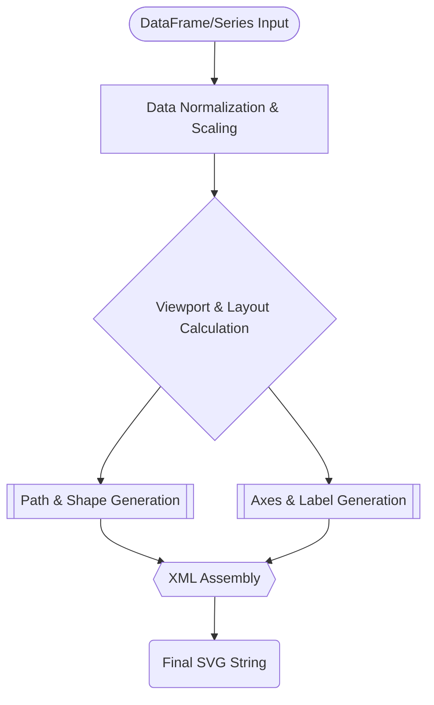

<spec>

# Pure SVG Chart Generation (viz)

## Overview

This specification defines the Visualization module for Pulsar. It provides a pure-Rust, dependency-free engine for generating SVG 1.1 compliant charts directly from DataFrames and Series, enabling high-quality static visualizations for data exploration and reporting.

## Requirements

### R1 - SVG 1.1 Compliance

```yaml
id: R1
priority: high
status: draft
```

Generate valid SVG 1.1 XML output representing data plots.

### R2 - Line Charts

```yaml
id: R2
priority: high
status: draft
```

Support line charts for visualizing one or more time series or numeric columns.

### R3 - Scatter Plots

```yaml
id: R3
priority: medium
status: draft
```

Provide scatter plots for visualizing relationships between two numeric columns.

### R4 - Histograms

```yaml
id: R4
priority: medium
status: draft
```

Implement histograms with automatic binning logic for distribution analysis.

### R5 - Styling and Themes

```yaml
id: R5
priority: low
status: draft
```

Allow customization of colors, line styles, labels, and axes through a declarative theme system.

### R6 - Feature Gating and Isolation

```yaml
id: R6
priority: high
status: draft
```

Gated behind 'viz' feature and strictly isolated from binding code.

## Acceptance Criteria

### Scenario: Line Chart Generation

- **WHEN** plot_line(df) is called on a valid DataFrame.
- **THEN** A valid SVG string containing <path> and <polyline> elements is produced.

### Scenario: Scatter Plot Scale

- **WHEN** plot_scatter(df, x='a', y='b') is called.
- **THEN** Data points are correctly scaled to fit the SVG viewport bounds.

### Scenario: SVG Schema Validation

- **WHEN** A generated histogram SVG is validated.
- **THEN** The output string passes standard SVG 1.1 schema validation.

## Diagrams

### Visualization Pipeline Flow



</spec>
