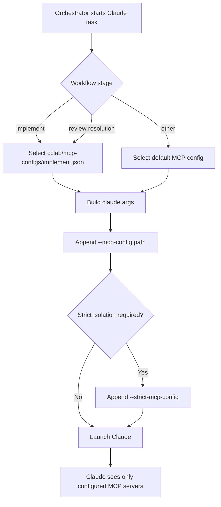

# Claude Code MCP Configuration

## Overview
<!-- type: overview lang: markdown -->

Claude Code can receive runtime MCP server configuration through command-line
flags. SDD uses that surface to select a stage-specific MCP config file when an
orchestrator launches Claude for implementation or issue-resolution work.

The old file lived at
`.aw/tech-design/crates/cclab-server/mcp/claude-mcp.md`. It is now a
configuration contract under `config/`, because `mcp/` is not an allowed
top-level TD directory.

### Reference

The original reference for the command-line flags is the Claude Code CLI
reference at `https://code.claude.com/docs/en/cli-reference`.

## Runtime Config
<!-- type: config lang: yaml -->

```yaml
claude_flags:
  mcp_config:
    flag: --mcp-config
    behavior: Load MCP servers from one or more JSON config files.
    examples:
      - claude --mcp-config ./mcp.json
      - claude --mcp-config ./mcp1.json ./mcp2.json
  strict_mcp_config:
    flag: --strict-mcp-config
    behavior: Use only MCP servers from --mcp-config and ignore user/global configs.
    example: claude --strict-mcp-config --mcp-config ./mcp-implement.json
mcp_config_shape:
  mcpServers:
    sdd-impl:
      command: sdd
      args:
        - mcp-server
        - --tools
        - implement
stage_configs:
  implement: cclab/mcp-configs/implement.json
  review_resolution: cclab/mcp-configs/implement.json
  default: cclab/mcp-configs/default.json
tool_sets:
  implement:
    tools:
      - read_all_requirements
      - read_implementation_summary
      - list_changed_files
      - read_file
  review_resolution:
    note: Claude resolves review issues with implementation-like read tools.
```

## Selection Logic
<!-- type: logic lang: mermaid -->



### Integration Strategy

1. Create stage-specific MCP config files under `cclab/mcp-configs/`.
2. For implementation, launch Claude with the implement-stage config.
3. For review issue resolution, reuse the implementation-like config because
   review itself is performed by Codex and Claude only needs read/repair tools.
4. Keep `--strict-mcp-config` available when isolation from user/global MCP
   configs is required.

## Scenarios
<!-- type: scenarios lang: yaml -->

```yaml
scenarios:
  - id: S1
    given: The orchestrator starts an implementation task
    when: It builds Claude CLI arguments
    then: It passes --mcp-config cclab/mcp-configs/implement.json
  - id: S2
    given: The orchestrator starts a review-resolution task for Claude
    when: It builds Claude CLI arguments
    then: It uses implementation-like read tools rather than the full MCP surface
  - id: S3
    given: Strict MCP isolation is enabled
    when: Claude is launched
    then: --strict-mcp-config is passed so user and global MCP configs are ignored
  - id: S4
    given: A stage has no dedicated MCP config
    when: The orchestrator builds Claude CLI arguments
    then: It falls back to the default MCP config path
```

## Changes
<!-- type: changes lang: yaml -->

```yaml
files:
  - path: .aw/tech-design/crates/cclab-server/config/claude-code-mcp.md
    action: MODIFY
    impl_mode: hand-written
    desc: Move Claude Code MCP configuration notes under config and normalize sections.
  - path: cclab/mcp-configs/implement.json
    action: CREATE
    impl_mode: hand-written
    desc: Add the implementation-stage MCP config used by Claude Code.
  - path: crates/cclab-server/src/orchestrator/claude.rs
    action: MODIFY
    impl_mode: hand-written
    desc: Select stage-specific MCP config files when launching Claude.
```
