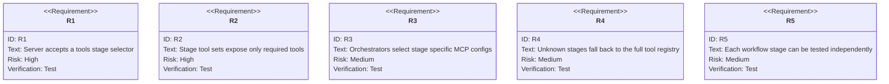
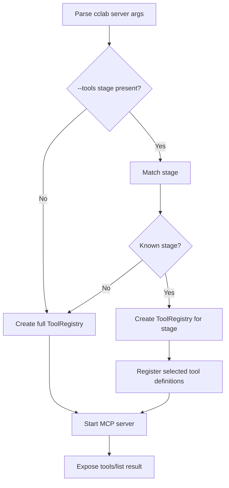

# Dynamic MCP Configuration Strategy

## Overview
<!-- type: overview lang: markdown -->

Runtime MCP configuration lets each workflow stage expose only the tools it
needs. The SDD MCP server previously exposed every core and Mermaid tool to
every stage, which increased prompt size and made implementation and review
sessions harder to steer.

The active contract is stage-aware filtering for `cclab server --tools
<stage>`, plus stage-specific MCP config files for Claude Code and Codex
profiles.

### Problem Statement

The full MCP surface contains 22 tools:

- 14 core tools for proposal, spec, tasks, validation, knowledge, and
  implementation workflows.
- 8 Mermaid diagram tools for flowchart, sequence, state, class, ERD, mindmap,
  requirement, and journey diagrams.

Implementation only needs a small read-oriented subset. Review only needs
validation, review append, and file reading. Exposing all tools increases model
cognitive load and token usage.

## Requirements
<!-- type: requirements lang: mermaid -->



## Stage Tool Configuration
<!-- type: config lang: yaml -->

```yaml
tool_sets:
  plan:
    count: 22
    tools:
      - all_core_tools
      - mermaid_diagram_tools
  challenge:
    count: 5
    tools:
      - read_file
      - list_specs
      - read_knowledge
      - validate_change
  implement:
    count: 4
    tools:
      - read_all_requirements
      - read_implementation_summary
      - list_changed_files
      - read_file
  review:
    count: 3
    tools:
      - validate_change
      - append_review
      - read_file
  archive:
    count: 6
    tools:
      - read_knowledge
      - write_knowledge
      - read_file
      - list_specs
server_cli:
  command: cclab server
  flag: --tools
  examples:
    - cclab server --tools plan
    - cclab server --tools implement
    - cclab server --tools review
orchestrator_configs:
  implement: cclab/mcp-configs/implement.json
  review: cclab/mcp-configs/review.json
  challenge: cclab/mcp-configs/challenge.json
  default: cclab/mcp-configs/default.json
```

## Filtering Logic
<!-- type: logic lang: mermaid -->



### Implementation Steps

1. Add `ToolRegistry::new_for_stage(stage)` and per-stage helper functions.
2. Add `--tools <STAGE>` to the MCP server CLI arguments.
3. Add stage-specific MCP config files under `cclab/mcp-configs/`.
4. Teach orchestrators to select the stage config before launching Claude Code
   or Codex.
5. Verify each stage independently with `tools/list`.

### Expected Reduction

| Stage | Before | After | Reduction |
|-------|--------|-------|-----------|
| Implement | 22 | 4 | 82 percent |
| Review | 22 | 3 | 86 percent |
| Challenge | 22 | 5 | 77 percent |

## Test Plan
<!-- type: test-plan lang: mermaid -->

```mermaid
---
id: cclab-server-dynamic-mcp-config-test-plan
entry: TP1
---
requirementDiagram
    requirement TP1 {
        id: TP1
        text: cclab server --tools implement exposes four tools
        risk: high
        verifymethod: test
    }
    requirement TP2 {
        id: TP2
        text: cclab server --tools review exposes three tools
        risk: high
        verifymethod: test
    }
    requirement TP3 {
        id: TP3
        text: orchestrator implement uses implement MCP config
        risk: medium
        verifymethod: test
    }
    requirement TP4 {
        id: TP4
        text: orchestrator review uses review MCP config
        risk: medium
        verifymethod: test
    }
```

### Commands

```bash
cclab server --tools implement
cclab server --tools review
sdd implement test-change
sdd review test-change
```

Future hardening should auto-generate MCP configs during `cclab init`, validate
tool availability before each stage starts, and log actual tool usage by stage.

## Changes
<!-- type: changes lang: yaml -->

```yaml
files:
  - path: .aw/tech-design/crates/cclab-server/config/dynamic-mcp-config.md
    action: MODIFY
    impl_mode: hand-written
    desc: Move dynamic MCP configuration strategy under config and normalize sections.
  - path: crates/cclab-server/src/mcp/tools/mod.rs
    action: MODIFY
    impl_mode: hand-written
    desc: Add stage-aware ToolRegistry construction.
  - path: crates/cclab-server/src/cli/mcp_server.rs
    action: MODIFY
    impl_mode: hand-written
    desc: Add --tools stage selector for MCP server startup.
  - path: cclab/mcp-configs/implement.json
    action: CREATE
    impl_mode: hand-written
    desc: Add implementation-stage MCP config.
  - path: cclab/mcp-configs/review.json
    action: CREATE
    impl_mode: hand-written
    desc: Add review-stage MCP config.
  - path: cclab/mcp-configs/challenge.json
    action: CREATE
    impl_mode: hand-written
    desc: Add challenge-stage MCP config.
```
