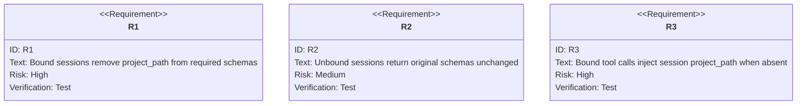
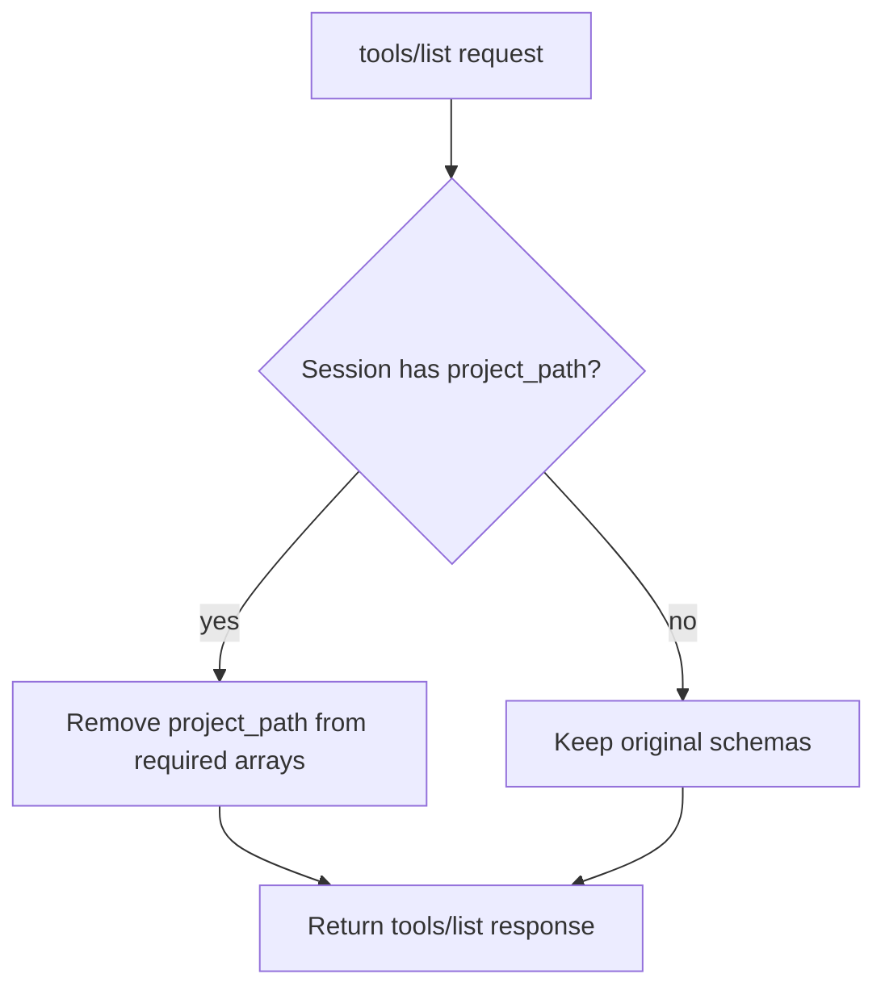

# Dynamic tools/list Schema Based on Session

## Overview
<!-- type: overview lang: markdown -->

When an MCP session has a bound `project_path` from the `X-Cclab-Project`
header, the `tools/list` response dynamically removes `project_path` from each
tool input schema's `required` array. Properly configured clients get cleaner
schemas while unconfigured clients keep backwards-compatible required
`project_path` arguments.

The old root files were:

- `.aw/tech-design/crates/cclab-server/dynamic-tool-schema.md`
- `.aw/tech-design/crates/cclab-server/dynamic-tool-schema`

The canonical TD now lives at
`.aw/tech-design/crates/cclab-server/interfaces/mcp/dynamic-tool-schema.md`.

## Requirements
<!-- type: requirements lang: mermaid -->



### R1: Dynamic Required Field Removal

When `tools/list` is called and the session has a bound `project_path`, the
server iterates over all tool definitions and removes `project_path` from each
tool's `input_schema.required` array before returning the response.

### R2: No-op For Unbound Sessions

When the session has no bound `project_path`, `tools/list` returns the original
schemas unchanged and `project_path` remains required.

### R3: Tool Call Injection

When a session-bound tool call arrives without `project_path` in arguments, the
server injects `session.project_path` into the arguments before dispatching to
the handler.

## Scenarios
<!-- type: scenarios lang: yaml -->

```yaml
scenarios:
  - id: S1
    requirement: R1
    given: Session has bound project_path from header
    when: Client calls tools/list
    then: All tool schemas show project_path as optional by omitting it from required
  - id: S2
    requirement: R2
    given: Session has no bound project_path
    when: Client calls tools/list
    then: All tool schemas keep project_path in required
  - id: S3
    requirement: R3
    given: Session is bound to /my/project and a tool call has no project_path
    when: Server dispatches the tool call
    then: project_path /my/project is injected into arguments
```

## tools/list Schema Decision
<!-- type: logic lang: mermaid -->



## Changes
<!-- type: changes lang: yaml -->

```yaml
files:
  - path: .aw/tech-design/crates/cclab-server/interfaces/mcp/dynamic-tool-schema.md
    action: MODIFY
    impl_mode: hand-written
    desc: Move dynamic tool schema TD under interfaces/mcp and normalize sections.
  - path: crates/cclab-server/src/http_server.rs
    action: MODIFY
    impl_mode: hand-written
    desc: Adjust tools/list schemas and inject session project_path for bound MCP sessions.
```
