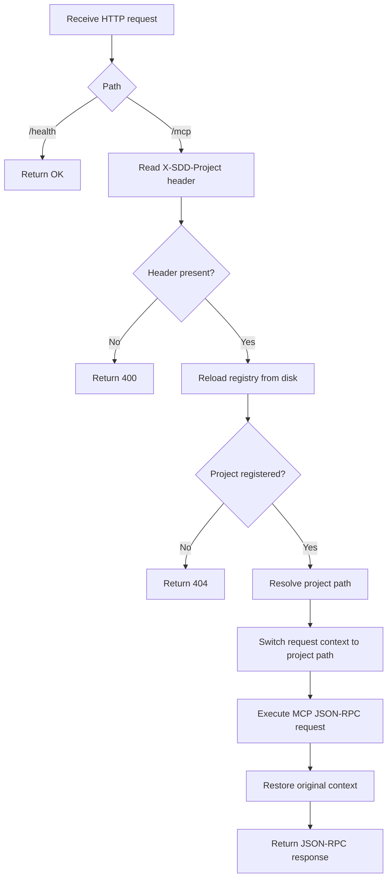
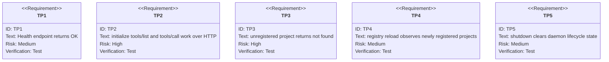

# HTTP MCP Server

## Overview
<!-- type: overview lang: markdown -->

The HTTP MCP server is a global Streamable HTTP daemon for SDD. It avoids stdio
buffering problems in pipe-based environments and supports multiple projects by
selecting the project context from HTTP headers.

The old file lived at `.aw/tech-design/crates/cclab-server/mcp/http-server.md`.
The active contract is now under `interfaces/mcp/` because `mcp/` is not an
allowed top-level TD directory.

### Key Properties

| Property | Contract |
|----------|----------|
| Server instance | one global daemon, default port 3000 |
| Project isolation | `X-SDD-Project` and `X-SDD-Cwd` headers select project context |
| Transport | JSON-RPC 2.0 over Streamable HTTP at `/mcp` |
| Registry | `~/.sdd/registry.json` tracks daemon and registered projects |
| Client setup | `cclab server start --update-clients` can update client config |

## Requirements

```mermaid
---
id: cclab-server-http-mcp-server-requirements
entry: R1
---
requirementDiagram
    requirement R1 {
        id: R1
        text: One daemon serves multiple registered projects
        risk: high
        verifymethod: test
    }
    requirement R2 {
        id: R2
        text: Each MCP request runs in the selected project context
        risk: high
        verifymethod: test
    }
    requirement R3 {
        id: R3
        text: Registry reloads allow dynamic project registration
        risk: medium
        verifymethod: test
    }
    requirement R4 {
        id: R4
        text: Server lifecycle commands start list stop and shutdown daemon state
        risk: medium
        verifymethod: test
    }
    requirement R5 {
        id: R5
        text: Client configuration points to HTTP transport with project headers
        risk: medium
        verifymethod: inspection
    }
```

<!-- type: requirements lang: mermaid -->



## HTTP Interface
<!-- type: rest-api lang: yaml -->

```yaml
openapi: 3.1.0
info:
  title: cclab HTTP MCP server
  version: 0.1.0
paths:
  /health:
    get:
      summary: Health check endpoint
      responses:
        "200":
          description: Server is alive
          content:
            text/plain:
              example: OK
  /mcp:
    post:
      summary: JSON-RPC 2.0 MCP endpoint
      headers:
        X-SDD-Project:
          required: true
          schema:
            type: string
        X-SDD-Cwd:
          required: false
          schema:
            type: string
      requestBody:
        required: true
        content:
          application/json:
            schema:
              type: object
              required: [jsonrpc, id, method]
              properties:
                jsonrpc:
                  const: "2.0"
                id:
                  oneOf:
                    - type: string
                    - type: integer
                method:
                  type: string
                  examples: [initialize, tools/list, tools/call]
                params:
                  type: object
      responses:
        "200":
          description: JSON-RPC response
        "400":
          description: Missing or invalid project header or request payload
        "404":
          description: Project not registered
```

## CLI Surface
<!-- type: cli lang: yaml -->

```yaml
commands:
  - name: cclab server start
    desc: Register current project and start daemon if needed.
    options:
      - name: --update-clients
        desc: Write client MCP configuration for the current project.
      - name: --daemon
        desc: Start in background mode.
      - name: --port
        value: PORT
        default: 3000
        desc: Override HTTP server port.
  - name: cclab server list
    desc: Show daemon status and registered projects.
  - name: cclab server stop
    desc: Unregister current or named project.
    args:
      - name: project
        optional: true
  - name: cclab server shutdown
    desc: Stop the daemon process.
```

## Registry And Client Config
<!-- type: config lang: yaml -->

```yaml
registry_path: ~/.sdd/registry.json
registry_shape:
  server:
    pid: 12345
    port: 3000
    started_at: "2026-01-21T10:00:00Z"
  projects:
    my-project:
      path: /Users/user/projects/my-project
      registered_at: "2026-01-21T10:00:15Z"
client_config:
  mcpServers:
    sdd:
      url: http://localhost:3000/mcp
      transport: http
      headers:
        X-SDD-Project: my-project
        X-SDD-Cwd: /Users/user/projects/my-project
      timeout: 30000
```

## Request Routing Logic
<!-- type: logic lang: mermaid -->



### Process Model

| Process | Role |
|---------|------|
| `cclab server start` | registers project, starts daemon if absent, then exits |
| `cclab server run --port 3000` | daemon HTTP server |
| registry file | daemon PID, port, start time, and project map |

## Test Plan
<!-- type: test-plan lang: mermaid -->



### Smoke Commands

```bash
curl http://localhost:3000/health
curl -X POST http://localhost:3000/mcp -H "Content-Type: application/json" -H "X-SDD-Project: my-project" -d '{"jsonrpc":"2.0","id":1,"method":"initialize","params":{}}'
curl -X POST http://localhost:3000/mcp -H "Content-Type: application/json" -H "X-SDD-Project: my-project" -d '{"jsonrpc":"2.0","id":2,"method":"tools/list","params":{}}'
```

## Changes
<!-- type: changes lang: yaml -->

```yaml
files:
  - path: .aw/tech-design/crates/cclab-server/interfaces/mcp/http-server.md
    action: MODIFY
    impl_mode: hand-written
    desc: Move HTTP MCP server contract under interfaces and normalize sections.
  - path: crates/cclab-server/src/mcp
    action: MODIFY
    impl_mode: hand-written
    desc: Implement global HTTP MCP daemon request routing and registry-backed project context.
  - path: cclab server start
    action: MODIFY
    impl_mode: hand-written
    desc: Register project and start daemon lifecycle.
  - path: cclab server list
    action: MODIFY
    impl_mode: hand-written
    desc: Report daemon and registered project status.
```
