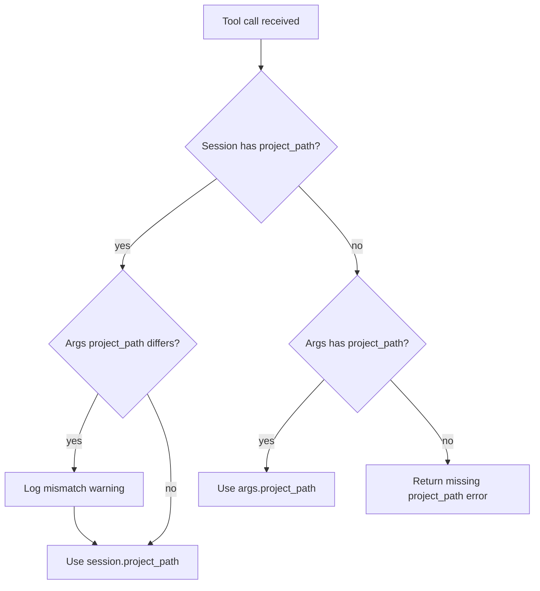

# MCP Session-based Project Binding

## Overview
<!-- type: overview lang: markdown -->

MCP session binding associates a project path with an MCP HTTP session. On
`initialize`, the server reads the `X-Cclab-Project` HTTP header and stores the
value against the `Mcp-Session-Id`. Subsequent tool calls resolve `project_path`
from the session first, with fallback to the explicit tool argument for
backwards compatibility.

The old files lived at:

- `.aw/tech-design/crates/cclab-server/mcp-session-binding.md`
- `.aw/tech-design/crates/cclab-server/mcp-session-binding`

The active contract is now
`.aw/tech-design/crates/cclab-server/interfaces/mcp/session-binding.md`.

## Requirements
<!-- type: requirements lang: mermaid -->

```mermaid
---
id: mcp-session-binding-requirements
entry: R1
---
requirementDiagram
    requirement R1 {
        id: R1
        text: Initialize reads X-Cclab-Project header
        risk: high
        verifymethod: test
    }
    requirement R2 {
        id: R2
        text: Tool calls prefer session project path over args
        risk: high
        verifymethod: test
    }
    requirement R3 {
        id: R3
        text: Missing header preserves backwards compatible arg behavior
        risk: medium
        verifymethod: test
    }
```

### R1: Read Project Header On Initialize

When the server receives an `initialize` JSON-RPC request, it extracts the
`X-Cclab-Project` header from the HTTP request. If present, the value is stored
as `session.project_path` keyed by `Mcp-Session-Id`.

### R2: Resolve Session-bound Project Path

On tool calls, `project_path` resolution priority is:

1. `session.project_path` when bound.
2. `args.project_path` when provided.
3. Error when neither source exists.

If both session and argument values exist but differ, the server logs a warning
and uses the session-bound path.

### R3: Preserve Backwards Compatibility

When no `X-Cclab-Project` header is sent, behavior is unchanged:
`project_path` remains a required tool argument.

## Scenarios
<!-- type: scenarios lang: yaml -->

```yaml
scenarios:
  - id: S1
    requirement: R1
    given: The MCP client sends X-Cclab-Project /path/to/project on initialize
    when: The server creates or updates the MCP session
    then: The session stores project_path as /path/to/project
  - id: S2
    requirement: R2
    given: A session is bound to /path/to/project
    when: The client calls sdd_run_change without a project_path argument
    then: The server uses the session-bound /path/to/project value
  - id: S3
    requirement: R3
    given: The MCP client sends no X-Cclab-Project header
    when: The client calls sdd_run_change with project_path /some/path
    then: The server uses /some/path from arguments
  - id: S4
    requirement: R2
    given: A session is bound to /project-a
    when: A tool call passes project_path /project-b
    then: The server logs a mismatch warning and uses /project-a
```

## Project Path Resolution
<!-- type: logic lang: mermaid -->



## Changes
<!-- type: changes lang: yaml -->

```yaml
files:
  - path: .aw/tech-design/crates/cclab-server/interfaces/mcp/session-binding.md
    action: MODIFY
    impl_mode: hand-written
    desc: Move session-binding TD under interfaces/mcp and normalize sections.
  - path: crates/cclab-server/src/http_server.rs
    action: MODIFY
    impl_mode: hand-written
    desc: Bind project_path to MCP HTTP sessions from X-Cclab-Project.
```
