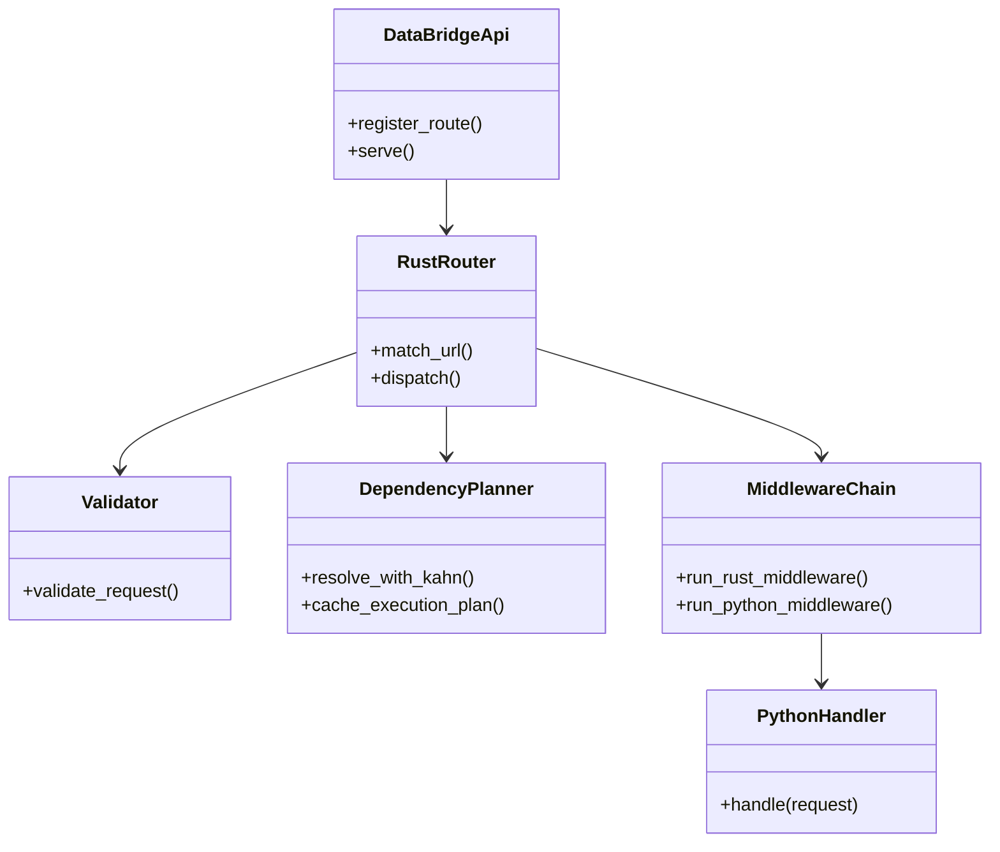

# API Server Architecture

## Overview
<!-- type: overview lang: markdown -->

`data-bridge-api` is a hybrid Rust/Python web framework that aims to provide a
FastAPI-like developer experience with the performance profile of a native Rust
server.

### Core Philosophy

1. Rust handles routing, validation, serialization, and HTTP processing.
2. Python owns route handlers and dependency definitions.
3. The FFI boundary minimizes copies where practical.

### Comparison With FastAPI

| Feature | FastAPI / Uvicorn | Data Bridge API |
|---------|-------------------|-----------------|
| Language | Python / Starlette | Rust / Hyper / Tokio |
| JSON | standard `json` or `orjson` | `sonic-rs` |
| Validation | Pydantic | Rust-native validation |
| Routing | Python regex and match | Rust match |
| Concurrency | Python `asyncio` loop | Tokio runtime plus Python async handlers |

## Key Components
<!-- type: dependency lang: mermaid -->



The Rust router handles URL matching before Python code executes, avoiding GIL
work for 404s and invalid methods. Dependency injection uses Kahn's algorithm to
resolve Python-defined dependency graphs at startup, cache execution plans, and
support singleton and request scopes. Middleware runs through one chain that can
interleave Rust and Python middleware while keeping the core execution path
optimized in Rust.

## Changes
<!-- type: changes lang: yaml -->

```yaml
files:
  - path: .aw/tech-design/crates/cclab-server/logic/api-server-architecture.md
    action: MODIFY
    impl_mode: hand-written
    desc: Move API server architecture note under logic and normalize sections.
  - path: crates/data-bridge/src/api.rs
    action: MODIFY
    impl_mode: hand-written
    desc: Implement Rust/Python API bridge routing validation and handler dispatch.
```
