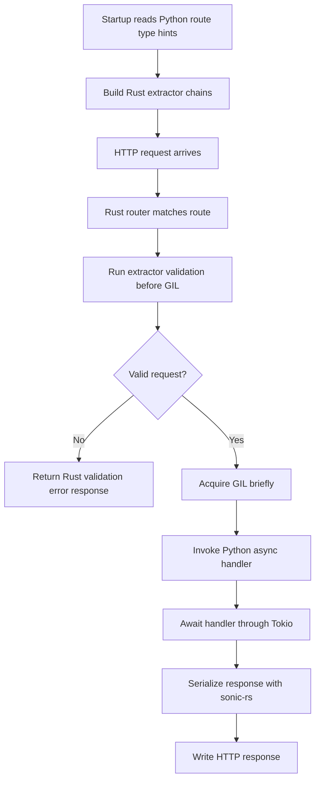

# API Server Implementation Details

## Overview
<!-- type: overview lang: markdown -->

The API server implementation relies on the Mamba binding layer for the Rust/Python-compatible boundary,
`sonic-rs` for JSON serialization, Tokio for async runtime execution, and
startup-time Python type extraction to build optimized Rust request extractors.

### Rust/Python Boundary

All FFI entry points are wrapped with panic and error boundaries:

- Rust panics are contained with `catch_unwind` so they do not crash the Python
  interpreter.
- Rust errors are mapped to Python-facing exceptions such as `HTTPException`.

### Serialization

`sonic-rs` writes JSON directly to response buffers and avoids intermediate
Python strings. It is selected for materially better throughput than standard
Python JSON serialization.

### Async Runtime

The server runs on Tokio. Python-compatible async handlers are awaited through the binding runtime
coroutine support, and background tasks are spawned on Tokio so they do not
block the response path.

### Type Extraction

Python type hints such as `str`, `int`, and user models are inspected at
startup. Rust uses the extracted metadata to build route-specific extractor
chains and validate requests before acquiring the GIL for handler invocation.

## Request Execution Flow
<!-- type: logic lang: mermaid -->



## Changes
<!-- type: changes lang: yaml -->

```yaml
files:
  - path: .aw/tech-design/crates/cclab-server/logic/api-server-implementation.md
    action: MODIFY
    impl_mode: hand-written
    desc: Move API server implementation note under logic and normalize sections.
  - path: crates/data-bridge/src/api.rs
    action: MODIFY
    impl_mode: hand-written
    desc: Implement Mamba boundary request validation async handler dispatch and response serialization.
```
