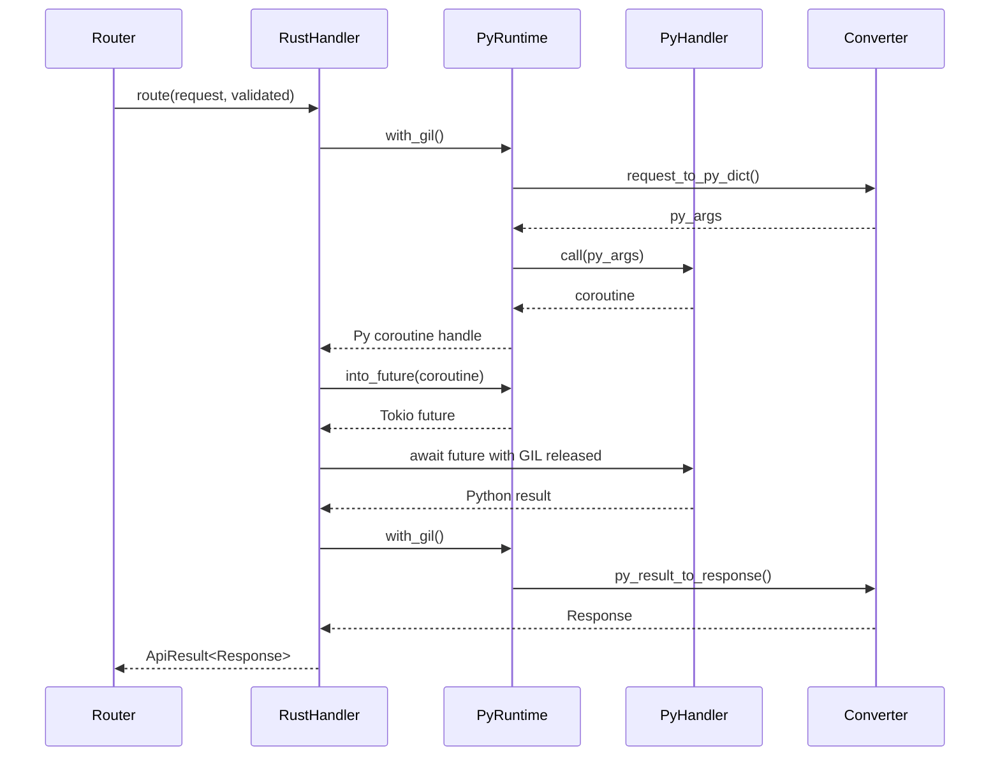
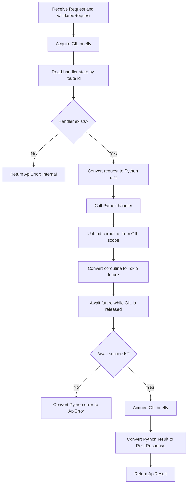
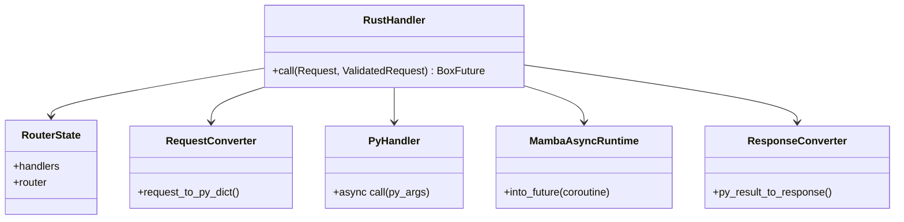
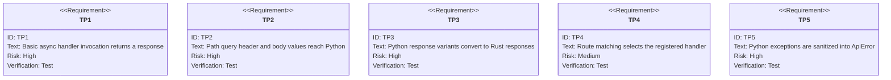

# Python Handler Invocation Bridge Implementation

## Overview
<!-- type: overview lang: markdown -->

The Python handler invocation bridge in `crates/data-bridge/src/api.rs` lets
Rust route handlers call Python async handlers from the Tokio runtime while
holding the GIL only for short conversion and setup windows.

### Request Conversion

`request_to_py_dict()` converts `Request` and `ValidatedRequest` into a Python
dict containing:

- `path_params`: validated path parameters
- `query_params`: validated query parameters
- `headers`: HTTP headers
- `body`: validated request body when present
- `method`: HTTP method string
- `path`: request path
- `url`: full URL

All request values are converted from `SerializableValue` into Python objects.

### Response Conversion

`py_result_to_response()` converts Python handler results into Rust `Response`
values:

| Python result | Rust response |
|---------------|---------------|
| `PyResponse` object | status, headers, and body extracted from the object |
| dict or list | JSON response |
| string | plain text response |
| bytes | binary response with content type |
| other serializable value | JSON response |

### GIL Strategy

The bridge holds the GIL only while converting the request, invoking the Python
handler to obtain a coroutine, converting that coroutine to a Tokio future, and
converting the result back into a Rust response. The Python coroutine execution
itself is awaited with the GIL released, so I/O-heavy handlers can progress
without blocking unrelated Python work.

### Error and Security Boundaries

Errors are converted into `ApiError` variants. Lock failures, missing handlers,
and conversion failures are internal errors; Python call and execution failures
are handler errors. Python exception text is sanitized before it reaches an HTTP
500 response. Handler lookup uses the route id, requests are validated before
the handler is invoked, and shared handler state is guarded by `RwLock`.

## Handler Interaction
<!-- type: interaction lang: mermaid -->



## Invocation Logic
<!-- type: logic lang: mermaid -->



### Critical GIL Sections

| Section | Work | Expected duration |
|---------|------|-------------------|
| Request conversion | Handler lookup, request dict creation, handler call | under 1 ms |
| Coroutine setup | Bind coroutine and convert to Tokio future | under 1 ms |
| Response conversion | Bind result and convert to Rust response | under 1 ms |

Total GIL hold time should stay near 3 ms per request, excluding the async
handler execution.

## Dependencies
<!-- type: dependency lang: mermaid -->



The bridge depends on the Mamba async runtime to
convert Python coroutines into Rust futures.

## Test Plan
<!-- type: test-plan lang: mermaid -->



The primary test suite is `tests/api/test_handler_invocation.py`, covering
basic handler invocation, path and query parameters, response object handling,
text, JSON, and dict responses, route matching, and multiple route
registration. Follow-up integration tests should exercise the Axum HTTP server,
throughput under concurrent handlers, and Python exception paths.

## Changes
<!-- type: changes lang: yaml -->

```yaml
files:
  - path: .aw/tech-design/crates/cclab-server/logic/handler-invocation-implementation.md
    action: MODIFY
    impl_mode: hand-written
    desc: Move the implementation note under logic and normalize section formats.
  - path: crates/data-bridge/src/api.rs
    action: MODIFY
    impl_mode: hand-written
    desc: Add Python request conversion response conversion and async handler invocation.
  - path: tests/api/test_handler_invocation.py
    action: CREATE
    impl_mode: hand-written
    desc: Add Python handler invocation coverage for route and response behavior.
```
