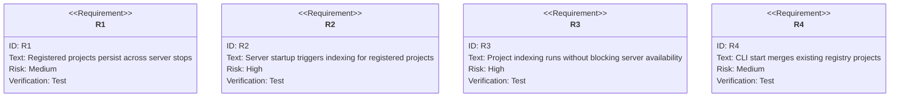
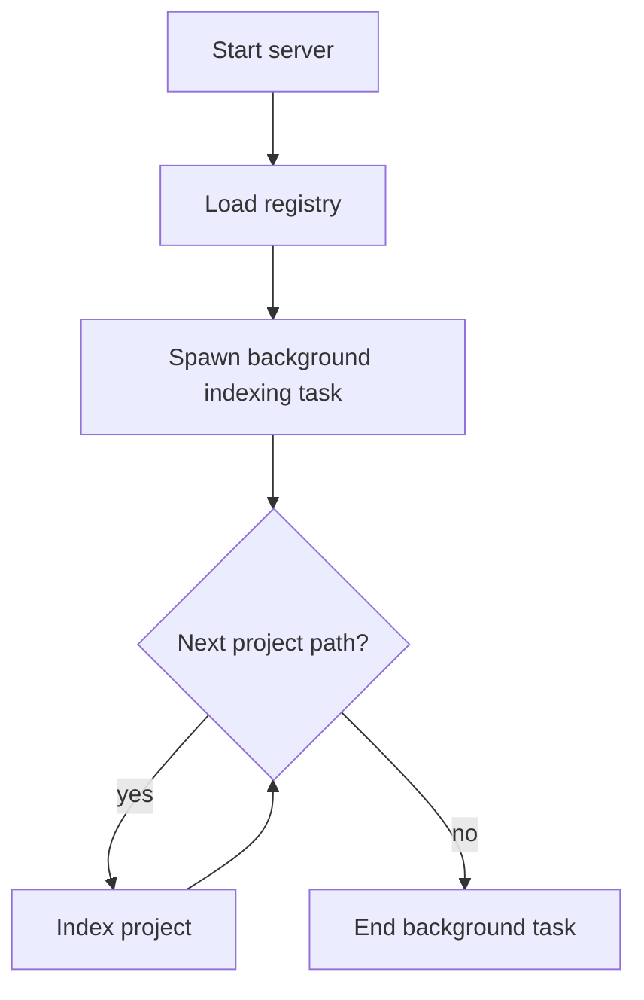

# Lens Automatic Initialization

## Overview
<!-- type: overview lang: markdown -->

Lens handlers for registered projects are initialized automatically at server
startup. This improves responsiveness by pre-indexing registered projects and
avoids the first-request delay caused by lazy initialization. The registry also
survives server restarts so previously registered projects can be reloaded.

The old active file lived at
`.aw/tech-design/crates/cclab-server/lens-init-spec.md`. The canonical TD is
now `.aw/tech-design/crates/cclab-server/logic/lens-automatic-initialization.md`.

## Requirements
<!-- type: requirements lang: mermaid -->



### R1: Registry Persistence

Registered projects must be preserved in `~/.cclab/registry.json` even when the
server process is stopped.

### R2: Background Initialization

The server must automatically trigger indexing for all registered projects on
startup.

### R3: Non-blocking Startup

Project indexing must run in background tasks so the server can become
available immediately.

### R4: CLI Integration

The CLI must correctly handle existing projects when starting a new server
instance after a shutdown or crash.

## Scenarios
<!-- type: scenarios lang: yaml -->

```yaml
scenarios:
  - id: S1
    requirement: R1
    given: A server with three registered projects is shut down
    when: The server is restarted
    then: The three projects are still listed in the registry
  - id: S2
    requirement: R2
    given: A server starts with registered projects in the registry
    when: Startup completes
    then: Background indexing begins for every registered project
  - id: S3
    requirement: R3
    given: A large project is registered
    when: The server starts on port 3456
    then: The server becomes available immediately while indexing continues in the background
  - id: S4
    requirement: R2
    given: A server starts with existing projects in the registry
    when: Background tasks complete
    then: LensHandlerPool contains initialized handlers for all registered projects
  - id: S5
    requirement: R4
    given: A server is started after a system crash
    when: cclab server start --port 3456 runs
    then: The new server instance merges registered projects instead of overwriting them
```

## Initialization Algorithm
<!-- type: logic lang: mermaid -->



## Changes
<!-- type: changes lang: yaml -->

```yaml
files:
  - path: .aw/tech-design/crates/cclab-server/logic/lens-automatic-initialization.md
    action: MODIFY
    impl_mode: hand-written
    desc: Move Lens automatic initialization TD under logic and normalize sections.
  - path: crates/cclab-server/src/http_server.rs
    action: MODIFY
    impl_mode: hand-written
    desc: Load registered projects at server startup and initialize Lens handlers in background tasks.
```
