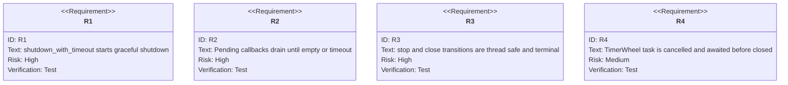
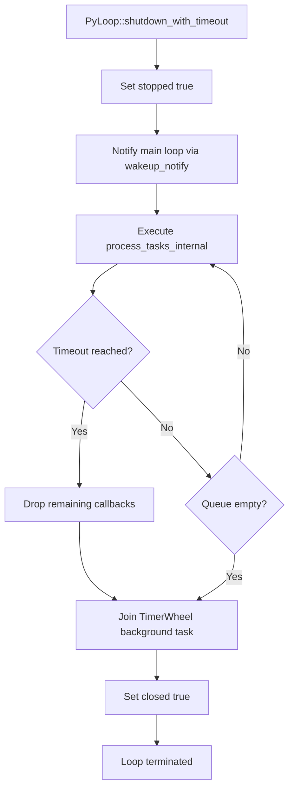

# Shutdown Management

## Overview
<!-- type: overview lang: markdown -->

Graceful shutdown coordinates the PyLoop event loop, task queue draining, and
background processors such as the TimerWheel. Shutdown sets a stopped flag,
notifies the main loop, drains pending callbacks within a timeout, joins
background tasks, and marks the loop closed.

The old file lived at `.aw/tech-design/crates/cclab-server/shutdown-management.md`.
The canonical TD now lives under `logic/`.

## Requirements
<!-- type: requirements lang: mermaid -->



### R1: Shutdown API

`shutdown_with_timeout(timeout: Duration)` sets the stopped flag and initiates
task draining.

### R2: Graceful Task Draining

`process_tasks_internal` continues processing until the queue is empty during
shutdown, while respecting the configured timeout.

### R3: Lifecycle State Transitions

`stop()` and `close()` must be thread-safe and transition the loop to a terminal
state exactly once.

### R4: TimerWheel Coordination

The TimerWheel background task must be cancelled and awaited before the loop is
marked closed.

## Scenarios
<!-- type: scenarios lang: yaml -->

```yaml
scenarios:
  - id: S1
    requirement: R1
    given: PyLoop is running
    when: shutdown_with_timeout is called
    then: The stopped flag is set and the main loop is notified to exit after the current poll
  - id: S2
    requirement: R2
    given: Shutdown is in progress
    when: The loop enters the draining phase
    then: process_tasks_internal executes until pending callbacks are handled or timeout expires
  - id: S3
    requirement: R4
    given: The TimerWheel background thread is already stopped
    when: TimerWheel join is executed
    then: Shutdown continues without error
  - id: S4
    requirement: R3
    given: PyLoop is already shutting down
    when: shutdown_with_timeout is called again
    then: The second call returns without re-initiating shutdown
```

## Detailed Shutdown Flow
<!-- type: logic lang: mermaid -->



## Changes
<!-- type: changes lang: yaml -->

```yaml
files:
  - path: .aw/tech-design/crates/cclab-server/logic/shutdown-management.md
    action: MODIFY
    impl_mode: hand-written
    desc: Move shutdown management TD under logic and normalize sections.
  - path: crates/cclab-server/src
    action: MODIFY
    impl_mode: hand-written
    desc: Implement graceful shutdown timeout task draining and TimerWheel coordination.
```
