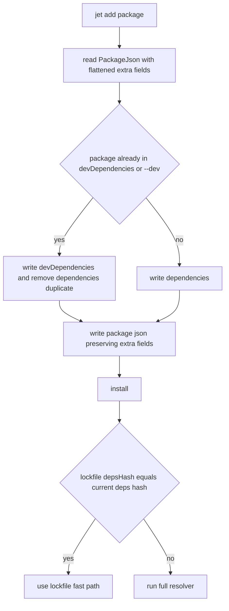

# Jet Add Package Json Preservation

## Scenarios
<!-- type: scenarios lang: yaml -->

```yaml
scenarios:
  - id: S1
    given: package json contains private type scripts and other unknown root fields
    when: jet add writes the package json
    then: those fields remain present in the rewritten file
  - id: S2
    given: a package already exists in devDependencies
    when: jet add package runs without --dev
    then: Jet updates devDependencies and does not add a duplicate dependencies entry
  - id: S3
    given: package json dependencies changed after the lockfile marker was written
    when: jet install considers the lockfile fast path
    then: Jet rejects the fast path if lockfile depsHash differs from the current dependency hash
  - id: S4
    given: the lockfile fast path is rejected for dependency drift
    when: install continues
    then: full resolution is used so the new package can be written to jet-lock yaml and node_modules
```

## Add Pipeline
<!-- type: logic lang: mermaid -->



## Test Plan
<!-- type: test-plan lang: mermaid -->

```mermaid
---
id: jet-add-package-json-preservation-test-plan
entry: T1
---
requirementDiagram
    requirement R1 {
        id: R1
        text: package json extra fields round trip
        risk: high
        verifymethod: unit-test
    }
    requirement R2 {
        id: R2
        text: existing dependency group is preserved
        risk: medium
        verifymethod: unit-test
    }
    requirement R3 {
        id: R3
        text: stale depsHash rejects lockfile fast path
        risk: high
        verifymethod: unit-test
    }
    element T1 {
        type: test
        docref: cargo test -p jet pkg_manager::tests::test_package_json_preserves_extra_fields
    }
    element T2 {
        type: test
        docref: cargo test -p jet pkg_manager::tests::test_add_dependency_target_preserves_existing_dev_group
    }
    element T3 {
        type: test
        docref: cargo test -p jet pkg_manager::tests::test_lockfile_hash_matches_current_deps
    }
```

## Changes
<!-- type: changes lang: yaml -->

```yaml
files:
  - path: .aw/tech-design/crates/jet-add-package-json-preservation.md
    action: CREATE
    impl_mode: hand-written
    desc: Focused TD for jet add package json preservation and lockfile hash invalidation.
  - path: projects/jet/src/pkg_manager/mod.rs
    action: MODIFY
    impl_mode: hand-written
    desc: Preserve unknown package json fields, avoid duplicate dependency groups, and require depsHash equality for lockfile fast-path.
```

# Reviews

### Review 1
**Verdict:** approved

- [scenarios] Scenario set directly covers metadata loss, duplicate dependency groups, stale lockfile hash, and full-resolution fallback.
- [logic] Pipeline is clear about preserving flattened package metadata before install and rejecting the lockfile path on dependency drift.
- [test-plan] Unit tests target the package-json round trip, group selection, and depsHash guard without depending on live registry behavior.
- [changes] File scope is intentionally limited to the package manager module plus this TD.
