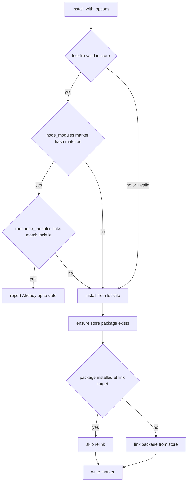

# Jet Install Store Hydration

## Scenarios
<!-- type: scenarios lang: yaml -->

```yaml
scenarios:
  - id: S1
    given: jet-lock yaml contains @types/prop-types and the node_modules marker matches package json deps
    and: the global store path for @types/prop-types is missing
    when: jet install runs
    then: Jet does not print Already up to date and proceeds through lockfile installation
  - id: S2
    given: node_modules contains a package with the expected package json version
    and: the global store no longer has the package or matching integrity marker
    when: install_resolved processes the lockfile entry
    then: Jet hydrates the store before deciding whether node_modules can be skipped
  - id: S3
    given: node_modules contains a dangling scoped-package symlink
    when: the marker fast path checks root links
    then: the link is treated as invalid and lockfile install repairs it
  - id: S4
    given: a lockfile key is scoped like /@types/prop-types@15.7.15
    when: lockfile validation checks the store
    then: Jet checks @types/prop-types rather than prop-types or @types/prop-types@15.7.15
```

## Install Pipeline
<!-- type: logic lang: mermaid -->



## Test Plan
<!-- type: test-plan lang: mermaid -->

```mermaid
---
id: jet-install-store-hydration-test-plan
entry: T1
---
requirementDiagram
    requirement R1 {
        id: R1
        text: marker fast path validates root links
        risk: high
        verifymethod: unit-test
    }
    requirement R2 {
        id: R2
        text: store is hydrated before installed skip
        risk: high
        verifymethod: unit-test
    }
    requirement R3 {
        id: R3
        text: scoped lockfile names validate store paths
        risk: medium
        verifymethod: unit-test
    }
    element T1 {
        type: test
        docref: cargo test -p jet pkg_manager::tests::test_lockfile_root_links_valid_detects_missing_scoped_link
    }
    element T2 {
        type: test
        docref: cargo test -p jet pkg_manager::tests::test_lockfile_root_links_valid_accepts_scoped_package_link
    }
    element T3 {
        type: test
        docref: cargo test -p jet pkg_manager::lockfile::tests::test_lockfile_scoped_non_workspace_entry_not_skipped
    }
```

## Changes
<!-- type: changes lang: yaml -->

```yaml
files:
  - path: .aw/tech-design/crates/jet-install-store-hydration.md
    action: CREATE
    impl_mode: hand-written
    desc: Focused TD for lockfile marker and store hydration repair behavior.
  - path: projects/jet/src/pkg_manager/mod.rs
    action: MODIFY
    impl_mode: hand-written
    desc: Validate root node_modules links before marker fast-path success and ensure store hydration precedes installed-package skip.
  - path: projects/jet/src/pkg_manager/lockfile.rs
    action: MODIFY
    impl_mode: hand-written
    desc: Add scoped-package lockfile validation coverage for missing store entries.
```

# Reviews

### Review 1
**Verdict:** approved

- [scenarios] Scenario set covers the missing scoped store package, stale marker, dangling symlink, and scoped lockfile key parsing paths from the issue.
- [logic] Pipeline explicitly gates `Already up to date` behind both store validation and root link validation, and moves store hydration before installed-package skip.
- [test-plan] Unit tests target the high-risk marker fast path and scoped package validation without requiring registry network access.
- [changes] File list is scoped to the package manager install path, lockfile coverage, and this TD.
