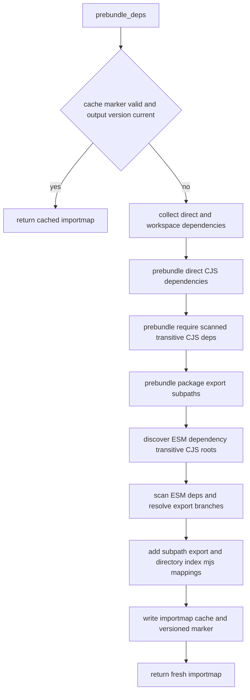

# Jet MUI Emotion Importmap

## Scenarios
<!-- type: scenarios lang: yaml -->

```yaml
scenarios:
  - id: S1
    given: package json depends on react react-dom MUI and Emotion
    when: jet dev prebundle runs
    then: importmap resolves MUI Emotion dom-helpers and react-is without user patches
  - id: S2
    given: package exports contain nested browser module import default branches
    when: resolver chooses an entry
    then: browser module ESM path is selected
  - id: S3
    given: package exports omit a directory subpath but the package ships subdir index mjs
    when: importmap is generated
    then: bare package slash subpath maps to the index mjs file
  - id: S4
    given: an ESM package depends on a CJS helper package
    when: transitive root discovery scans dependency package json files
    then: the helper package is bundled into node_modules .jet and mapped as ESM
  - id: S5
    given: node_modules .jet cache marker has an old output version
    when: prebundle cache validation runs
    then: cache is invalid and importmap is regenerated
```

## Resolver Pipeline
<!-- type: logic lang: mermaid -->



## Test Plan
<!-- type: test-plan lang: mermaid -->

```mermaid
---
id: jet-mui-emotion-importmap-test-plan
entry: T1
---
requirementDiagram
    requirement R2 {
        id: R2
        text: export branch priority
        risk: high
        verifymethod: unit-test
    }
    requirement R4 {
        id: R4
        text: transitive CJS root prebundle
        risk: high
        verifymethod: unit-test
    }
    requirement R5 {
        id: R5
        text: cache version invalidation
        risk: medium
        verifymethod: unit-test
    }
    element T1 {
        type: test
        docref: cargo test -p jet dev_server::prebundle_tests::test_resolve_exports_prefers_browser_module_nested_default
    }
    element T2 {
        type: test
        docref: cargo test -p jet dev_server::prebundle_tests::test_resolve_exports_import_object_default
    }
    element T3 {
        type: test
        docref: cargo test -p jet dev_server::prebundle_tests::test_stale_cache_marker_version_invalid
    }
```

## Changes
<!-- type: changes lang: yaml -->

```yaml
files:
  - path: .aw/tech-design/crates/jet-mui-emotion-importmap.md
    action: CREATE
    impl_mode: hand-written
    desc: Focused TD for MUI Emotion importmap and prebundle resolver behavior.
  - path: projects/jet/src/dev_server/prebundle.rs
    action: MODIFY
    impl_mode: hand-written
    desc: Prefer browser/module export branches, discover transitive CJS package roots, map subpaths, and version the prebundle cache marker.
  - path: projects/jet/src/dev_server/prebundle_tests.rs
    action: MODIFY
    impl_mode: hand-written
    desc: Add resolver branch and cache invalidation regression tests.
```

# Reviews

### Review 1
**Verdict:** approved

- [scenarios] Scenario set covers the MUI/Emotion failure path, nested export preference, subpath mapping, transitive CJS root discovery, and cache invalidation.
- [logic] Pipeline order is implementable and matches the existing `PreBundler::prebundle_deps` ownership boundary.
- [test-plan] Unit-level resolver and cache regressions are sufficient for the immediate implementation slice; full browser fixture coverage can be added as a follow-up when the app harness is stable.
- [changes] File list is scoped to TD, prebundle logic, and regression tests.
