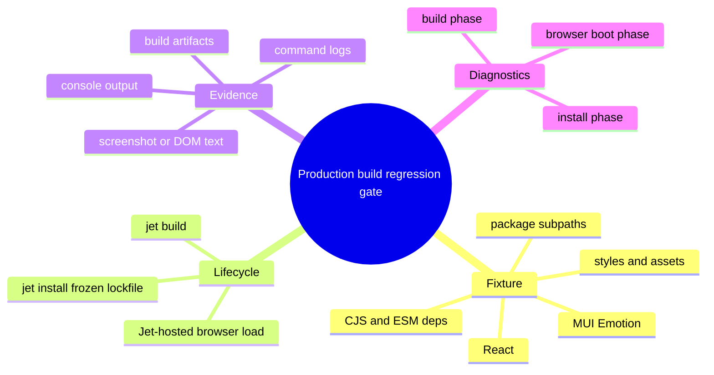
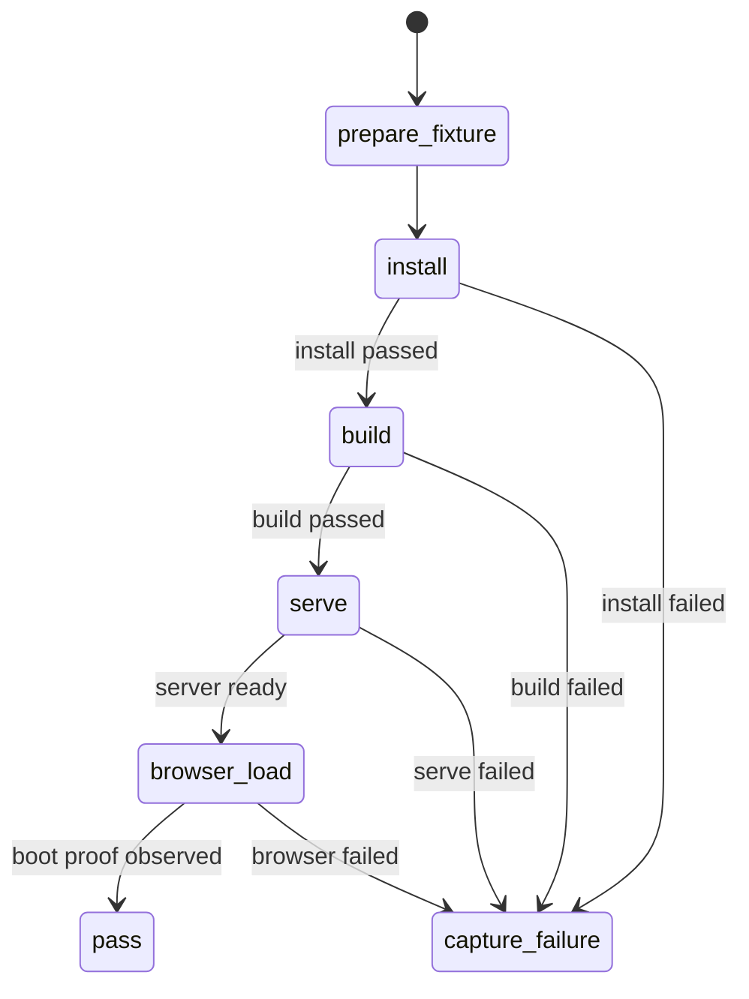
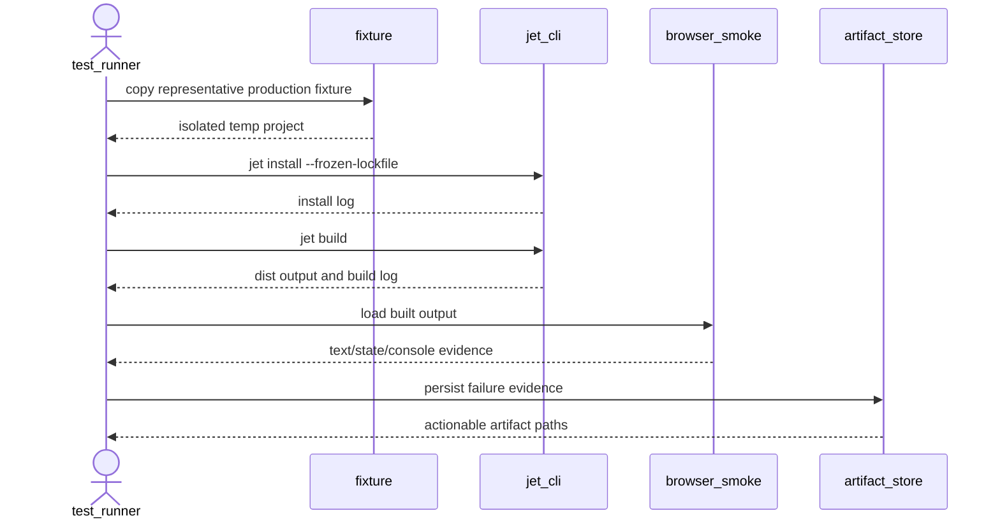
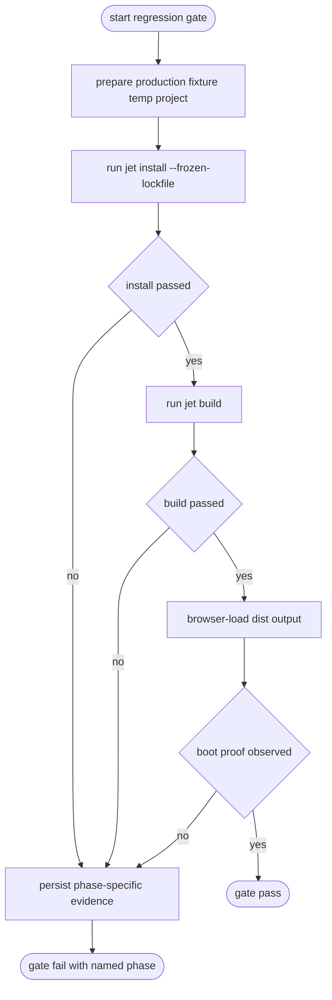
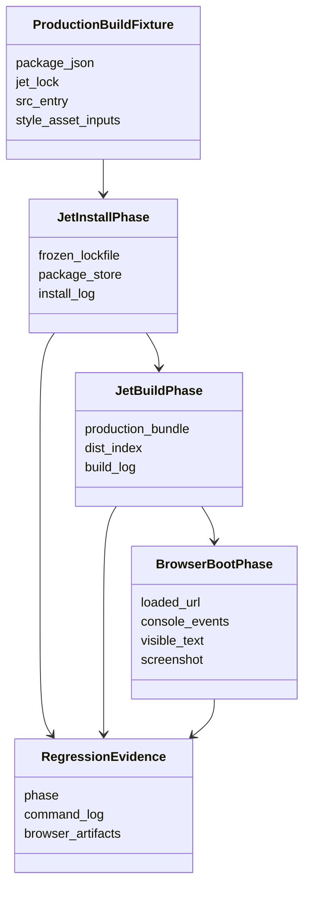
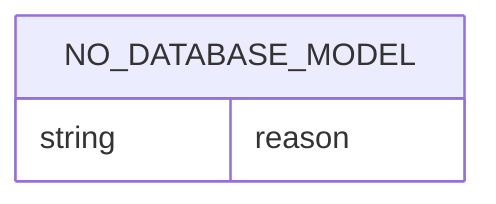
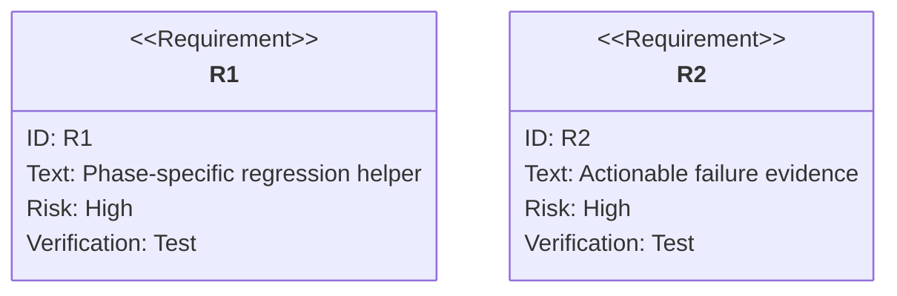

# Add Production Jet Build Regression Coverage

## Scenarios
<!-- type: scenarios lang: yaml -->

```yaml
scenarios:
  - id: production_build_regression_gate_runs_full_jet_lifecycle
    given: "A representative Jet fixture imports React, MUI/Emotion, CJS dependencies, ESM package subpaths, extensionless package directories, CSS/style injection, and static assets."
    when: "The regression test runs `jet install --frozen-lockfile`, `jet build`, serves the dist output from the test harness, and browser-loads it through Jet browser tooling."
    then: "The test proves the production bundle boots in a browser-visible surface instead of only compiling unit-level code."
  - id: build_failure_names_exact_phase
    given: "The fixture install, production build, or browser boot fails."
    when: "The regression gate records failure evidence."
    then: "The output names the failing phase and persists command logs plus browser artifacts needed for triage."
  - id: hermetic_fixture_host
    given: "The regression fixture needs to serve production output."
    when: "The browser smoke runs."
    then: "The test uses an in-process Rust static server plus Jet browser tooling and does not depend on an external Python/http-server workaround."
```
## Mindmap
<!-- type: mindmap lang: mermaid -->


## State Machine
<!-- type: state-machine lang: mermaid -->


## Interaction
<!-- type: interaction lang: mermaid -->


## Logic
<!-- type: logic lang: mermaid -->


## Dependency
<!-- type: dependency lang: mermaid -->


## Data Model
<!-- type: db-model lang: mermaid -->


## Schema
<!-- type: schema lang: yaml -->

```yaml
production_build_regression_evidence:
  phase: "install|build|serve|browser"
  fixture: "fixture name or temp project path"
  command:
    argv: "command that ran"
    exit_code: "integer or null"
    stdout_path: "path to captured stdout"
    stderr_path: "path to captured stderr"
  browser:
    url: "loaded production output URL"
    console_log_path: "path to browser console log"
    screenshot_path: "path to failure screenshot when available"
    visible_text: "text proof used by the assertion"
  artifacts:
    dist_path: "built output path"
    report_dir: "failure artifact directory"
```
## REST API
<!-- type: rest-api lang: yaml -->

```yaml
not_applicable:
  reason: "The production build regression gate does not introduce HTTP REST endpoints."
```
## RPC API
<!-- type: rpc-api lang: yaml -->

```yaml
not_applicable:
  reason: "The production build regression gate does not introduce RPC methods or service contracts."
```
## Async API
<!-- type: async-api lang: yaml -->

```yaml
not_applicable:
  reason: "The production build regression gate does not introduce pub-sub, WebSocket, or background protocol contracts."
```
## CLI
<!-- type: cli lang: yaml -->

```yaml
commands_under_test:
  - command: "jet install --frozen-lockfile"
    phase: install
    expectation: "hydrates the fixture dependencies from the lockfile without mutating package metadata"
  - command: "jet build"
    phase: build
    expectation: "produces production dist output for the representative fixture"
  - command: "cargo test -p jet production_build_regression -- --nocapture"
    phase: verification
    expectation: "runs the full install/build/browser-load regression gate with actionable failure artifacts"
```
## Wireframe
<!-- type: wireframe lang: yaml -->

```yaml
not_applicable:
  reason: "The production build regression gate is a Rust/CLI test artifact and does not introduce a UI layout."
```
## Component
<!-- type: component lang: yaml -->

```yaml
not_applicable:
  reason: "The change adds a regression fixture/test, not reusable UI components."
```
## Design Token
<!-- type: design-token lang: yaml -->

```yaml
not_applicable:
  reason: "The regression gate does not add or modify visual design tokens."
```
## Config
<!-- type: config lang: yaml -->

```yaml
config_surfaces:
  - path: "fixture jet.config.toml or default Jet build config"
    purpose: "exercise production build defaults and output directory behavior"
  - path: "fixture package manager lock/config inputs"
    purpose: "prove `jet install --frozen-lockfile` can prepare the build without package metadata mutation"
```
## Manifest
<!-- type: manifest lang: yaml -->

```yaml
fixture_manifests:
  - path: "package.json"
    covers:
      - "React and MUI/Emotion dependencies"
      - "CJS dependency imported by the app"
      - "ESM package subpath import"
      - "extensionless package directory import"
  - path: "jet lockfile"
    covers:
      - "frozen install reproducibility before production build"
```
## Runtime Image
<!-- type: runtime-image lang: yaml -->

```yaml
not_applicable:
  reason: "The regression gate does not define or build container/runtime images."
```
## Deployment
<!-- type: deployment lang: yaml -->

```yaml
not_applicable:
  reason: "The regression gate validates local Jet production output and does not introduce deployment manifests or rollout steps."
```
## Unit Test
<!-- type: unit-test lang: mermaid -->


## E2E Test
<!-- type: e2e-test lang: yaml -->

```yaml
e2e_tests:
  - id: production_build_fixture_boots_in_browser
    name: "Production build fixture boots in browser"
    command: "cargo test -p jet production_build_regression -- --nocapture"
    fixture: "representative React/MUI production fixture"
    verifies:
      - "jet install --frozen-lockfile succeeds"
      - "jet build produces dist output"
      - "built output browser-loads with expected visible text and no boot console errors"
      - "failure artifacts identify install, build, serve, or browser phase"
```

# Reviews

### Review 1
**Verdict:** approved

- [scenarios] Contract directly matches #4128 acceptance: frozen install, production build, browser boot, and actionable artifacts.
- [cli/e2e-test] Verification command is concrete and machine-checkable.
- [schema/logic] Failure evidence schema and phase routing are enough for implementation.
- [scope] No API, UI, deployment, or runtime-image work is introduced.

## Changes
<!-- type: changes lang: yaml -->

```yaml
changes:
  - path: projects/jet/tests/build/production_build_regression.rs
    action: create
    section: e2e-test
    impl_mode: hand-written
    description: "Add the production build regression integration test that prepares the fixture, runs Jet install/build, browser-loads dist output, and emits phase-specific artifacts."
  - path: projects/jet/tests/fixtures/production-build-regression/package.json
    action: create
    section: manifest
    impl_mode: hand-written
    description: "Define the representative React/MUI production fixture dependency manifest."
  - path: projects/jet/tests/fixtures/production-build-regression/src/main.tsx
    action: create
    section: manifest
    impl_mode: hand-written
    description: "Add fixture source importing React, MUI/Emotion, package subpaths, CJS/ESM shapes, styles, and assets."
  - path: projects/jet/tests/fixtures/production-build-regression/src/style.css
    action: create
    section: manifest
    impl_mode: hand-written
    description: "Add fixture style input used to prove production CSS/style injection survives build output boot."
  - path: projects/jet/tests/fixtures/production-build-regression/src/message.cjs
    action: create
    section: manifest
    impl_mode: hand-written
    description: "Add local CJS fixture module used by the production build regression app."
```
