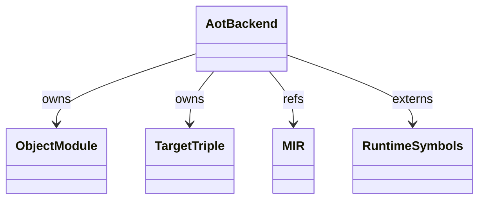
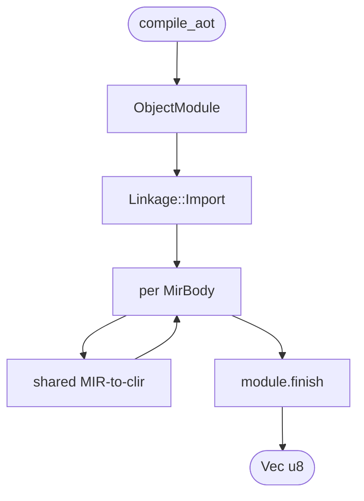
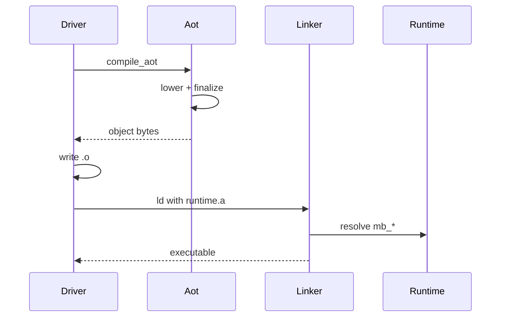

# Cranelift AOT

`codegen/cranelift/aot.rs` is the AOT (ahead-of-time) variant of the
Cranelift backend. Same MIR-to-clir lowering as `cranelift.md` but
emits ELF / Mach-O object bytes via `cranelift_object` instead of
loading machine code into the JIT in-process. AOT output is consumed
by `mamba build` to produce shareable binaries.

Three load-bearing invariants:

1. **AOT and JIT share one MIR pipeline** — they differ only in
   `cranelift_object::ObjectModule` vs `cranelift_jit::JITModule`
   construction. Lowering rules in `cranelift/mod.rs` are identical.
2. **Object output is platform-native** — Mach-O on macOS, ELF on
   Linux. `cranelift_object` picks the right format from
   `target_lexicon::Triple`.
3. **Runtime symbols become unresolved externs in the object** — the
   AOT object has unresolved references to every `mb_*` symbol; a
   subsequent link step resolves them against `libmamba_runtime.a`
   (or equivalent).

## Type model
<!-- type: dependency lang: mermaid -->



## Output shape
<!-- type: schema lang: yaml -->

```yaml
$schema: "https://json-schema.org/draft/2020-12/schema"
$id: "cranelift-aot-types"
$defs:
  AotOutput:
    type: object
    properties:
      bytes:    { type: array, items: { type: integer, minimum: 0, maximum: 255 } }
      target:   { type: string, description: "target triple (e.g., aarch64-apple-darwin)" }
      format:   { type: string, enum: [ELF, MachO, COFF] }
      externs:  { type: array, items: { type: string }, description: "unresolved symbol names" }
    required: [bytes, target, format, externs]
```

## AOT compilation logic
<!-- type: logic lang: mermaid -->



## AOT build interaction
<!-- type: interaction lang: mermaid -->



## Acceptance scenarios
<!-- type: scenarios lang: yaml -->

```yaml
scenarios:
  - id: aot-hello
    given: hello.py is compiled with `mamba build hello.py -o hello`
    when: the AOT backend emits and links an object file
    then: the hello executable is produced with runtime symbols resolved
  - id: aot-execution
    given: the generated hello executable exists
    when: the user runs `./hello`
    then: it prints hello
```

## Tests
<!-- type: tests lang: yaml -->

```yaml
runner: "cargo test -p mamba --test runtime_tests --release -- {name} --test-threads=1"
fixtures:
  - id: aot_hello
    name: "test_aot_compile_hello"
    description: "compile_aot produces valid object bytes for a hello-world module"
  - id: aot_externs_unresolved
    name: "test_aot_externs_marked_import"
    description: "every mb_* in the catalog is declared Linkage::Import in the object"
```

## Changes
<!-- type: changes lang: yaml -->

```yaml
changes:
  - file: crates/mamba/src/codegen/cranelift/aot.rs
    action: modify
    impl_mode: hand-written
    description: "cranelift_object::ObjectModule wrapper; shared MIR-to-clir lowering; emit Vec<u8> object bytes for system linker. Hand-written."
```
