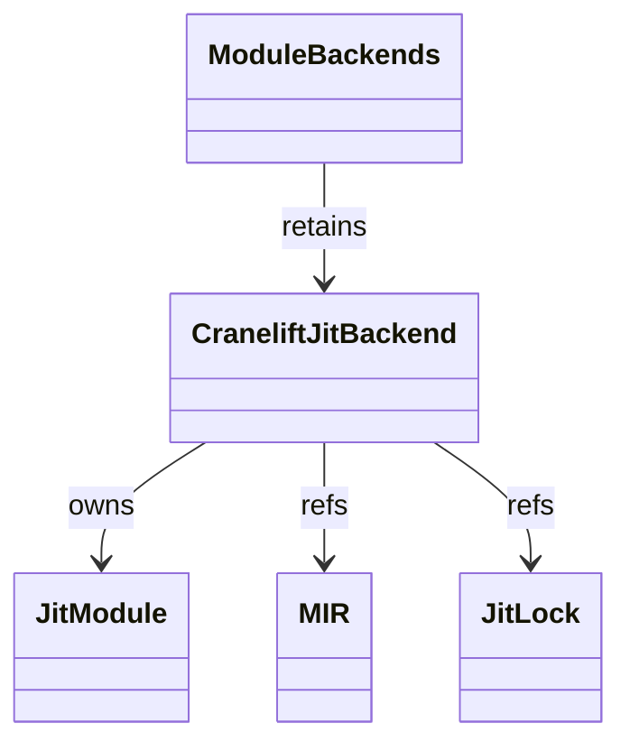
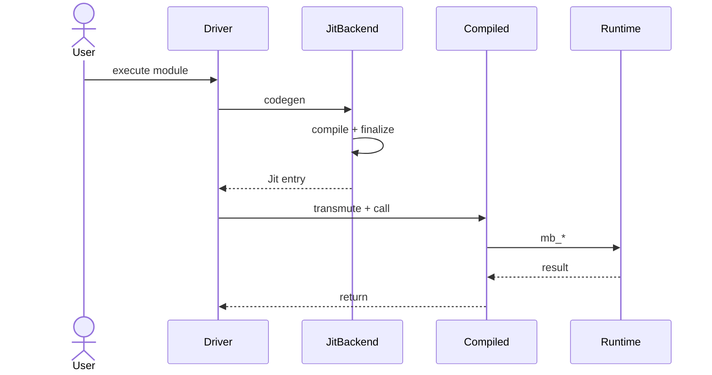

# Cranelift JIT

`codegen/cranelift/jit.rs` (1427 LOC) is the JIT variant — emits
machine code into a writable+executable mmap region in-process,
returns a function pointer the caller can call directly. This is the
default path for `mamba run` and the conformance test harness.

Three load-bearing invariants:

1. **`JIT_LOCK: Mutex<()>` serializes JIT compilation across tests** —
   Cranelift's JIT module isn't thread-safe under our usage pattern,
   so the test harness wraps every JIT invocation in a global mutex.
   Skipping the lock causes intermittent SIGABRTs in `compiled_blob.rs:90`
   under multi-thread test execution (still tracked as an open
   pre-existing batch-suite issue per handoff).
2. **W^X memory required** — JIT pages are mapped writable, code
   written, then re-mapped executable (W^X). On macOS `MAP_JIT` flag
   is needed to bypass the platform's hardened-runtime restriction.
3. **Module backends must outlive any code that calls into them** —
   per `runtime/module.md`, every module's JIT backend is pushed into
   `MODULE_JIT_BACKENDS` so the function pointers stay valid for
   cross-module callbacks. Dropping the backend invalidates the
   `extern "C" fn` pointer the module exported.

## Type model
<!-- type: dependency lang: mermaid -->



## JIT shape
<!-- type: schema lang: yaml -->

```yaml
$schema: "https://json-schema.org/draft/2020-12/schema"
$id: "cranelift-jit-types"
$defs:
  JitOutput:
    type: object
    properties:
      entry:    { type: integer, x-rust-type: "*const u8" }
      backend:  { x-rust-type: "Box<CraneliftJitBackend>", description: "must be retained for fn-pointer lifetime" }
    required: [entry, backend]
  WxFlow:
    description: "W^X memory transition per JIT page"
    type: array
    items:
      type: object
      properties:
        step:        { type: string }
        permissions: { type: string, enum: [RW, RX, R] }
      required: [step, permissions]
    examples:
      - - { step: "alloc",         permissions: RW, description: "mmap PROT_READ|PROT_WRITE; macOS adds MAP_JIT" }
        - { step: "code-write",    permissions: RW, description: "Cranelift writes machine code" }
        - { step: "transition",    permissions: RX, description: "mprotect to PROT_READ|PROT_EXEC" }
        - { step: "execute",       permissions: RX }
        - { step: "dropped",       permissions: R,  description: "munmap on backend drop" }
```

## JIT compile + finalize logic
<!-- type: logic lang: mermaid -->

```mermaid
---
id: jit-compile
entry: enter
nodes:
  enter:        { kind: start,    label: "JitBackend::codegen(MirModule)" }
  acquire_lock: { kind: process,  label: "JIT_LOCK.lock() — serialize compilation" }
  init_jit:    { kind: process,  label: "JITBuilder + JITModule init; declare runtime externs as native fn pointers" }
  per_body:    { kind: process,  label: "for each MirBody: define Function" }
  lower:       { kind: process,  label: "shared MIR-to-clir lowering (per cranelift.md)" }
  finalize:    { kind: process,  label: "module.finalize_definitions — patches all extern addresses; flips W→X" }
  get_entry:   { kind: process,  label: "module.get_finalized_function(main_id) → *const u8" }
  retain_backend: { kind: process, label: "MODULE_JIT_BACKENDS.push(Box::new(self))" }
  release_lock: { kind: process,  label: "JIT_LOCK guard dropped" }
  done:         { kind: terminal, label: "Jit { entry, backend }" }
edges:
  - { from: enter,        to: acquire_lock }
  - { from: acquire_lock, to: init_jit }
  - { from: init_jit,     to: per_body }
  - { from: per_body,     to: lower }
  - { from: lower,        to: per_body, label: "next body" }
  - { from: per_body,     to: finalize, label: "all done" }
  - { from: finalize,     to: get_entry }
  - { from: get_entry,    to: retain_backend }
  - { from: retain_backend, to: release_lock }
  - { from: release_lock, to: done }
---
flowchart TD
    enter([JIT codegen]) --> acquire_lock[JIT_LOCK]
    acquire_lock --> init_jit[JITModule + externs]
    init_jit --> per_body[per MirBody]
    per_body --> lower[shared lowering]
    lower --> per_body
    per_body --> finalize[finalize_definitions W to X]
    finalize --> get_entry[get_finalized_function]
    get_entry --> retain_backend[MODULE_JIT_BACKENDS push]
    retain_backend --> release_lock[drop guard]
    release_lock --> done([Jit { entry, backend }])
```

## JIT execute interaction
<!-- type: interaction lang: mermaid -->



## Acceptance scenarios
<!-- type: scenarios lang: yaml -->

```yaml
scenarios:
  - id: jit-hello
    given: language/hello.py runs through the JIT backend
    when: the backend compiles, finalizes, and executes the module
    then: stdout contains hello
  - id: jit-lock-serialization
    given: concurrent fixture runs request JIT compilation
    when: JIT_LOCK serializes compilation
    then: isolated runs pass without SIGABRT in compiled_blob.rs
  - id: backend-retention
    given: REPL cells define functions across executions
    when: MODULE_JIT_BACKENDS retains prior module backends
    then: earlier function pointers remain valid across cells
```

## Tests
<!-- type: tests lang: yaml -->

```yaml
runner: "cargo test -p mamba --test conformance_tests --release -- {name} --test-threads=1"
fixtures:
  - id: jit_hello
    name: "language/hello.py"
    paired: "language/hello.expected"
    verifies: ["JIT compile + execute"]
  - id: jit_lock_serialization
    name: "test_jit_lock_serializes_compilation"
    description: "concurrent JIT compiles do not race"
  - id: jit_backend_retention
    name: "test_module_jit_backends_retained"
    description: "MODULE_JIT_BACKENDS keeps fn pointers alive across imports"
```

## Changes
<!-- type: changes lang: yaml -->

```yaml
changes:
  - file: crates/mamba/src/codegen/cranelift/jit.rs
    action: modify
    impl_mode: hand-written
    description: "JITModule wrapper + JIT_LOCK + W→X memory transition + finalize_definitions + module backend retention. Hand-written; W^X + macOS MAP_JIT contract is platform-specific."
```
