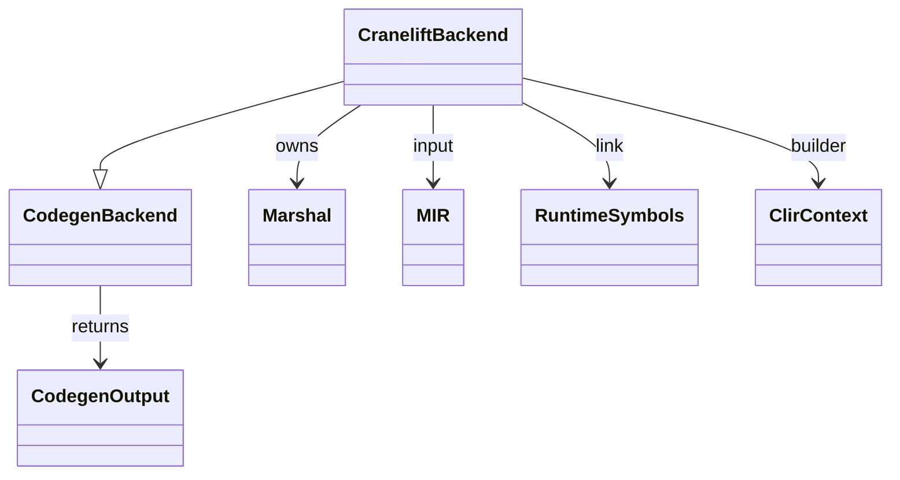
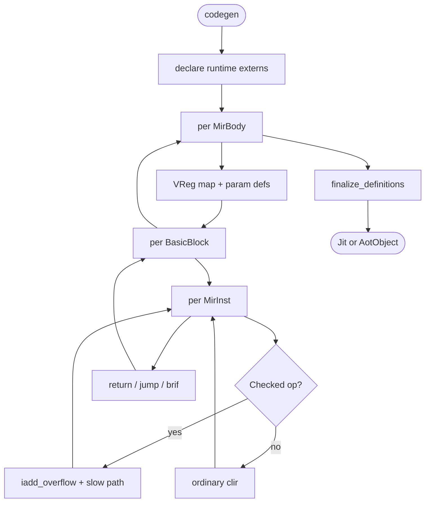
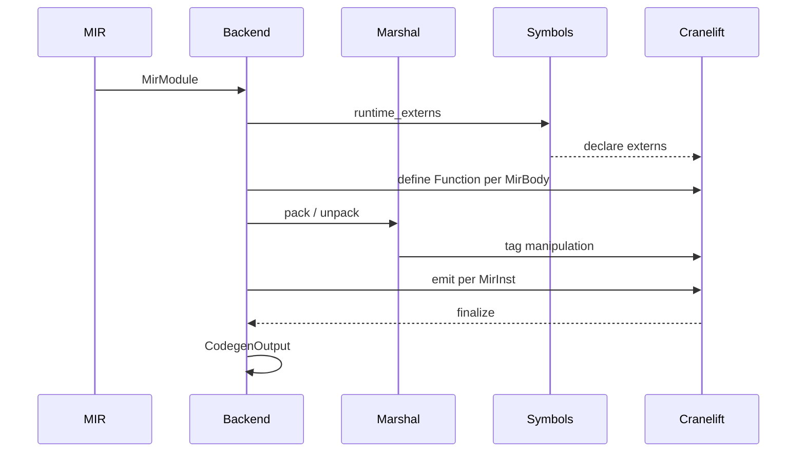

# Cranelift Codegen

`codegen/cranelift/mod.rs` (1656 LOC) is Mamba's primary backend. It
walks `mir::MirModule` block-by-block, lowering each `MirInst` into
`cranelift_codegen` IR, and produces either JIT machine code (per
`cranelift-jit.md`) or an object file (per `cranelift-aot.md`).

`marshal.rs` carries the helpers that bridge Mamba's NaN-boxed
`MbValue` (per `value-and-rc.md`) into Cranelift IR — pack / unpack
tag bits, decode integer payload, retain / release pointer values.

Three load-bearing invariants:

1. **NaN-box pack / unpack via `marshal.rs` is the only allowed way**
   — the rest of the backend never reads tag bits directly. Wrapping
   the bit ops in helpers means future tag-layout changes (per
   `value-and-rc.md`) only touch one file.
2. **Every `mb_*` call site uses the SystemV / C ABI** — Cranelift
   defaults to platform native, so on aarch64 / x86_64 the runtime
   functions are linkable with the `extern "C" fn` declarations in
   `runtime/symbols.rs` (per `symbols.md`).
3. **`CheckedAdd` / `CheckedSub` / `CheckedMul` lower inline, not
   through `mb_*` runtime calls** — the BigInt promote path is
   inlined: overflow check + branch to `bigint_from_i128` slow path.
   Calling out to runtime per int-add would be a 10x slowdown on hot
   numeric code.

## Type model
<!-- type: dependency lang: mermaid -->



## Codegen output shape
<!-- type: schema lang: yaml -->

```yaml
$schema: "https://json-schema.org/draft/2020-12/schema"
$id: "cranelift-types"
$defs:
  CodegenOutput:
    description: "Two output flavors"
    oneOf:
      - title: Jit
        properties:
          entry: { type: integer, x-rust-type: "*const u8", description: "address of compiled module body" }
        required: [entry]
      - title: AotObject
        properties:
          bytes: { type: array, items: { type: integer, minimum: 0, maximum: 255 }, description: "ELF / Mach-O object bytes" }
        required: [bytes]
  MirToClirRule:
    description: "Each MirInst lowers to one or more Cranelift IR instructions"
    type: array
    items:
      type: object
      properties:
        mir_inst:    { type: string }
        clir_emit:   { type: string }
        notes:       { type: string }
      required: [mir_inst, clir_emit]
    examples:
      - - { mir_inst: BinOp,        clir_emit: "iadd / isub / imul / iconst / fadd ...", notes: "type-dispatched per TypeId" }
        - { mir_inst: CheckedAdd,   clir_emit: "iadd_overflow + brif → bigint_from_i128 slow path; merge", notes: "inline, no runtime call" }
        - { mir_inst: LoadConst,    clir_emit: "iconst / f64const / func_addr (FuncRef) / call mb_global_get_id (Func external)" }
        - { mir_inst: Call,         clir_emit: "call sym(args) — SymbolId resolves to mb_X address" }
        - { mir_inst: GetAttr,      clir_emit: "call mb_getattr(obj, 'attr')" }
        - { mir_inst: SetAttr,      clir_emit: "call mb_setattr(obj, 'attr', value)" }
        - { mir_inst: GetItem,      clir_emit: "call mb_dict_getitem / mb_list_getitem / mb_tuple_getitem dispatched per ty" }
        - { mir_inst: MakeList,     clir_emit: "call mb_list_new + iter mb_list_append" }
        - { mir_inst: MakeCell,     clir_emit: "call mb_cell_new(value)" }
        - { mir_inst: LoadCapture,  clir_emit: "load from current closure env array" }
        - { mir_inst: LoadGlobal,   clir_emit: "call mb_global_get_id(SymbolId)" }
```

## Lowering pass logic
<!-- type: logic lang: mermaid -->



## MIR-to-clir interaction
<!-- type: interaction lang: mermaid -->



## Acceptance scenarios
<!-- type: scenarios lang: yaml -->

```yaml
scenarios:
  - id: hello-jit
    given: language/hello.py calls print
    when: Cranelift codegen compiles the module body
    then: the generated code calls mb_print and executes through the JIT
  - id: checked-int-overflow
    given: arithmetic/int_overflow.py computes `(1 << 47) + 1`
    when: CheckedAdd lowers to Cranelift IR
    then: codegen emits inline overflow detection plus the bigint_from_i128 slow path
  - id: extern-resolution
    given: runtime symbols declare every required mb_* external
    when: Cranelift finalize_definitions runs
    then: all externs resolve without MIR-link errors
```

## Tests
<!-- type: tests lang: yaml -->

```yaml
runner: "cargo test -p mamba --test conformance_tests --release -- {name} --test-threads=1"
fixtures:
  - id: hello
    name: "language/hello.py"
    paired: "language/hello.expected"
    verifies: ["full pipeline: parse + lower + codegen + JIT exec"]
  - id: int_checked_overflow
    name: "arithmetic/int_overflow.py"
    paired: "arithmetic/int_overflow.expected"
    verifies: ["CheckedAdd inline lowering with BigInt slow path"]
  - id: extern_resolution
    name: "test_extern_link_complete"
    description: "Cranelift finalize_definitions resolves every declared extern (no missing mb_*)"
```

## Changes
<!-- type: changes lang: yaml -->

```yaml
changes:
  - file: crates/mamba/src/codegen/mod.rs
    action: modify
    impl_mode: hand-written
    description: "CodegenBackend trait + CodegenOutput enum. Hand-written."
  - file: crates/mamba/src/codegen/cranelift/mod.rs
    action: modify
    impl_mode: hand-written
    description: "Cranelift backend — walks MirModule and emits cranelift_codegen IR; declares runtime externs; finalizes module. Hand-written."
  - file: crates/mamba/src/codegen/cranelift/marshal.rs
    action: modify
    impl_mode: hand-written
    description: "NaN-box pack / unpack helpers (per value-and-rc.md). Hand-written; tag-layout abstraction is the contract."
```
