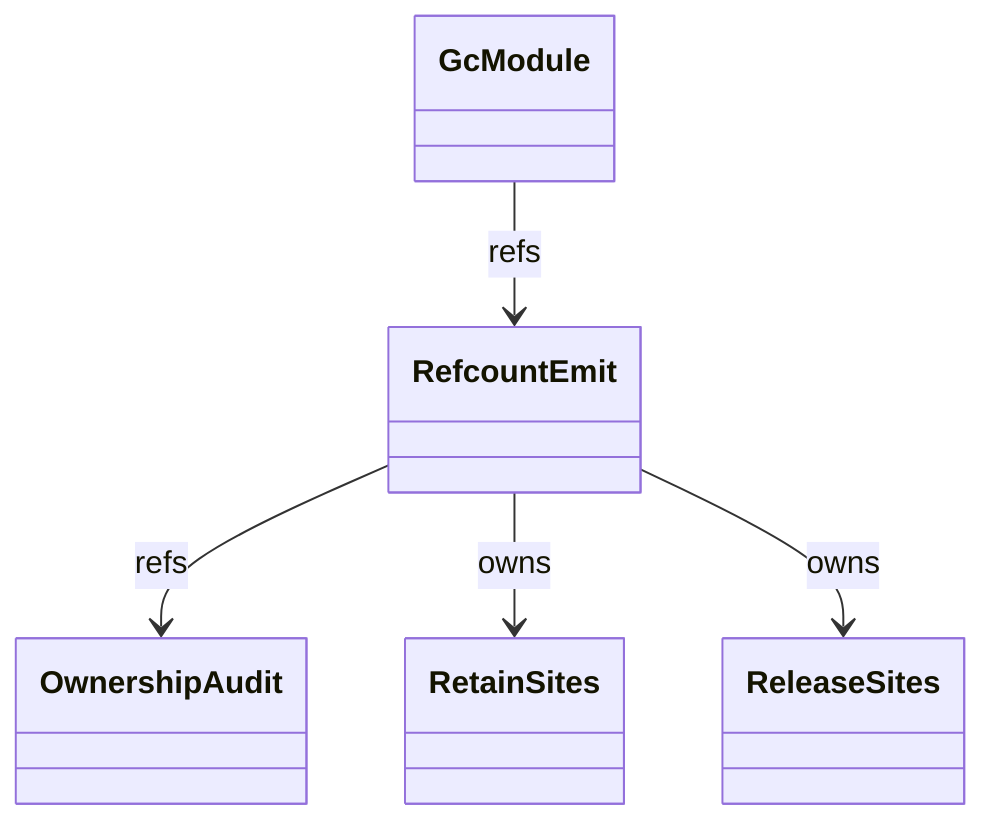
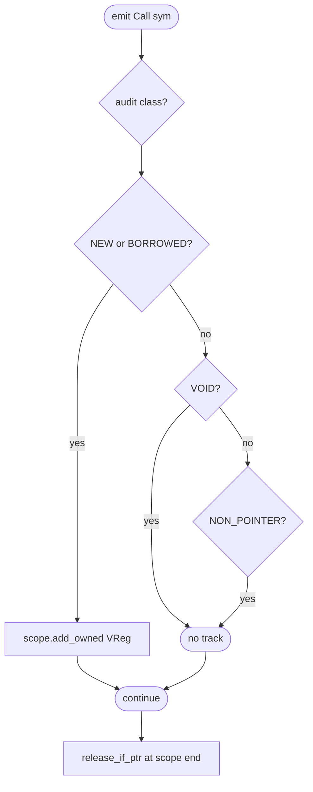
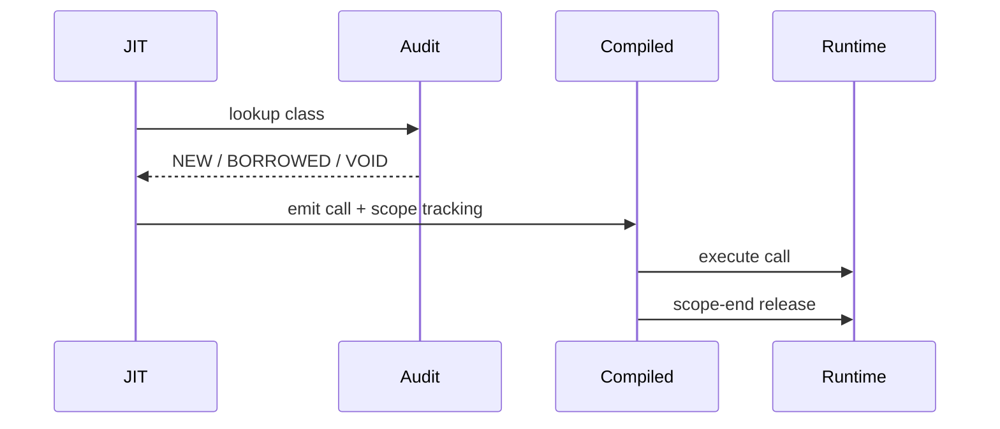

# JIT Refcount Emit

The JIT codegen pass inserts `mb_retain_value` and `mb_release_value`
calls around heap-pointer values produced and consumed by JIT code.
This is what keeps the refcount in sync with what the runtime expects
per the NEW / BORROWED / VOID classification in `value-and-rc.md`.

This is a sub-spec of `cranelift.md` focused exclusively on refcount
correctness — incorrect emission causes either leaks (skipping
release) or use-after-free (skipping retain on a borrowed return).

Three load-bearing invariants:

1. **NEW returns are NOT additionally retained** — a function classed
   NEW per the audit returns `rc=1`; the JIT must NOT call
   `mb_retain` on the result. Doing so leaks one reference per call.
2. **BORROWED returns ARE additionally retained at the runtime side**
   — `mb_list_getitem` etc. call `retain_if_ptr(result)` internally
   before returning, so the JIT receives a NEW-equivalent. The audit
   in `rc.rs:13-67` is the authoritative table.
3. **Drop scope decrements via `mb_release_value` at end of scope** —
   when a JIT-tracked Value goes out of scope (scope-end / function
   exit / overwrite), the codegen must emit `release_if_ptr`. Closure
   #1129 enabled GC re-run — confirms the emit is now correct.

## Type model
<!-- type: dependency lang: mermaid -->



## Audit shape
<!-- type: schema lang: yaml -->

```yaml
$schema: "https://json-schema.org/draft/2020-12/schema"
$id: "jit-refcount-types"
$defs:
  OwnershipClass:
    type: string
    enum: [NEW, BORROWED, VOID, NON_POINTER]
  RuntimeFnClassification:
    type: object
    properties:
      name:  { type: string, description: "mb_*" }
      class: { $ref: "#/$defs/OwnershipClass" }
    required: [name, class]
    examples:
      - { name: mb_list_new,        class: NEW }
      - { name: mb_list_getitem,    class: BORROWED }
      - { name: mb_list_append,     class: VOID }
      - { name: mb_len,             class: NON_POINTER }
      - { name: mb_iter,            class: NEW }
      - { name: mb_dict_get,        class: BORROWED }
      - { name: mb_global_get_id,   class: BORROWED }
  EmitRule:
    type: object
    properties:
      call_class: { $ref: "#/$defs/OwnershipClass" }
      jit_action: { type: string }
    required: [call_class, jit_action]
    examples:
      - { call_class: NEW,         jit_action: "no extra retain on result; release at scope end" }
      - { call_class: BORROWED,    jit_action: "callee already retained; treat as NEW from JIT's perspective; release at scope end" }
      - { call_class: VOID,        jit_action: "no result; nothing to track" }
      - { call_class: NON_POINTER, jit_action: "result is i64/f64/bool; no rc actions" }
```

## Emit decision logic
<!-- type: logic lang: mermaid -->



## Retain / release interaction
<!-- type: interaction lang: mermaid -->



## Acceptance scenarios
<!-- type: scenarios lang: yaml -->

```yaml
scenarios:
  - id: append-pop-balanced
    given: data_structures/append_pop.py appends and pops values in a loop
    when: JIT codegen emits retain and release calls around heap values
    then: refcounts remain balanced after each iteration
  - id: cycle-collected
    given: data_structures/cycle.py creates a self-cycle list
    when: GC reruns cycle collection after refcount releases
    then: cycles are broken and collected
  - id: closure-drop
    given: language/closure_capture_loop.py creates many captured cells
    when: closures are dropped
    then: JIT scope tracking releases captured cells
```

## Tests
<!-- type: tests lang: yaml -->

```yaml
runner: "cargo test -p mamba --test jit_refcount_tests --release -- {name} --test-threads=1"
fixtures:
  - id: append_pop_balanced
    name: "test_append_pop_no_leak"
    description: "loop append + pop maintains balanced rc"
  - id: cycle_collected
    name: "test_self_cycle_collected"
    description: "GC re-enabled (#1129); cycles collected"
  - id: closure_drop
    name: "test_closure_drop_releases_cells"
    description: "closure scope-end releases captured cells"
```

## Changes
<!-- type: changes lang: yaml -->

```yaml
changes:
  - file: crates/mamba/src/codegen/cranelift/mod.rs
    action: modify
    impl_mode: hand-written
    description: "Refcount emit logic embedded in cranelift backend — consults runtime/rc audit table per Call site; tracks owned VRegs per scope; emits mb_release_value at scope end. Hand-written; the audit is the contract."
```
