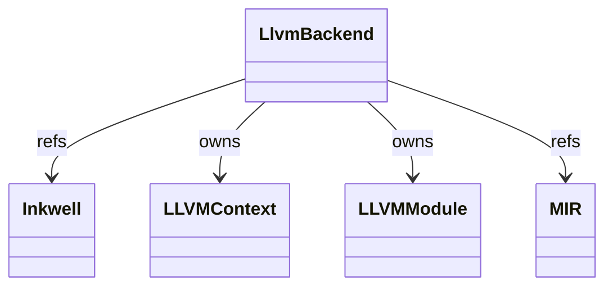
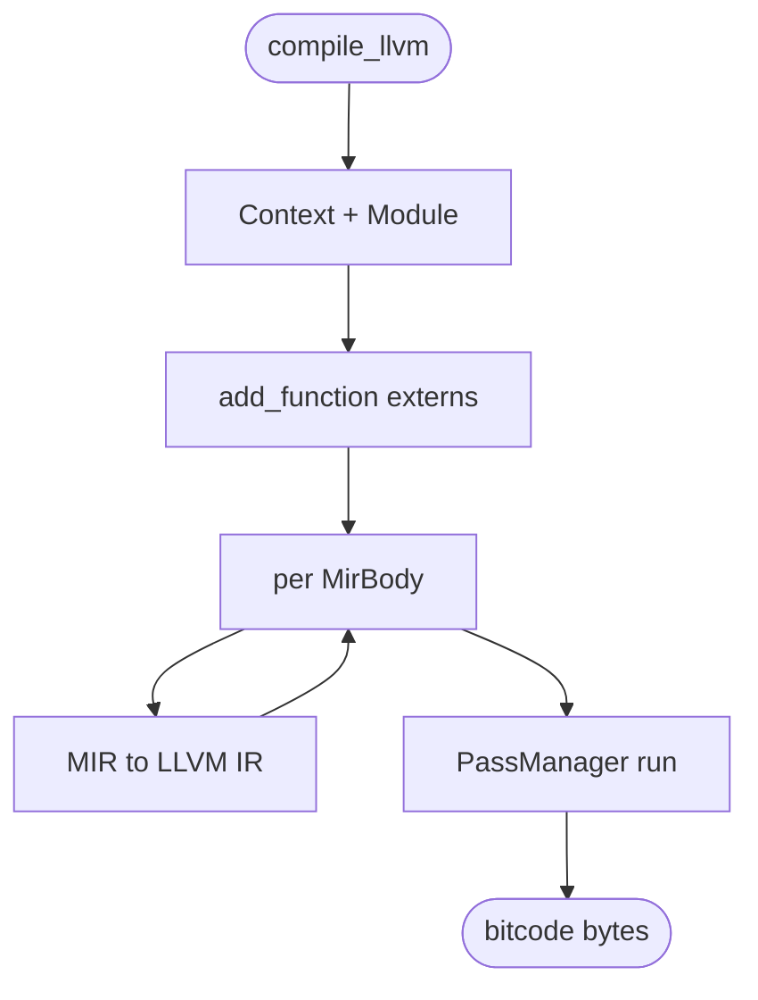
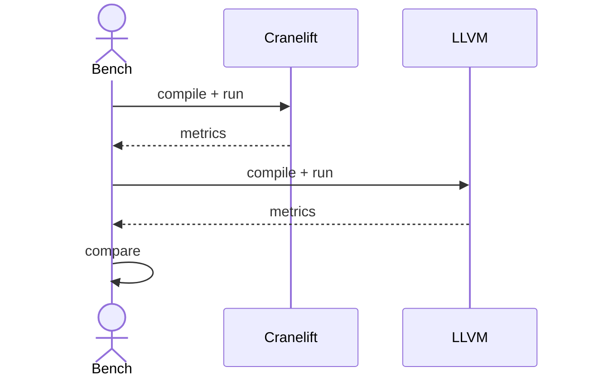

# LLVM Codegen

Alternate backend (1031 LOC) targeting LLVM IR via `inkwell`.
Cranelift (per `cranelift.md`) is the primary backend; LLVM is kept as
an experimental option for benchmarking and as a future hook for
heavier optimizations (LTO, cross-fn inlining).

LLVM is feature-gated. The default `cargo build` uses Cranelift only;
LLVM is enabled via `--features llvm` when needed for comparison.

Three load-bearing invariants:

1. **LLVM is non-default and feature-gated** — most contributors and
   conformance tests run on Cranelift. LLVM-only regressions are
   tolerated lower-priority. The standardized invariants in
   `cranelift.md` (NaN-box pack/unpack, ABI, checked-arith inline)
   apply identically in LLVM where supported.
2. **LLVM IR for `CheckedAdd` uses `llvm.sadd.with.overflow.i64`** —
   the equivalent of Cranelift's `iadd_overflow`. The slow-path call
   to `bigint_from_i128` is the same.
3. **LLVM mode is currently AOT-only** — JIT-via-LLVM (MCJIT /
   ORCJit) is not wired today. Enabling it would need W^X + symbol
   resolution similar to the Cranelift path.

## Type model
<!-- type: dependency lang: mermaid -->



## Output shape
<!-- type: schema lang: yaml -->

```yaml
$schema: "https://json-schema.org/draft/2020-12/schema"
$id: "llvm-types"
$defs:
  LlvmOutput:
    type: object
    properties:
      bitcode:        { type: array, items: { type: integer, minimum: 0, maximum: 255 } }
      target:         { type: string, description: "target triple" }
      optimization:   { type: string, enum: [O0, O1, O2, O3] }
    required: [bitcode, target, optimization]
  MirToLlvmRule:
    description: "MirInst → LLVM IR mapping"
    type: array
    items:
      type: object
      properties:
        mir_inst:    { type: string }
        llvm_emit:   { type: string }
      required: [mir_inst, llvm_emit]
    examples:
      - - { mir_inst: BinOp Add Int, llvm_emit: "add i64" }
        - { mir_inst: CheckedAdd,    llvm_emit: "call llvm.sadd.with.overflow.i64; extractvalue 1; br to slow path" }
        - { mir_inst: LoadConst Int, llvm_emit: "i64 const" }
        - { mir_inst: Call,          llvm_emit: "call sym(args)" }
        - { mir_inst: GetAttr,       llvm_emit: "call mb_getattr" }
```

## Compile logic
<!-- type: logic lang: mermaid -->



## Backend-comparison interaction
<!-- type: interaction lang: mermaid -->



## Acceptance scenarios
<!-- type: scenarios lang: yaml -->

```yaml
scenarios:
  - id: llvm-feature-build
    given: the llvm feature is enabled
    when: `cargo build -p mamba --features llvm` runs
    then: the build succeeds and the LLVM backend is available
  - id: llvm-aot-build
    given: hello.py is compiled with `mamba build --backend llvm`
    when: the LLVM backend emits output
    then: it produces bitcode and a linkable object path
```

## Tests
<!-- type: tests lang: yaml -->

```yaml
runner: "cargo test -p mamba --features llvm --test runtime_tests --release -- {name} --test-threads=1"
fixtures:
  - id: llvm_hello
    name: "test_llvm_compile_hello"
    description: "LLVM backend produces valid bitcode for hello.py"
  - id: llvm_checked_add
    name: "test_llvm_checked_add"
    description: "CheckedAdd lowers via llvm.sadd.with.overflow.i64"
```

## Changes
<!-- type: changes lang: yaml -->

```yaml
changes:
  - file: crates/mamba/src/codegen/llvm.rs
    action: modify
    impl_mode: hand-written
    description: "LLVM backend via inkwell — feature-gated, AOT-only today. Hand-written; mirrors cranelift.md invariants where supported."
```
