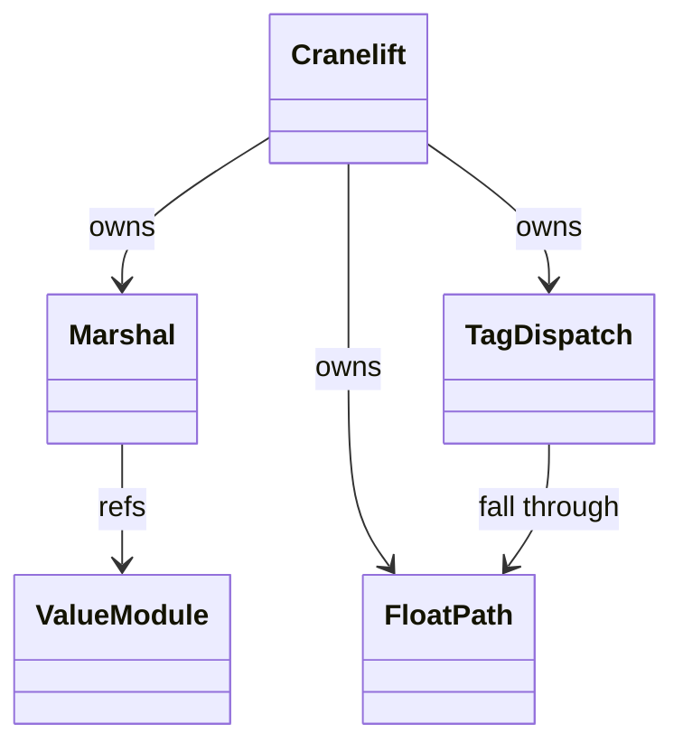
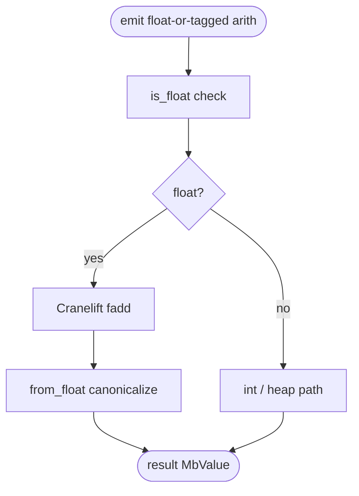
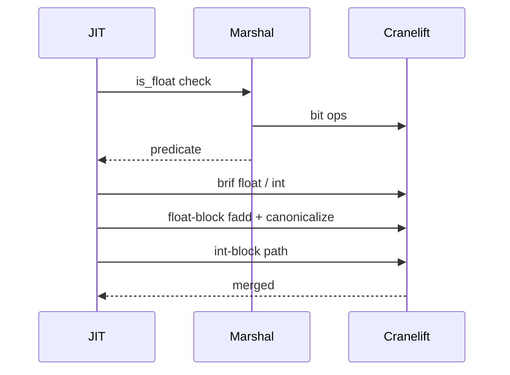

# NaN-Boxing Float Path

NaN-boxed `MbValue` (per `value-and-rc.md`) packs floats as plain
IEEE 754 doubles when they are NOT one of our tagged NaN patterns.
This sub-spec records the codegen-side considerations: how the JIT
emits float arithmetic without accidentally producing one of our tag
patterns, and how unpacking distinguishes float from tagged values.

Three load-bearing invariants:

1. **Canonical NaN passes through the float branch** — `f64::NAN` has
   bit pattern `0x7FF8000000000000`. Our tag prefix is
   `0xFFF8000000000000`. The MSB (sign bit) being 0 vs 1 distinguishes
   them. `is_float` checks `(bits & NAN_PREFIX) != NAN_PREFIX OR bits == canonical NaN.bits`.
2. **Float results never collide with tagged values** — IEEE 754
   arithmetic on finite doubles produces finite doubles or NaN; none
   match our tag prefix bit pattern except canonical NaN, which is
   handled. Adding a new tag would require auditing this.
3. **`from_float` canonicalizes any NaN that overlaps the prefix** —
   a stray `f64::from_bits(NAN_PREFIX | data)` could be mistaken for
   a tagged value; `from_float` checks and rewrites to canonical NaN.
   Skipping this lets a maliciously-constructed float spoof a tag.

## Type model
<!-- type: dependency lang: mermaid -->



## NaN-box layout shape
<!-- type: schema lang: yaml -->

```yaml
$schema: "https://json-schema.org/draft/2020-12/schema"
$id: "nan-float-types"
$defs:
  TagSlot:
    description: "Bits 48..50 within the NaN payload — 3-bit tag space"
    type: object
    properties:
      width: { type: integer, const: 3 }
      values:
        type: object
        additionalProperties: { type: string }
        examples:
          - { "0": PTR, "1": INT, "2": BOOL, "3": NONE, "4": FUNC, "5": NOTIMPLEMENTED }
  FloatVsTagged:
    description: "How the JIT distinguishes float from tagged"
    type: array
    items:
      type: object
      properties:
        bits_pattern: { type: string }
        kind:         { type: string, enum: [Float, TaggedValue] }
      required: [bits_pattern, kind]
    examples:
      - - { bits_pattern: "anything not matching NAN_PREFIX",       kind: Float }
        - { bits_pattern: "NAN_PREFIX | tag(48..50) | payload(48b)", kind: TaggedValue }
        - { bits_pattern: "f64::NAN.to_bits() (0x7FF800...)",       kind: Float, description: "canonical NaN — sign bit 0" }
```

## Float-path emit logic
<!-- type: logic lang: mermaid -->



## Float arith interaction
<!-- type: interaction lang: mermaid -->



## Acceptance scenarios
<!-- type: scenarios lang: yaml -->

```yaml
scenarios:
  - id: nan-not-equal-self
    given: float_methods/special_values.py evaluates `x = float('nan'); x == x`
    when: codegen routes canonical NaN through the float branch
    then: IEEE 754 comparison returns false
  - id: mixed-int-float
    given: arithmetic/mixed_int_float.py evaluates `1 + 2.0`
    when: tag dispatch selects the float block
    then: the int operand promotes to f64 and the result is 3.0
  - id: infinity-pass-through
    given: language/nan_inf.py evaluates positive and negative infinity values
    when: from_float packs the results
    then: infinity bit patterns pass through without NaN-prefix canonicalization
```

## Tests
<!-- type: tests lang: yaml -->

```yaml
runner: "cargo test -p mamba --test conformance_tests --release -- {name} --test-threads=1"
fixtures:
  - id: nan_neq_self
    name: "float_methods/special_values.py"
    paired: "float_methods/special_values.expected"
    verifies: ["NaN != NaN; canonical NaN through float branch"]
  - id: int_plus_float
    name: "arithmetic/mixed_int_float.py"
    paired: "arithmetic/mixed_int_float.expected"
    verifies: ["int + float promote to f64; tag dispatch correct"]
  - id: inf_arith
    name: "language/nan_inf.py"
    paired: "language/nan_inf.expected"
    verifies: ["Inf passes; arithmetic with Inf yields IEEE results"]
```

## Changes
<!-- type: changes lang: yaml -->

```yaml
changes:
  - file: crates/mamba/src/codegen/cranelift/marshal.rs
    action: modify
    impl_mode: hand-written
    description: "is_float / from_float / NaN-canonicalization helpers; emit Cranelift bit ops for tag dispatch. Hand-written; bit-pattern invariants are platform-independent ABI."
```
