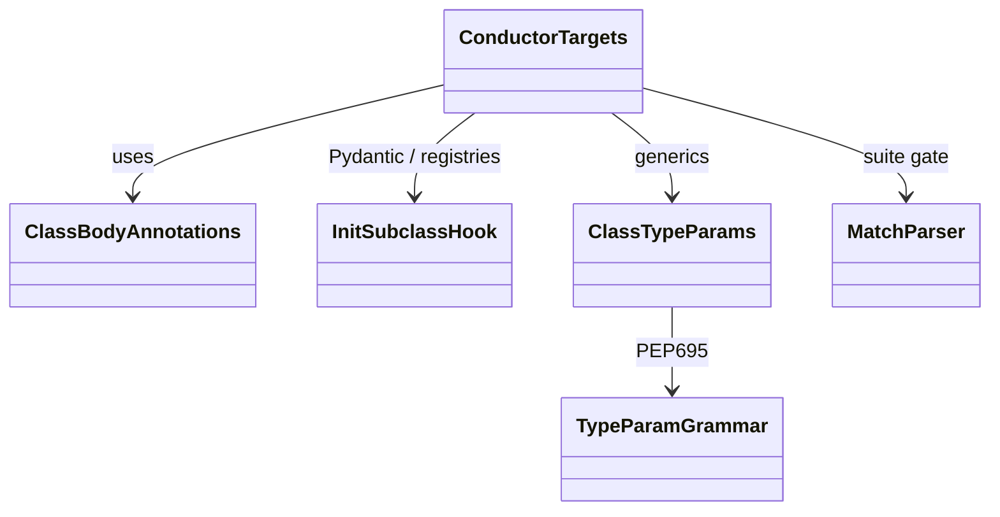
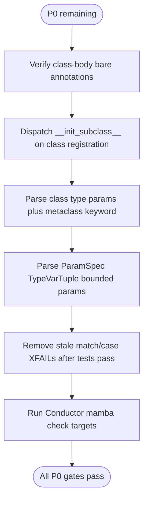
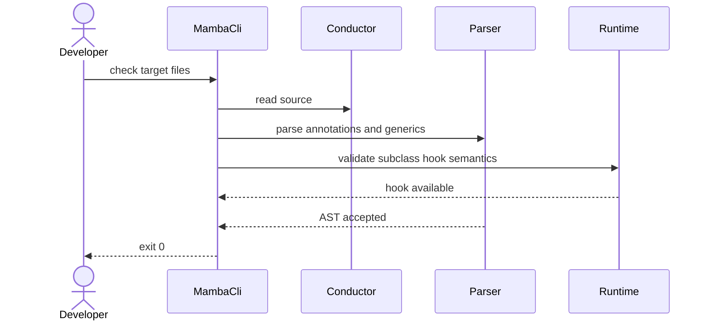

# Conductor Mamba P0 Remaining

This spec captures the remaining Mamba parser and runtime blockers before
Conductor can migrate to the Mamba engine. The prior P0 spec shipped import
aliases, relative imports, dict unpacking, and advanced f-strings. This follow-up
focuses on class-body annotations, subclass hooks, PEP 695 syntax combinations,
match/case XFAIL cleanup, and direct Conductor file checks.

## Requirements

```mermaid
---
id: conductor-mamba-p0-remaining-requirements
title: Conductor Mamba P0 Remaining Requirements
requirements:
  R1:
    text: Bare type annotations parse and compile end-to-end in class bodies.
    type: functionalRequirement
    risk: Medium
    verification: Test
  R2:
    text: __init_subclass__ hook fires for direct base classes during class registration.
    type: functionalRequirement
    risk: High
    verification: Test
  R3:
    text: Class syntax supports PEP 695 type parameters combined with class keyword arguments.
    type: functionalRequirement
    risk: Medium
    verification: Test
  R4:
    text: PEP 695 type aliases and generic functions support ParamSpec, TypeVarTuple, and bounded parameters.
    type: functionalRequirement
    risk: Medium
    verification: Test
  R5:
    text: Stale match/case XFAIL annotations are removed only after parser tests pass.
    type: functionalRequirement
    risk: Low
    verification: Test
  R6:
    text: Conductor settings.py, models.py, and agent.py compile under cclab mamba check.
    type: functionalRequirement
    risk: High
    verification: Test
elements:
  parser_stmt_compound:
    text: parse_class and parse_match implementation
    type: module
    docref: crates/mamba/src/parser/stmt_compound.rs
  parser_type_expr:
    text: PEP 695 type parameter grammar
    type: module
    docref: crates/mamba/src/parser/type_expr.rs
  runtime_class:
    text: mb_class_register subclass hook dispatch
    type: module
    docref: crates/mamba/src/runtime/class.rs
  conductor_check:
    text: Conductor backend file compilation checks
    type: test
    docref: projects/conductor/be/src/
relationships:
  - { from: parser_stmt_compound, to: R1, type: satisfies }
  - { from: runtime_class, to: R2, type: satisfies }
  - { from: parser_stmt_compound, to: R3, type: satisfies }
  - { from: parser_type_expr, to: R4, type: satisfies }
  - { from: parser_stmt_compound, to: R5, type: satisfies }
  - { from: conductor_check, to: R6, type: verifies }
  - { from: R6, to: R1, type: derives }
  - { from: R6, to: R2, type: derives }
  - { from: R6, to: R3, type: derives }
  - { from: R6, to: R4, type: derives }
  - { from: R6, to: R5, type: derives }
---
requirementDiagram
    accDirection TB
    functionalRequirement R1 {
        id: "R1"
        text: "Bare type annotations parse and compile end-to-end in class bodies"
        risk: Medium
        verifymethod: Test
    }
    functionalRequirement R2 {
        id: "R2"
        text: "__init_subclass__ hook fires during class registration"
        risk: High
        verifymethod: Test
    }
    functionalRequirement R3 {
        id: "R3"
        text: "PEP 695 class type parameters combine with class keyword arguments"
        risk: Medium
        verifymethod: Test
    }
    functionalRequirement R4 {
        id: "R4"
        text: "PEP 695 ParamSpec TypeVarTuple and bounded parameters parse"
        risk: Medium
        verifymethod: Test
    }
    functionalRequirement R5 {
        id: "R5"
        text: "Match case XFAIL annotations removed after passing parser tests"
        risk: Low
        verifymethod: Test
    }
    functionalRequirement R6 {
        id: "R6"
        text: "Conductor backend target files compile under cclab mamba check"
        risk: High
        verifymethod: Test
    }
    element parser_stmt_compound {
        type: "module"
        docref: "crates/mamba/src/parser/stmt_compound.rs"
    }
    element parser_type_expr {
        type: "module"
        docref: "crates/mamba/src/parser/type_expr.rs"
    }
    element runtime_class {
        type: "module"
        docref: "crates/mamba/src/runtime/class.rs"
    }
    element conductor_check {
        type: "test"
        docref: "projects/conductor/be/src/"
    }
    parser_stmt_compound - satisfies -> R1
    runtime_class - satisfies -> R2
    parser_stmt_compound - satisfies -> R3
    parser_type_expr - satisfies -> R4
    parser_stmt_compound - satisfies -> R5
    conductor_check - verifies -> R6
    R6 - derives -> R1
    R6 - derives -> R2
    R6 - derives -> R3
    R6 - derives -> R4
    R6 - derives -> R5
```

<!-- type: requirements lang: mermaid -->



## Dependency Model
<!-- type: dependency lang: mermaid -->



## Delivery Logic
<!-- type: logic lang: mermaid -->



## Conductor Check Interaction
<!-- type: interaction lang: mermaid -->



## Acceptance Scenarios
<!-- type: scenarios lang: yaml -->

```yaml
scenarios:
  - id: bare-annotation-class
    given: class Point defines x and y as bare float annotations
    when: the class compiles through parse, HIR, type-check, and codegen
    then: no error is emitted and the Point section of cpython_compat classes passes
  - id: init-subclass-hook
    given: Base.__init_subclass__ appends the subclass name to a registry
    when: class Child(Base) is registered
    then: the hook receives cls=Child and the registry contains Child
  - id: class-type-params-with-metaclass
    given: class MyClass[T](metaclass=Meta) and Concrete[T: int](list[T], metaclass=Meta)
    when: parser tests run
    then: both class definitions produce valid AST and generic_class_keywords has no XFAIL
  - id: pep695-param-kinds
    given: type Callback[**P], type Shape[*Ts], and bounded generic function parameters
    when: PEP 695 parser tests run
    then: ParamSpecParam, TypeVarTupleParam, and bounded parameter nodes are represented
  - id: match-xfail-cleanup
    given: match_basic, match_sequence, match_mapping, and match_class fixtures
    when: their stale XFAIL comments are removed
    then: each parser test passes with no xfail log line
  - id: conductor-targets
    given: settings.py, database/models.py, and agents/llm/agent.py in Conductor
    when: cclab mamba check runs on each file
    then: all three commands exit 0
```

## Test Plan

```mermaid
---
id: conductor-mamba-p0-remaining-test-plan
title: Conductor Mamba P0 Remaining Test Plan
---
flowchart TD
    Runner["Verification commands"]
    Runner --> T1["cargo test -p mamba -- cpython_compat test_grammar/classes"]
    Runner --> T2["cargo test -p mamba -- jit::init_subclass_basic"]
    Runner --> T3["cargo test -p mamba -- cpython_compat test_grammar/generic_class_keywords"]
    Runner --> T4["cargo test -p mamba -- cpython_compat test_grammar/type_alias_complex"]
    Runner --> T5["cargo test -p mamba -- cpython_compat test_grammar/type_params_pep695"]
    Runner --> T6["cargo test -p mamba -- cpython_compat test_match/match_basic"]
    Runner --> T7["cargo test -p mamba -- cpython_compat test_match/match_sequence"]
    Runner --> T8["cargo test -p mamba -- cpython_compat test_match/match_mapping"]
    Runner --> T9["cargo test -p mamba -- cpython_compat test_match/match_class"]
    Runner --> T10["cclab mamba check projects/conductor/be/src/config/settings.py"]
    Runner --> T11["cclab mamba check projects/conductor/be/src/database/models.py"]
    Runner --> T12["cclab mamba check projects/conductor/be/src/agents/llm/agent.py"]
    Runner --> T13["cargo test -p mamba"]
```

<!-- type: test-plan lang: mermaid -->



## Changes
<!-- type: changes lang: yaml -->

```yaml
changes:
  - file: crates/mamba/src/runtime/class.rs
    action: modify
    impl_mode: hand-written
    description: Dispatch __init_subclass__ on direct base classes during class registration.
  - file: crates/mamba/src/parser/stmt_compound.rs
    action: modify
    impl_mode: hand-written
    description: Accept class type parameters combined with class keyword arguments and verify existing match parser coverage.
  - file: crates/mamba/src/parser/type_expr.rs
    action: modify
    impl_mode: hand-written
    description: Support PEP 695 ParamSpec, TypeVarTuple, and bounded type parameters.
  - file: crates/mamba/tests/fixtures/cpython/test_match/match_basic.py
    action: modify
    impl_mode: hand-written
    description: Remove stale XFAIL only after the parser test passes.
  - file: crates/mamba/tests/fixtures/cpython/test_match/match_sequence.py
    action: modify
    impl_mode: hand-written
    description: Remove stale XFAIL only after the parser test passes.
  - file: crates/mamba/tests/fixtures/cpython/test_match/match_mapping.py
    action: modify
    impl_mode: hand-written
    description: Remove stale XFAIL only after the parser test passes.
  - file: crates/mamba/tests/fixtures/cpython/test_match/match_class.py
    action: modify
    impl_mode: hand-written
    description: Remove stale XFAIL only after the parser test passes.
```
