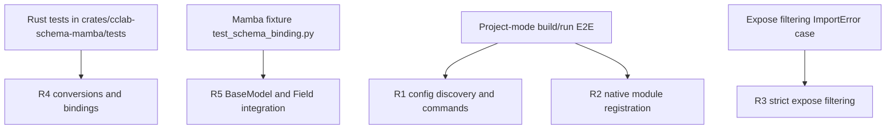

# Conductor Mamba P1 Core Spec

## Overview
<!-- type: overview lang: markdown -->

This specification outlines the integration of Mamba with external Rust crates. It details the steps to wire `[crates]` configurations into the Mamba compiler driver, enabling native Rust modules to be seamlessly imported and utilized within Mamba scripts. Additionally, it defines the implementation of `cclab-schema-mamba` as the primary prototype binding crate. This change supports project-mode builds, configuration discovery via `mamba.toml`, and runtime type conversions between Mamba and Rust types, ultimately bringing powerful, strictly typed Rust extensions to the Mamba language.
## Requirements
<!-- type: requirements lang: mermaid -->

```mermaid
---
id: conductor-mamba-p1-core-requirements
requirements:
  R1:
    text: "Mamba compiler driver discovers mamba.toml, loads MambaConfig, parses entry_point, and exposes project-mode build/run commands."
    type: functionalRequirement
    risk: High
    verification: Test
  R2:
    text: "Native modules from MAMBA_MODULES are registered, injected into Cranelift JIT symbols, and fall back gracefully when mamba.toml is absent."
    type: functionalRequirement
    risk: High
    verification: Test
  R3:
    text: "Import resolution enforces expose filtering at compile time and raises ImportError for hidden native symbols."
    type: functionalRequirement
    risk: High
    verification: Test
  R4:
    text: "cclab-schema-mamba provides the prototype binding crate with MambaModule registration, conversions, and mb_schema_* methods."
    type: functionalRequirement
    risk: Medium
    verification: Test
  R5:
    text: "BaseModel and Field integrate through native objects, __init_subclass__, and a kwargs dictionary ABI."
    type: functionalRequirement
    risk: Medium
    verification: Test
---
requirementDiagram
  requirement R1
  requirement R2
  requirement R3
  requirement R4
  requirement R5
```
## Scenarios
<!-- type: scenarios lang: yaml -->

```yaml
scenarios:
  - id: native-crate-run
    given: a directory contains mamba.toml with `[crates]` specifying cclab-schema-mamba
    and: main.py imports BaseModel from cclab_schema_mamba and defines a user class
    when: the user executes `cclab mamba run` in that directory
    then: the driver discovers mamba.toml, registers cclab-schema-mamba, injects its symbols into Cranelift, and executes the script
  - id: explicit-config-build
    given: a Mamba project has a custom configuration file custom-mamba.toml
    when: the user executes `cclab mamba build --config custom-mamba.toml`
    then: the driver uses the explicit config, registers its crates, and produces the artifact for entry_point
  - id: single-file-fallback
    given: a directory has no mamba.toml
    when: the user executes `cclab mamba run script.py`
    then: the driver falls back to single-file mode without crate wiring
  - id: expose-filtering-violation
    given: a native crate is configured with an expose list
    when: a Mamba script imports a Rust symbol outside that expose list
    then: import resolution raises a compile-time ImportError for the hidden symbol
  - id: schema-validation
    given: a `class UserCreate(BaseModel)` definition uses `Field(min_length=3, default="test")`
    when: a Mamba script instantiates UserCreate with invalid data
    then: mb_schema_validate raises a precise validation error matching the field constraints
```
## Diagrams
<!-- type: doc lang: markdown -->

### Interaction
<!-- type: interaction lang: mermaid -->
<!-- score-td-placeholder -->

### Logic
<!-- type: logic lang: mermaid -->
<!-- score-td-placeholder -->

### Dependencies
<!-- type: dependency lang: mermaid -->
<!-- score-td-placeholder -->

### State Machine
<!-- type: state-machine lang: mermaid -->
<!-- score-td-placeholder -->

### Data Model
<!-- type: db-model lang: mermaid -->
<!-- score-td-placeholder -->

## API Spec
<!-- type: doc lang: markdown -->

### REST API
<!-- type: rest-api lang: yaml -->
<!-- score-td-placeholder -->

### RPC API
<!-- type: rpc-api lang: yaml -->
<!-- score-td-placeholder -->

### Async API
<!-- type: async-api lang: yaml -->
<!-- score-td-placeholder -->

### CLI
<!-- type: cli lang: yaml -->
<!-- score-td-placeholder -->

### Schema
<!-- type: schema lang: yaml -->
<!-- score-td-placeholder -->

### Config
<!-- type: config lang: yaml -->
<!-- score-td-placeholder -->

## Test Plan
<!-- type: test-plan lang: mermaid -->


## Changes
<!-- type: changes lang: yaml -->

```yaml
- action: modify
  file: crates/mamba/src/compiler/driver.rs
  description: Update driver to discover `mamba.toml`, read `[crates]`, invoke `register_external_modules()`, and inject symbols into Cranelift JIT. Enforce expose filtering.

- action: modify
  file: crates/mamba/src/cli/mod.rs
  description: Add new subcommands `build` and `run` to support project-mode, using `MambaConfig`.

- action: modify
  file: crates/mamba/src/cli/build.rs
  description: Implement project-mode build command to read `mamba.toml` and `entry_point`.

- action: modify
  file: crates/mamba/src/cli/run.rs
  description: Implement project-mode run command.

- action: create
  file: crates/cclab-schema-mamba/Cargo.toml
  description: Setup the new binding crate with appropriate dependencies, including `cclab-mamba-registry`.

- action: create
  file: crates/cclab-schema-mamba/src/lib.rs
  description: Implement `MambaModule` and `distributed_slice` registration for the crate.

- action: create
  file: crates/cclab-schema-mamba/src/types.rs
  description: Add conversions between `MbValue` and schema types (`FromMbValue`, `IntoMbValue`).

- action: create
  file: crates/cclab-schema-mamba/src/methods.rs
  description: Expose FFI methods: `mb_schema_base_model_new`, `mb_schema_field`, `mb_schema_validate`, `mb_schema_field_validator`, `mb_schema_to_json_schema`.

- action: create
  file: crates/cclab-schema-mamba/tests/test_binding.rs
  description: Rust-level unit integration tests for `cclab-schema-mamba`.

- action: create
  file: crates/mamba/tests/fixtures/test_schema_binding.py
  description: Python fixture for end-to-end integration proof.
```
## Wireframe
<!-- type: wireframe lang: yaml -->

```yaml
wireframe: {}
```

## Component
<!-- type: component lang: yaml -->

```yaml
component: {}
```

## Design Token
<!-- type: design-token lang: yaml -->

```yaml
tokens: {}
```

## Doc
<!-- type: doc lang: markdown -->

<!-- TODO -->
