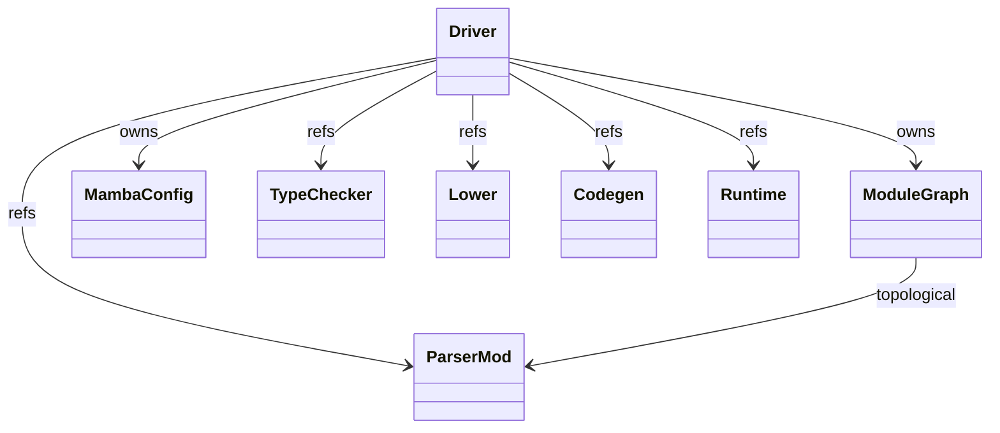
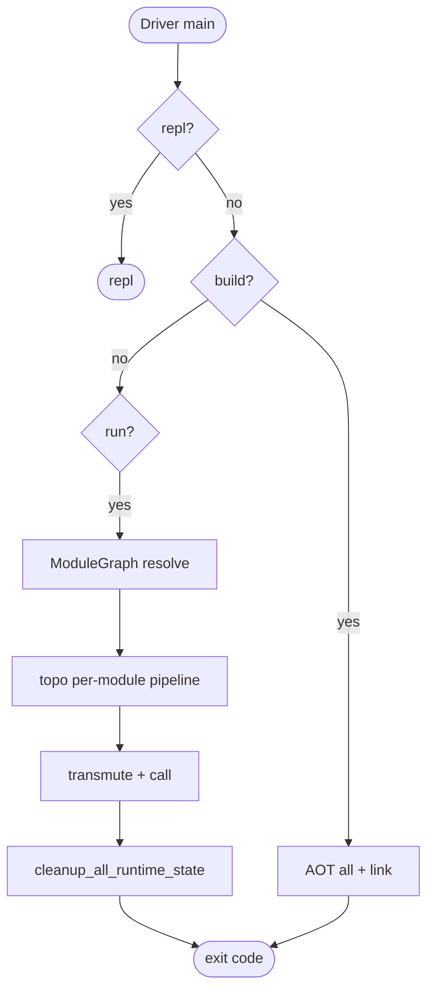
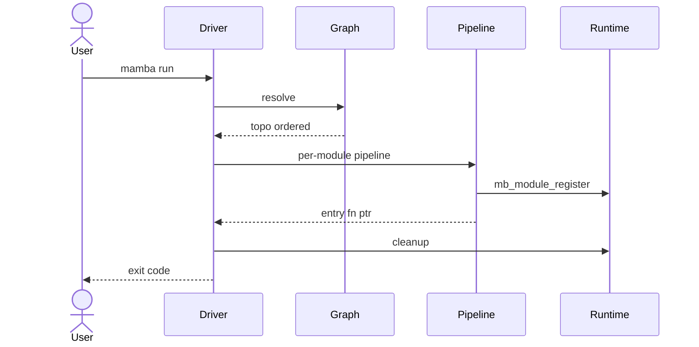
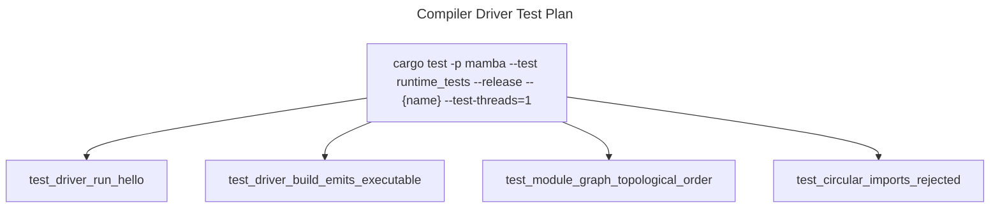

# Compiler Driver

`driver/mod.rs` (881 LOC) is the top-level orchestrator — wires
parser, lower, type-check, codegen, JIT, and runtime into a single
pipeline. `module_graph.rs` (614 LOC) tracks dependency edges between
imported modules so re-compilation only touches what changed.
`config.rs` (274 LOC) defines `MambaConfig` (driver options:
target backend, optimization level, search paths).

Three load-bearing invariants:

1. **`MambaConfig` is unified between driver and schema layers** —
   commit `1ba891cc4` (#1134) merged the previously-dual `driver/config.rs`
   and `config/schema.rs` into one canonical type. Future config
   additions go in this one place.
2. **Module graph cycles are detected and rejected at parse time** —
   import cycles raise `ImportError`; downstream compilation paths
   assume DAG ordering. The graph also drives incremental rebuild
   ordering.
3. **The driver is the only place that creates `CraneliftJitBackend`
   instances for top-level modules** — module dependencies route
   their JIT-backends through `runtime/module::MODULE_JIT_BACKENDS`
   (per `module.md`) but the entry-point backend is owned by the
   driver until execution completes.

## Type model
<!-- type: dependency lang: mermaid -->



## Driver shape
<!-- type: schema lang: yaml -->

```yaml
$schema: "https://json-schema.org/draft/2020-12/schema"
$id: "driver-types"
$defs:
  MambaConfig:
    type: object
    x-rust-type: MambaConfig
    properties:
      target:        { type: string, description: "e.g. aarch64-apple-darwin / x86_64-unknown-linux-gnu" }
      backend:       { type: string, enum: [cranelift, llvm] }
      opt_level:     { type: string, enum: [O0, O1, O2, O3] }
      search_paths:  { type: array, items: { type: string } }
      script_dir:
        oneOf:
          - { type: "null" }
          - { type: string }
      output_path:
        oneOf:
          - { type: "null" }
          - { type: string }
      mode:          { type: string, enum: [run, build, repl, test] }
    required: [target, backend, opt_level, search_paths, script_dir, output_path, mode]
  ModuleNode:
    type: object
    properties:
      name:          { type: string }
      file:          { type: string }
      imports:       { type: array, items: { type: string } }
      hash:          { type: string, description: "content hash for change detection" }
      compiled:      { type: boolean }
    required: [name, file, imports, hash, compiled]
```

## Run / build dispatch logic
<!-- type: logic lang: mermaid -->



## Run interaction
<!-- type: interaction lang: mermaid -->



## Acceptance scenarios
<!-- type: scenarios lang: yaml -->
```yaml
scenarios:
  - id: run-hello
    given: hello.py prints hello
    when: mamba run hello.py is executed
    then: the driver runs the pipeline and returns stdout hello
  - id: build-executable
    given: hello.py is a valid entry module
    when: mamba build hello.py -o hello is executed
    then: the driver emits an executable at the requested output path
  - id: module-topology
    given: pkg/main.py imports submodules
    when: mamba run pkg/main.py is executed
    then: ModuleGraph resolves topological order and compiles dependencies before main
  - id: circular-imports
    given: circular_imports.py contains a module import cycle
    when: the driver resolves the module graph
    then: it rejects the graph with an ImportError before downstream compilation
```

## Tests
<!-- type: test-plan lang: mermaid -->


## Changes
<!-- type: changes lang: yaml -->

```yaml
changes:
  - file: crates/mamba/src/driver/mod.rs
    action: modify
    impl_mode: hand-written
    description: "Driver entry — run / build / repl / test dispatch; pipeline orchestration. Hand-written."
  - file: crates/mamba/src/driver/module_graph.rs
    action: modify
    impl_mode: hand-written
    description: "Import-graph DAG; topological ordering; cycle detection; content-hash change tracking. Hand-written."
  - file: crates/mamba/src/driver/config.rs
    action: modify
    impl_mode: hand-written
    description: "MambaConfig — unified per #1134 commit 1ba891cc4. Hand-written."
```
