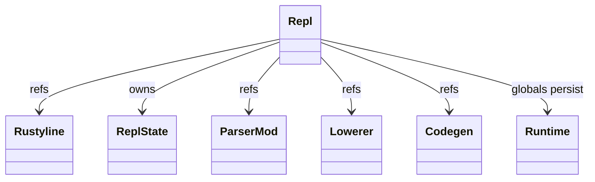
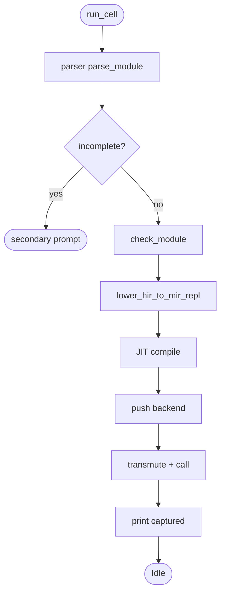
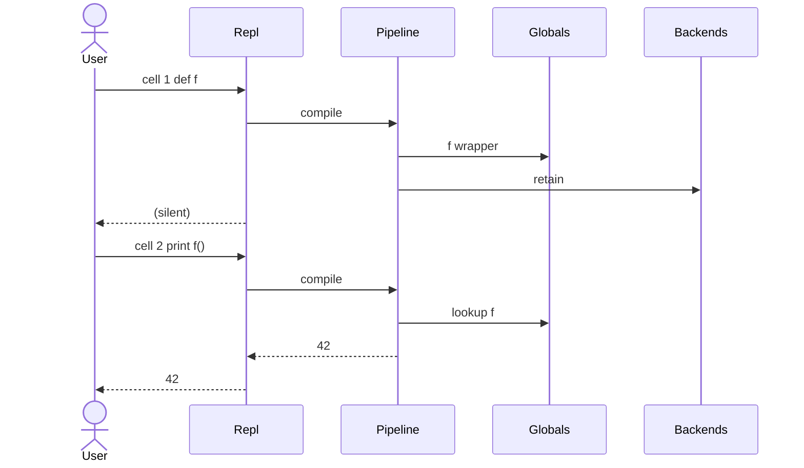
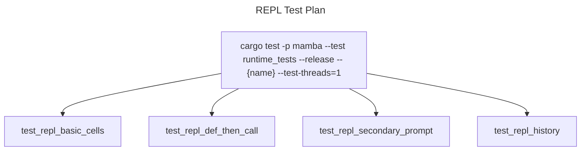

# REPL

`driver/repl.rs` (445 LOC) implements the `mamba` interactive shell.
Each input cell is parsed as a partial module, lowered through the
same pipeline as `mamba run`, JIT-compiled, and executed. Definitions
persist across cells via `runtime/closure::GLOBAL_BY_ID` and
`runtime/module::MODULES`.

Commit `f383369e0` (#838) added `rustyline` for proper readline
support — line editing, history, `Ctrl-R` search.

Three load-bearing invariants:

1. **REPL state is module-shaped** — each cell looks like a top-level
   `Module.stmts` to the rest of the pipeline. Function and class
   definitions register into the persistent module namespace; later
   cells can reference them by ordinary name lookup.
2. **JIT backends per cell are retained in `MODULE_JIT_BACKENDS`** —
   cell N defines `def f(): ...`; cell N+1 calls `f()`. The fn pointer
   from cell N's JIT compile must outlive cell N's frame, so the
   backend is pushed into the global retention vector (per `module.md`).
3. **`__main__` is the cell namespace** — bare assignments and
   imports go into `__main__` like a normal Python script. This
   matches CPython's REPL semantics.

## Type model
<!-- type: dependency lang: mermaid -->



## REPL state shape
<!-- type: schema lang: yaml -->

```yaml
$schema: "https://json-schema.org/draft/2020-12/schema"
$id: "repl-types"
$defs:
  ReplState:
    type: object
    properties:
      history:        { type: array, items: { type: string }, description: "rustyline history buffer" }
      cell_index:     { type: integer, minimum: 0 }
      module_name:    { type: string, const: __main__ }
      jit_backends:
        type: array
        items: { x-rust-type: "Box<CraneliftJitBackend>" }
        description: "retained per cell"
    required: [history, cell_index, module_name, jit_backends]
```

## REPL session lifecycle

```mermaid
---
id: repl-session
initial: Idle
nodes:
  Idle:        { kind: initial, label: "rustyline waiting for input" }
  Reading:     { kind: normal,  label: "consuming multi-line cell" }
  Parsing:     { kind: normal,  label: "parser attempts module parse" }
  Compiling:   { kind: normal,  label: "lower + codegen + JIT compile" }
  Executing:   { kind: normal,  label: "transmute + call entry fn" }
  Printing:    { kind: normal,  label: "captured stdout + last expr value" }
  Exiting:     { kind: terminal, label: "EOF / quit; cleanup_all_runtime_state" }
edges:
  - { from: Idle,      to: Reading,   event: "first character of cell" }
  - { from: Reading,   to: Reading,   event: "indented line continuation" }
  - { from: Reading,   to: Parsing,   event: "blank line / EOF marks cell end" }
  - { from: Parsing,   to: Compiling, event: "parse ok" }
  - { from: Parsing,   to: Idle,      event: "syntax error; print + reset" }
  - { from: Compiling, to: Executing }
  - { from: Compiling, to: Idle,      event: "type error; print + reset" }
  - { from: Executing, to: Printing }
  - { from: Executing, to: Idle,      event: "runtime exception; print traceback" }
  - { from: Printing,  to: Idle }
  - { from: Idle,      to: Exiting,   event: "Ctrl-D / quit()" }
---
stateDiagram-v2
    [*] --> Idle
    Idle --> Reading: input
    Reading --> Reading: continuation
    Reading --> Parsing: cell end
    Parsing --> Compiling: ok
    Parsing --> Idle: syntax error
    Compiling --> Executing
    Compiling --> Idle: type error
    Executing --> Printing
    Executing --> Idle: runtime exception
    Printing --> Idle
    Idle --> Exiting: EOF
    Exiting --> [*]
```

<!-- type: state-machine lang: mermaid -->



## Cell pipeline logic
<!-- type: logic lang: mermaid -->



## Cell-to-cell interaction
<!-- type: interaction lang: mermaid -->



## Acceptance scenarios
<!-- type: scenarios lang: yaml -->
```yaml
scenarios:
  - id: repl-start
    given: the user starts mamba without a script
    when: the REPL initializes
    then: it displays the primary prompt and waits for input
  - id: persistent-variable
    given: a prior cell assigns x = 1
    when: a later cell evaluates x + 1
    then: the REPL prints 2 using the persistent __main__ namespace
  - id: persistent-function
    given: a prior cell defines def f(): return 42
    when: a later cell evaluates f()
    then: the retained JIT backend and globals allow the call to return 42
  - id: repl-exit
    given: the REPL is idle
    when: the user sends Ctrl-D or quit()
    then: it exits and runs cleanup_all_runtime_state
```

## Tests
<!-- type: test-plan lang: mermaid -->


## Changes
<!-- type: changes lang: yaml -->

```yaml
changes:
  - file: crates/mamba/src/driver/repl.rs
    action: modify
    impl_mode: hand-written
    description: "Repl entry + ReplState + cell pipeline + rustyline integration. Hand-written; cross-cell namespace persistence is the contract."
```
