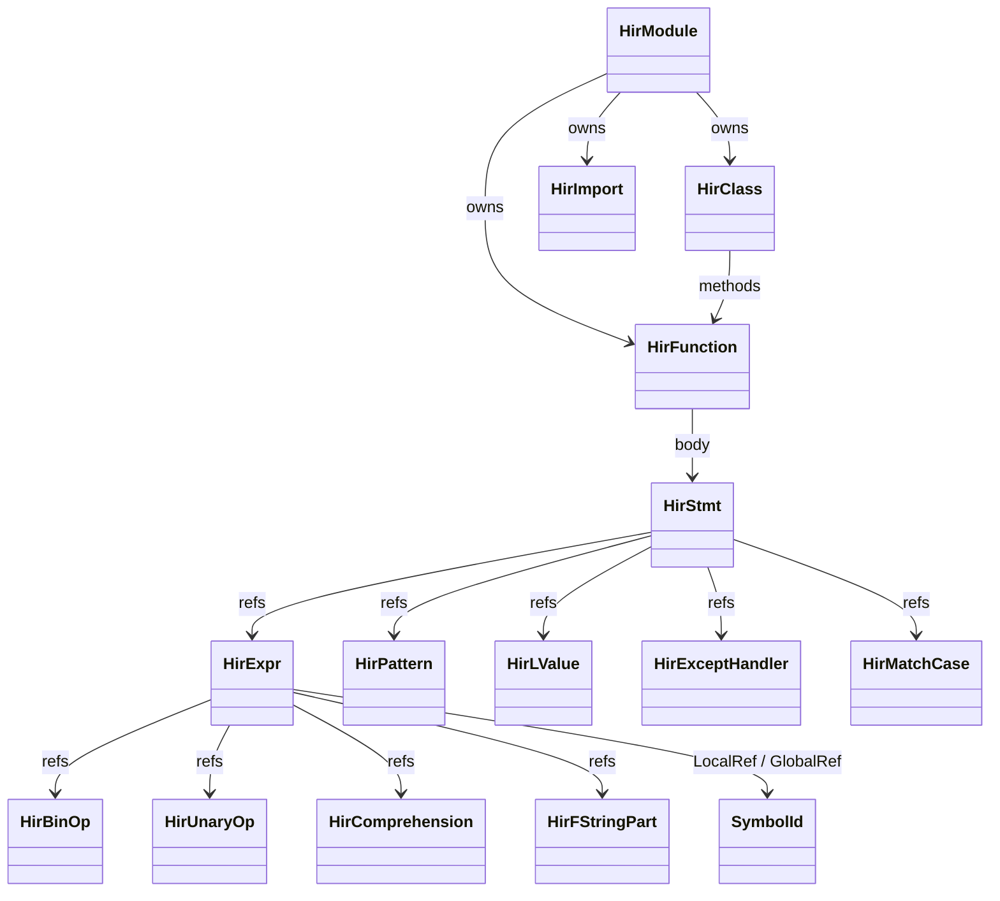
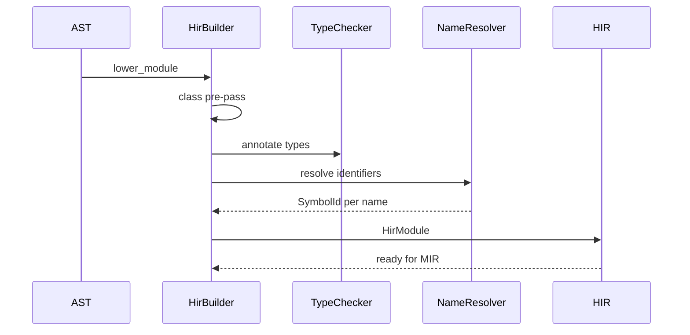
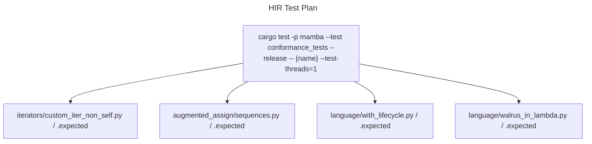

# HIR — High-level Intermediate Representation

The HIR sits between the parse-time AST and the MIR control-flow graph.
It is **post-desugaring**: AST forms like `for-else`, `with`, walrus,
augmented assignment, decorator chain, and starred unpacking are
rewritten into smaller primitive nodes. Names are also resolved at HIR
construction time — every `HirExpr::LocalRef` carries a `SymbolId`
rather than a string, and `HirImport` records the resolved module.

Three load-bearing invariants:

1. **HIR is desugar-stable** — what you see in HIR is what the JIT
   actually emits. If a parser feature lowers to two HIR nodes, then
   the IR-level analyses must consider both. Memory note
   `project_sdd_hir_lower_pair_misframing.md` tracks an open issue
   where the HIR + lower pair-spec describes the *post-desugared* IR
   while the code keeps syntactic variants — a frame mismatch the
   spec audit must reconcile.
2. **`HirFunction.body: Vec<HirStmt>` is the unit the lowerer walks**
   — every function (top-level, method, lambda, generator, async)
   becomes a `HirFunction` with the same body shape; the differences
   live in flags (`is_async`, `has_star_args`, `has_kwargs`) and
   `decorators` list, not in distinct types.
3. **Class symbol pre-pass is mandatory** — `lower::lower_module`
   pre-populates the class symbol table before lowering any method
   body, so forward-referenced class names in methods (e.g.,
   `class A: def f(self): return B()` followed by `class B: ...`)
   resolve. This is the load-bearing fix from commit `486b3ea7`
   documented in `iter.md`.

## Type model
<!-- type: dependency lang: mermaid -->



## HIR shape
<!-- type: schema lang: yaml -->

```yaml
$schema: "https://json-schema.org/draft/2020-12/schema"
$id: "hir-types"
$defs:
  HirModule:
    type: object
    x-rust-type: HirModule
    properties:
      functions: { type: array, items: { x-rust-type: HirFunction } }
      classes:   { type: array, items: { x-rust-type: HirClass } }
      imports:   { type: array, items: { x-rust-type: HirImport } }
      top_level: { type: array, items: { x-rust-type: HirStmt }, description: "module-body statements outside fn/class" }
    required: [functions, classes, imports, top_level]
  HirFunction:
    type: object
    x-rust-type: HirFunction
    properties:
      name:           { type: string }
      params:         { type: array, items: { x-rust-type: HirParam } }
      body:           { type: array, items: { x-rust-type: HirStmt } }
      decorators:     { type: array, items: { x-rust-type: HirExpr } }
      is_async:       { type: boolean }
      has_star_args:  { type: boolean, description: "registers symbol id in module::VARIADIC_SYMBOL_IDS" }
      has_kwargs:     { type: boolean, description: "registers in module::KWARGS_SYMBOL_IDS" }
    required: [name, params, body, decorators, is_async, has_star_args, has_kwargs]
  HirStmtVariant:
    description: "Representative — full enum has ~20"
    type: string
    enum: [Assign, Expr, If, While, For, Return, Yield, YieldFrom, Raise,
           Try, With, Match, Break, Continue, Pass, Import, Global, Nonlocal,
           Del, Assert, FunctionDef, ClassDef]
  HirExprVariant:
    type: string
    enum: [Int, Float, Complex, Str, FString, Bool, None_,
           LocalRef, GlobalRef, Attribute, Subscript, Slice,
           BinOp, UnaryOp, Compare, IfExpr, Lambda, Call, List,
           Tuple, Dict, Set, Comprehension, Walrus, Yield, YieldFrom,
           Await, Starred]
```

## AST → HIR desugar logic
<!-- type: logic lang: mermaid -->

```mermaid
---
id: ast-to-hir-pipeline
entry: enter
nodes:
  enter:        { kind: start,    label: "lower::lower_module(&Module, &TypeChecker)" }
  prepass:      { kind: process,  label: "Pre-pass: collect class names + symbols (R486b3ea7)" }
  fold_imports: { kind: process,  label: "resolve each Import / ImportFrom against module:: registries" }
  lower_top:    { kind: process,  label: "for each top-level Stmt: dispatch by AST variant" }
  is_def:       { kind: decision, label: "FnDef / AsyncFnDef / ClassDef?" }
  lower_def:    { kind: process,  label: "build HirFunction / HirClass; recurse body" }
  is_simple:    { kind: decision, label: "Assign / AugAssign / VarDecl?" }
  desugar_aug:  { kind: process,  label: "x += e → HirAssign(x, BinOp(x, op, e))" }
  desugar_var:  { kind: process,  label: "VarDecl → HirAssign with type annotation in symbol table" }
  is_loop:      { kind: decision, label: "For / While?" }
  desugar_for_else: { kind: process, label: "for-else lowers to two If branches around for-body break flag" }
  is_with:      { kind: decision, label: "With?" }
  desugar_with: { kind: process,  label: "with x as y: body → try/finally with __enter__/__exit__ calls" }
  is_walrus:    { kind: decision, label: "expression contains :=?" }
  desugar_walrus:{ kind: process, label: "(n := e) → HirAssign(n, e); HirLocalRef(n)" }
  is_match:     { kind: decision, label: "Match?" }
  lower_match:  { kind: process,  label: "build HirMatchCase per arm; pattern → HirPattern" }
  resolve_names: { kind: process, label: "walk HirExpr; LocalRef / GlobalRef carry SymbolId, not strings" }
  done:         { kind: terminal, label: "HirModule" }
edges:
  - { from: enter,         to: prepass }
  - { from: prepass,       to: fold_imports }
  - { from: fold_imports,  to: lower_top }
  - { from: lower_top,     to: is_def }
  - { from: is_def,        to: lower_def,         label: "yes" }
  - { from: is_def,        to: is_simple,         label: "no" }
  - { from: is_simple,     to: desugar_aug,       label: "AugAssign" }
  - { from: is_simple,     to: desugar_var,       label: "VarDecl" }
  - { from: is_simple,     to: is_loop,           label: "no" }
  - { from: is_loop,       to: desugar_for_else,  label: "for-else" }
  - { from: is_loop,       to: is_with,           label: "no" }
  - { from: is_with,       to: desugar_with,      label: "yes" }
  - { from: is_with,       to: is_walrus,         label: "no" }
  - { from: is_walrus,     to: desugar_walrus,    label: "yes" }
  - { from: is_walrus,     to: is_match,          label: "no" }
  - { from: is_match,      to: lower_match,       label: "yes" }
  - { from: is_match,      to: resolve_names,     label: "no — generic stmt" }
  - { from: lower_def,     to: resolve_names }
  - { from: desugar_aug,   to: resolve_names }
  - { from: desugar_var,   to: resolve_names }
  - { from: desugar_for_else, to: resolve_names }
  - { from: desugar_with,  to: resolve_names }
  - { from: desugar_walrus, to: resolve_names }
  - { from: lower_match,   to: resolve_names }
  - { from: resolve_names, to: lower_top, label: "next stmt" }
  - { from: resolve_names, to: done,      label: "EOF" }
---
flowchart TD
    enter([lower_module]) --> prepass[class name pre-pass]
    prepass --> fold_imports[resolve imports]
    fold_imports --> lower_top[per top-level Stmt]
    lower_top --> is_def{def/async/class?}
    is_def -->|yes| lower_def[HirFunction / HirClass]
    is_def -->|no| is_simple{Assign / AugAssign / VarDecl?}
    is_simple -->|AugAssign| desugar_aug[HirAssign w/ BinOp]
    is_simple -->|VarDecl| desugar_var[HirAssign + annot]
    is_simple -->|no| is_loop{loop?}
    is_loop -->|for-else| desugar_for_else[two-branch with break flag]
    is_loop -->|no| is_with{with?}
    is_with -->|yes| desugar_with[try/finally enter/exit]
    is_with -->|no| is_walrus{walrus?}
    is_walrus -->|yes| desugar_walrus[HirAssign + LocalRef]
    is_walrus -->|no| is_match{match?}
    is_match -->|yes| lower_match[HirMatchCase per arm]
    is_match -->|no| resolve_names[SymbolId resolve]
    lower_def --> resolve_names
    desugar_aug --> resolve_names
    desugar_var --> resolve_names
    desugar_for_else --> resolve_names
    desugar_with --> resolve_names
    desugar_walrus --> resolve_names
    lower_match --> resolve_names
    resolve_names --> lower_top
    resolve_names --> done([HirModule])
```

## AST → HIR interaction
<!-- type: interaction lang: mermaid -->



## Acceptance scenarios
<!-- type: scenarios lang: yaml -->

```yaml
scenarios:
  - id: forward-class-reference
    given: iterators/custom_iter_non_self.py references a later class from a method body
    when: HIR lowering runs the class symbol pre-pass
    then: the method body resolves the forward reference through the populated SymbolId table
  - id: augmented-assignment-desugar
    given: augmented_assign/sequences.py contains lst[0] += 1
    when: AST lowers to HIR
    then: AugAssign becomes a load, BinOp, and store sequence
  - id: with-desugar
    given: language/with_lifecycle.py contains with cm() as x
    when: AST lowers to HIR
    then: the with statement becomes try/finally with __enter__ and __exit__ calls
  - id: walrus-lambda
    given: language/walrus_in_lambda.py contains a walrus assignment inside a lambda
    when: HIR lowering handles the expression
    then: the assignment is local to the lambda scope and represented as HirAssign plus LocalRef
```

## Tests
<!-- type: test-plan lang: mermaid -->



## Changes
<!-- type: changes lang: yaml -->

```yaml
changes:
  - file: crates/mamba/src/hir/mod.rs
    action: modify
    impl_mode: hand-written
    description: "HirModule + HirFunction + HirClass + HirImport + HirStmt (~20) + HirExpr (~30) + HirPattern (~10) + HirLValue + HirComprehension + supporting types. Hand-written; HIR is the desugared, name-resolved IR."
```
