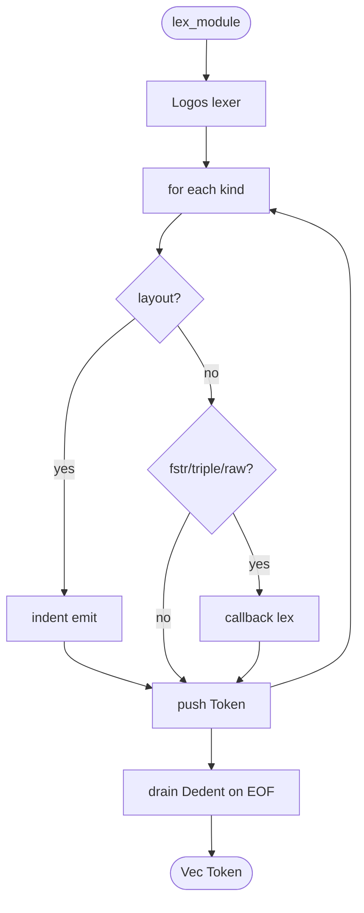
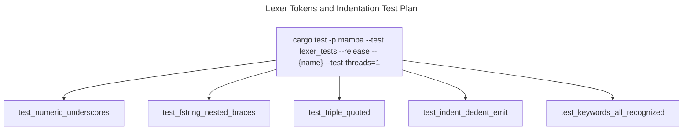

# Lexer

Mamba's lexer uses [Logos](https://crates.io/crates/logos) for token
extraction, plus a hand-rolled indentation tracker that produces
synthetic `Indent` and `Dedent` tokens. The two collaborate: Logos
handles regex-driven token kinds (keywords, identifiers, literals,
operators), and `indent.rs` post-processes the line-leading whitespace
to emit dedentation tokens whose stack the parser can consume.

Three load-bearing invariants:

1. **Triple-quoted and f-strings need callback lexers** — Logos's
   regex engine cannot handle nested expressions in f-strings (PEP
   701), backslash escapes inside f-strings, or multiline triple-quoted
   strings. Each gets a dedicated callback (`lex_fstr_dquote` /
   `lex_fstr_squote` / `lex_triple_dquote` / `lex_triple_squote`)
   with a priority high enough to beat the simpler regex variants.
2. **Underscores in numeric literals are stripped before parsing** —
   `1_000_000` lexes as `Int(1000000)` via `replace('_', "")`. Same
   pattern for hex / oct / bin / float. Removing the strip
   re-introduces the `1_000_000` parse failure that conformance fixed
   in commit history.
3. **`indent.rs` produces `Indent` / `Dedent` from line-leading
   whitespace; tabs are NOT mixed with spaces** — CPython's TabError
   surfacing requires the indentation tracker to consider whitespace
   shape, not just count. The current implementation may pass
   tests-with-spaces and tests-with-tabs separately but mixed-style
   indentation is an open gap.

## Type model
<!-- type: dependency lang: mermaid -->

```mermaid
---
id: lexer-types
types:
  TokenKind:        { kind: enum, label: "Logos-derived; ~150 variants" }
  Token:            { kind: struct, label: "kind + span (FileId + Range<usize>)" }
  IndentTracker:    { kind: struct, label: "indent.rs — column stack + emit pending tokens" }
  LogosLexer:       { kind: struct, label: "Logos<TokenKind>" }
  FStringCallback:  { kind: struct, label: "lex_fstr_dquote / lex_fstr_squote (PEP 701)" }
  TripleStrCallback:{ kind: struct, label: "lex_triple_dquote / lex_triple_squote" }
  Span:             { kind: struct, label: "FileId + byte range" }
  ParserConsumer:   { kind: struct, label: "from parser (consumes Token stream)" }
edges:
  - { from: Token,           to: TokenKind, kind: owns }
  - { from: Token,           to: Span,      kind: owns }
  - { from: LogosLexer,      to: TokenKind, kind: references, label: "regex-derived enum" }
  - { from: LogosLexer,      to: FStringCallback, kind: references }
  - { from: LogosLexer,      to: TripleStrCallback, kind: references }
  - { from: IndentTracker,   to: Token,     kind: owns,       label: "synthetic Indent/Dedent" }
  - { from: ParserConsumer,  to: Token,     kind: references, label: "stream input" }
---
classDiagram
    class TokenKind
    class Token
    class IndentTracker
    class LogosLexer
    class FStringCallback
    class TripleStrCallback
    class Span
    class ParserConsumer
    Token --> TokenKind : kind
    Token --> Span : span
    LogosLexer --> TokenKind : regex
    LogosLexer --> FStringCallback : f"
    LogosLexer --> TripleStrCallback : """
    IndentTracker --> Token : Indent / Dedent
    ParserConsumer --> Token : input
```

## Token shape
<!-- type: schema lang: yaml -->

```yaml
$schema: "https://json-schema.org/draft/2020-12/schema"
$id: "lexer-types"
$defs:
  TokenKindFamily:
    type: string
    enum:
      - keyword.control_flow
      - keyword.exception
      - keyword.async
      - keyword.other
      - keyword.type
      - literal.int
      - literal.float
      - literal.complex
      - literal.str
      - literal.triple_str
      - literal.fstr
      - literal.raw_str
      - literal.bytes
      - literal.true_false_none
      - identifier
      - operator.arith
      - operator.bit
      - operator.compare
      - operator.assign
      - operator.augmented
      - punctuation
      - bracket.paren
      - bracket.bracket
      - bracket.brace
      - layout.newline
      - layout.indent
      - layout.dedent
      - comment
      - end_of_file
  Token:
    type: object
    x-rust-type: Token
    properties:
      kind:  { description: "TokenKind variant; ~150 variants total" }
      span:  { description: "Span { file: FileId, range: Range<usize> }" }
    required: [kind, span]
  Span:
    type: object
    x-rust-type: Span
    properties:
      file: { type: integer, x-rust-type: FileId }
      start: { type: integer, x-rust-type: usize }
      end:   { type: integer, x-rust-type: usize }
    required: [file, start, end]
```

## Indent emission state machine

```mermaid
---
id: indent-tracker
initial: LineStart
nodes:
  LineStart:    { kind: initial,  label: "at start of new logical line" }
  Counting:     { kind: normal,   label: "consuming leading whitespace" }
  EmitIndent:   { kind: normal,   label: "leading column > stack top → emit Indent + push" }
  EmitDedent:   { kind: normal,   label: "leading column < stack top → emit Dedent(s) + pop(s)" }
  SameLevel:    { kind: normal,   label: "leading column == stack top → no emit" }
  TokenLine:    { kind: normal,   label: "rest of line tokenizes normally" }
  EOF:          { kind: terminal, label: "stack drained; emit one Dedent per level + EOF" }
edges:
  - { from: LineStart,  to: Counting }
  - { from: Counting,   to: EmitIndent, event: "deeper than stack top" }
  - { from: Counting,   to: EmitDedent, event: "shallower than stack top" }
  - { from: Counting,   to: SameLevel,  event: "equal to stack top" }
  - { from: EmitIndent, to: TokenLine }
  - { from: EmitDedent, to: TokenLine }
  - { from: SameLevel,  to: TokenLine }
  - { from: TokenLine,  to: LineStart,  event: "Newline token consumed" }
  - { from: TokenLine,  to: EOF,        event: "input exhausted" }
---
stateDiagram-v2
    [*] --> LineStart
    LineStart --> Counting: consume ws
    Counting --> EmitIndent: deeper
    Counting --> EmitDedent: shallower
    Counting --> SameLevel: equal
    EmitIndent --> TokenLine
    EmitDedent --> TokenLine
    SameLevel --> TokenLine
    TokenLine --> LineStart: Newline
    TokenLine --> EOF: end
    EOF --> [*]
```

<!-- type: state-machine lang: mermaid -->



## Logos + indent dispatch
<!-- type: logic lang: mermaid -->



## Parser-consumption interaction
<!-- type: interaction lang: mermaid -->

```mermaid
---
id: lexer-parser-flow
actors:
  - { id: Source,  kind: system, label: "Python source text" }
  - { id: Logos,   kind: system, label: "Logos lexer" }
  - { id: Indent,  kind: system, label: "indent tracker" }
  - { id: Parser,  kind: system, label: "parser/mod.rs" }
messages:
  - { from: Source, to: Logos,  name: "next regex match → TokenKind" }
  - { from: Logos,  to: Indent, name: "newline observed; current line column" }
  - { from: Indent, to: Indent, name: "compare to stack; emit Indent/Dedent if needed" }
  - { from: Indent, to: Parser, name: "synthetic Indent/Dedent tokens" }
  - { from: Logos,  to: Parser, name: "regular tokens (Ident, Int, Str, ...)" }
  - { from: Parser, to: Parser, name: "consume + classify (statement / expression / pattern)" }
---
sequenceDiagram
    participant Source
    participant Logos
    participant Indent
    participant Parser
    Source->>Logos: source text
    Logos->>Indent: newline observed
    Indent->>Indent: compare stack; emit
    Indent->>Parser: Indent/Dedent
    Logos->>Parser: regular tokens
    Parser->>Parser: classify
```

## Acceptance scenarios
<!-- type: scenarios lang: yaml -->
```yaml
scenarios:
  - id: numeric-underscores
    given: language/numeric_underscores.py contains numeric literals with underscores
    when: lexer tokenizes the source
    then: underscores are stripped and numeric token values match their canonical numbers
  - id: fstring-format-spec
    given: fstring/format_spec_broad.py contains nested f-string format specs
    when: callback lexing handles the f-string
    then: nested braces and format spec tokens match CPython behavior
  - id: triple-quoted-string
    given: language/triple_quoted.py contains multiline triple-quoted strings
    when: triple-string callback lexing runs
    then: it consumes until the matching delimiter and preserves expected content
  - id: indent-dedent
    given: language/indent_dedent.py has a nested block followed by outer-scope code
    when: indentation tracking processes line-leading whitespace
    then: Indent and Dedent tokens are emitted around the nested block
```

## Tests
<!-- type: test-plan lang: mermaid -->


## Changes
<!-- type: changes lang: yaml -->

```yaml
changes:
  - file: crates/mamba/src/lexer/token.rs
    action: modify
    impl_mode: hand-written
    description: "TokenKind enum (~150 variants) with Logos derives; callback lexers for f-strings, triple-quoted, raw strings; underscore stripping for numeric literals."
  - file: crates/mamba/src/lexer/indent.rs
    action: modify
    impl_mode: hand-written
    description: "Indent / Dedent emission via column-stack tracker."
  - file: crates/mamba/src/lexer/mod.rs
    action: modify
    impl_mode: hand-written
    description: "Top-level lex_module() integrating Logos with indent tracker; Vec<Token> output."
```
