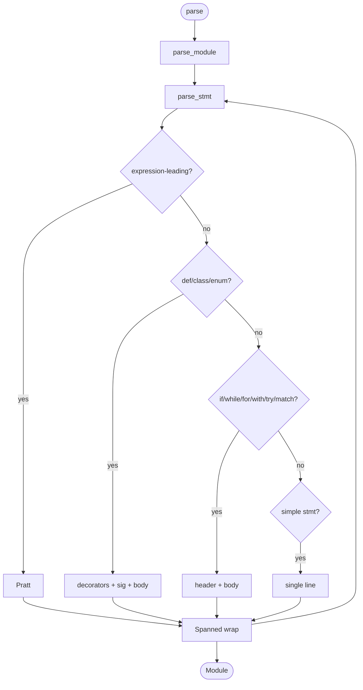
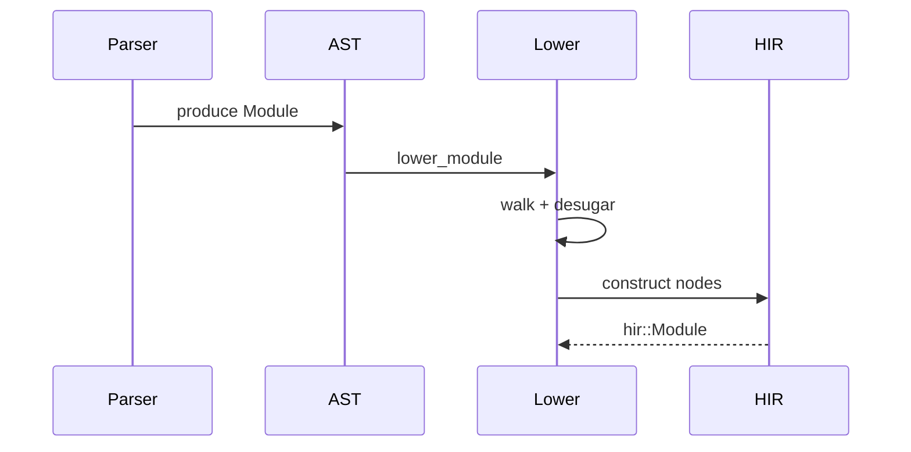
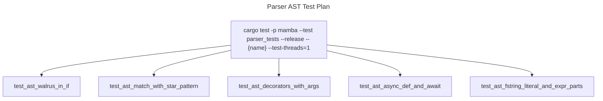

# Parser AST

Mamba's surface AST. `Module` is the root, owning `Vec<Spanned<Stmt>>`.
Five top-level enums hold the rest of the syntax tree:
`Stmt` (~30 variants for control flow, definitions, assignment, etc.),
`Expr` (~50 variants for literal / binop / call / lambda / fstring /
walrus / yield / await / starred / generator-expr / …),
`Pattern` (~10 variants for match-case), `TypeExpr` (~15 variants for
type annotations), and a handful of supporting types (`Param`,
`ExceptHandler`, `WithItem`, `Variant`, `MatchArm`, `BinOp`, `UnaryOp`,
`AugOp`, `CallArg`, `Comprehension`, `FStringPart`, `ParamKind`).

Every node is wrapped in `Spanned<T> { node: T, span: Span }` so
diagnostics carry source range. `Span = (FileId, Range<usize>)`.

Three load-bearing invariants:

1. **`Module.stmts: Vec<Spanned<Stmt>>` is the only entry point** —
   the parser produces this; HIR lowering consumes it. There are no
   side-effects in AST construction; it is a pure tree.
2. **Decorators are `Vec<Spanned<Expr>>` on FnDef / AsyncFnDef /
   ClassDef** — applied right-to-left at HIR/MIR lowering time (see
   `closure.md` mb_apply_decorators). Storing them as Expr (not Name)
   lets parameterized decorators (`@deco(arg)`) parse without
   special-casing.
3. **Pattern is its own enum, NOT a subset of Expr** — match-case
   patterns have different syntax than expressions (capture binding
   vs comparison, value patterns vs literal patterns). Conflating
   the two would force the parser to deal with ambiguity at every
   identifier.

## Type model

```mermaid
---
id: ast-types
types:
  Module:        { kind: struct }
  Stmt:          { kind: enum, label: "~30 variants — control / def / assign / import / try / etc." }
  Expr:          { kind: enum, label: "~50 variants — literal / binop / call / lambda / fstr / walrus / yield / await / starred / etc." }
  Pattern:       { kind: enum, label: "~10 variants — Capture / Value / OR / Class / Sequence / Mapping / Star / Group / Wildcard" }
  TypeExpr:      { kind: enum, label: "~15 variants — primitive / generic / Optional / Union / Callable" }
  Param:         { kind: struct, label: "name + type + default + kind" }
  ParamKind:     { kind: enum, label: "Positional / PosOrKw / KwOnly / VarArgs / VarKwargs" }
  Variant:       { kind: struct, label: "enum-variant ctor (name + fields)" }
  MatchArm:      { kind: struct, label: "pattern + guard + body" }
  ExceptHandler: { kind: struct, label: "exc_type + binding + body" }
  WithItem:      { kind: struct, label: "context + binding" }
  BinOp:         { kind: enum, label: "Add Sub Mul TrueDiv FloorDiv Mod Pow / BitAnd BitOr BitXor LShift RShift / Eq Ne Lt Le Gt Ge / And Or / Is IsNot In NotIn / MatMul" }
  UnaryOp:       { kind: enum, label: "Neg Pos Not Invert" }
  AugOp:         { kind: enum, label: "AddAssign SubAssign etc." }
  CallArg:       { kind: enum, label: "Pos / Kw(name, expr) / Star / DoubleStar" }
  Comprehension: { kind: struct, label: "target + iter + ifs (clauses)" }
  FStringPart:   { kind: enum, label: "Literal(String) / Expr(Expr, format_spec)" }
  Spanned:       { kind: struct, label: "node + span (from source-and-diagnostics)" }
edges:
  - { from: Module,        to: Stmt,         kind: owns,       label: "stmts" }
  - { from: Stmt,          to: Expr,         kind: references, label: "decorators / values / conditions" }
  - { from: Stmt,          to: Pattern,      kind: references, label: "MatchArm patterns" }
  - { from: Stmt,          to: TypeExpr,     kind: references, label: "annotations" }
  - { from: Stmt,          to: Param,        kind: references, label: "FnDef params" }
  - { from: Stmt,          to: Variant,      kind: references, label: "EnumDef variants" }
  - { from: Stmt,          to: MatchArm,     kind: references, label: "Match arms" }
  - { from: Stmt,          to: ExceptHandler, kind: references, label: "Try handlers" }
  - { from: Stmt,          to: WithItem,     kind: references }
  - { from: Stmt,          to: AugOp,        kind: references, label: "AugAssign" }
  - { from: Expr,          to: BinOp,        kind: references }
  - { from: Expr,          to: UnaryOp,      kind: references }
  - { from: Expr,          to: CallArg,      kind: references, label: "Call" }
  - { from: Expr,          to: Comprehension, kind: references, label: "ListComp/SetComp/DictComp/GenExpr" }
  - { from: Expr,          to: FStringPart,  kind: references, label: "FString" }
  - { from: Param,         to: ParamKind,    kind: owns }
  - { from: Pattern,       to: Pattern,      kind: references, label: "OR / Class / Sequence / Mapping nest" }
  - { from: TypeExpr,      to: TypeExpr,     kind: references, label: "Generic / Optional / Union nest" }
---
classDiagram
    class Module
    class Stmt
    class Expr
    class Pattern
    class TypeExpr
    class Param
    class Variant
    class MatchArm
    class ExceptHandler
    class WithItem
    class BinOp
    class UnaryOp
    class AugOp
    class CallArg
    class Comprehension
    class FStringPart
    Module --> Stmt : stmts
    Stmt --> Expr : refs
    Stmt --> Pattern : refs
    Stmt --> TypeExpr : refs
    Stmt --> Param : refs
    Stmt --> Variant : refs
    Stmt --> MatchArm : refs
    Stmt --> ExceptHandler : refs
    Stmt --> WithItem : refs
    Stmt --> AugOp : refs
    Expr --> BinOp : refs
    Expr --> UnaryOp : refs
    Expr --> CallArg : refs
    Expr --> Comprehension : refs
    Expr --> FStringPart : refs
    Pattern --> Pattern : nested
    TypeExpr --> TypeExpr : nested
```

<!-- type: dependency lang: mermaid -->



## AST shape
<!-- type: schema lang: yaml -->

```yaml
$schema: "https://json-schema.org/draft/2020-12/schema"
$id: "ast-types"
$defs:
  Module:
    type: object
    x-rust-type: Module
    properties:
      stmts:
        type: array
        items: { x-rust-type: "Spanned<Stmt>" }
    required: [stmts]
  Spanned:
    type: object
    x-rust-type: "Spanned<T>"
    properties:
      node: { description: "wrapped value" }
      span:
        type: object
        properties:
          file:  { type: integer, x-rust-type: FileId }
          start: { type: integer, x-rust-type: usize }
          end:   { type: integer, x-rust-type: usize }
        required: [file, start, end]
    required: [node, span]
  StmtVariant:
    description: "Representative variants — full enum has ~30"
    type: string
    enum: [VarDecl, Assign, AugAssign, FnDef, AsyncFnDef, ClassDef,
           EnumDef, If, While, For, With, Try, Raise, Match, Return,
           Yield, Import, ImportFrom, Global, Nonlocal, Pass, Break,
           Continue, Expr, Del, TypeAlias, Assert]
  ExprVariant:
    description: "Representative — full enum has ~50"
    type: string
    enum: [Int, Float, Complex, Str, FString, Bool, None_, Name,
           Attribute, Subscript, Slice, BinOp, UnaryOp, BoolOp, Compare,
           IfExpr, Lambda, Call, List, Tuple, Dict, Set, ListComp,
           SetComp, DictComp, GenExpr, Walrus, Yield, YieldFrom, Await,
           Starred]
  PatternVariant:
    type: string
    enum: [Capture, Value, OR, Class, Sequence, Mapping, Star, Group,
           Wildcard, Literal]
```

## Tree-construction logic
<!-- type: logic lang: mermaid -->



## Parser to HIR interaction
<!-- type: interaction lang: mermaid -->



## Acceptance scenarios
<!-- type: scenarios lang: yaml -->

```yaml
scenarios:
  - id: ast-walrus
    given: language/walrus_basic.py contains an assignment expression in an if condition
    when: recursive descent parsing builds the AST
    then: the condition is an Expr::Walrus and the body can refer to the bound name
  - id: ast-match-pattern
    given: language/match_basic.py contains a sequence match with a star pattern
    when: parse_match builds arms
    then: MatchArm holds Pattern::Sequence with nested Pattern::Star
  - id: ast-decorators-with-args
    given: decorator_with_args/deep_broad.py defines a parameterized decorator
    when: a function definition is parsed
    then: FnDef.decorators contains a Call expression rather than a name-only shortcut
  - id: ast-async-await
    given: async_await/gather.py defines async functions and await expressions
    when: parser output is lowered
    then: AsyncFnDef statements and Await expressions are present in the AST
```

## Tests
<!-- type: test-plan lang: mermaid -->



## Changes
<!-- type: changes lang: yaml -->

```yaml
changes:
  - file: crates/mamba/src/parser/ast.rs
    action: modify
    impl_mode: hand-written
    description: "Module + Stmt + Expr + Pattern + TypeExpr enums with all variants. Spanned<T> wrapper. Hand-written; AST shape is the contract for downstream lowering."
```
