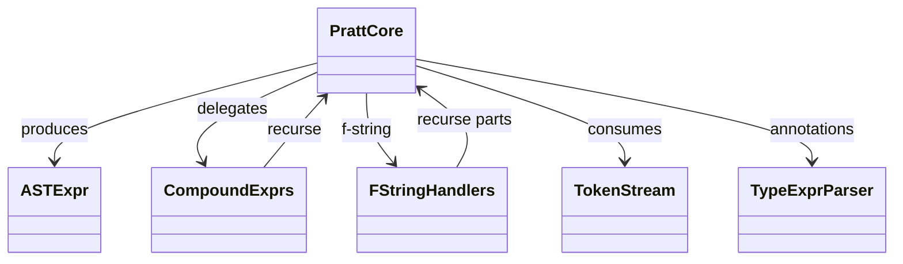
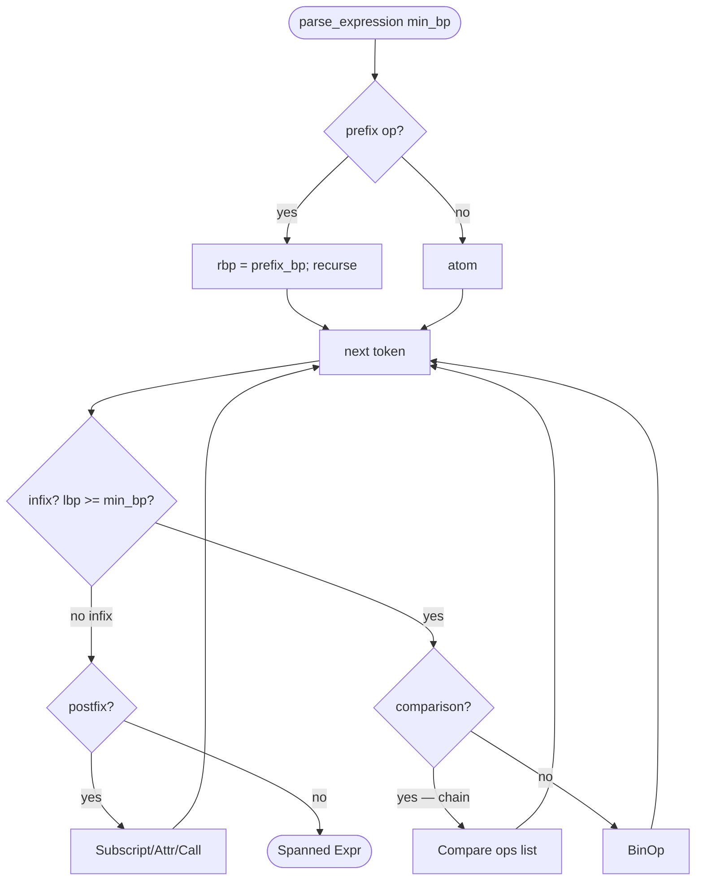
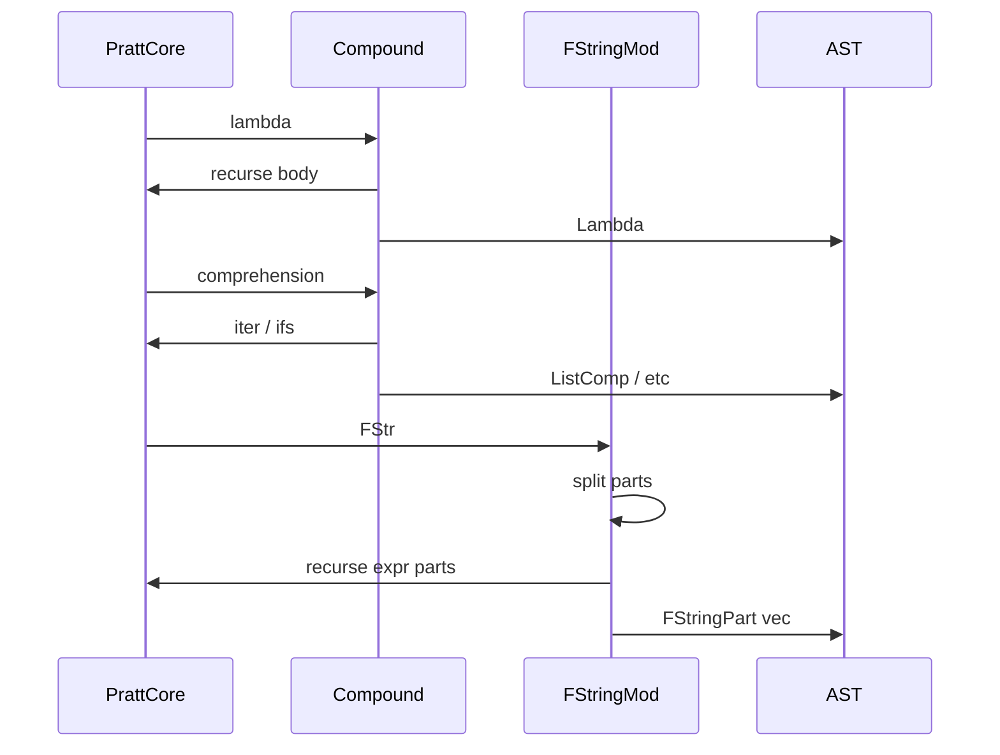

# Parser — Expression Pratt Parser

`parser/expr.rs` (1257 LOC) and `parser/expr_compound.rs` (802 LOC)
together implement Pratt expression parsing producing `Spanned<Expr>`
nodes per `parser/ast.md`. `expr.rs` carries the precedence tables
(`prefix_bp`, `infix_bp`) plus f-string parsing helpers; `expr_compound.rs`
handles the compound expressions (lambda, comprehensions, walrus, ternary
if-expression, unary chains).

Three load-bearing invariants:

1. **Pratt binding-power tables match Python operator precedence
   exactly** — `infix_bp(op)` returns `(left_bp, right_bp)` per CPython's
   precedence table. Off-by-one would silently parse `a or b and c` as
   `(a or b) and c` instead of `a or (b and c)`.
2. **`is_comparison_op` chains via `Expr::Compare`, not nested
   `BinOp`** — `1 < x < 10` lowers to `Compare { ops: [Lt, Lt],
   comparators: [x, 10] }`, NOT `(1 < x) < 10`. CPython chains
   comparisons with short-circuit evaluation; nested BinOp would lose
   that.
3. **F-string parts are parsed at lex time, not parse time** — the
   lexer produces `FStr(String)` containing the raw inner text;
   `parse_fstring_parts` here re-parses the content into
   `Vec<FStringPart>` with literal/expr/format-spec splitting, then
   recursively parses each expr part as a full `Expr`.

## Type model
<!-- type: dependency lang: mermaid -->



## Precedence shape
<!-- type: schema lang: yaml -->

```yaml
$schema: "https://json-schema.org/draft/2020-12/schema"
$id: "expr-parse-types"
$defs:
  PrecedenceLevel:
    type: object
    description: "Pratt binding power per CPython operator precedence"
    properties:
      level:        { type: integer, minimum: 1, maximum: 17 }
      operators:    { type: array, items: { type: string } }
      associativity: { type: string, enum: [left, right, chain] }
      description:  { type: string }
    required: [level, operators, associativity]
    examples:
      - { level: 1,  operators: [Or],         associativity: left,  description: "lowest binding — boolean or" }
      - { level: 2,  operators: [And],        associativity: left }
      - { level: 3,  operators: [Not],        associativity: right, description: "unary not — prefix" }
      - { level: 4,  operators: [Eq, Ne, Lt, Le, Gt, Ge, In, NotIn, Is, IsNot], associativity: chain, description: "comparison chains via Expr::Compare" }
      - { level: 5,  operators: [BitOr],      associativity: left }
      - { level: 6,  operators: [BitXor],     associativity: left }
      - { level: 7,  operators: [BitAnd],     associativity: left }
      - { level: 8,  operators: [LShift, RShift], associativity: left }
      - { level: 9,  operators: [Add, Sub],   associativity: left }
      - { level: 10, operators: [Mul, TrueDiv, FloorDiv, Mod, MatMul], associativity: left }
      - { level: 11, operators: [Neg, Pos, Invert], associativity: right, description: "unary arith — prefix" }
      - { level: 12, operators: [Pow],        associativity: right, description: "right-associative" }
      - { level: 13, operators: [Await],      associativity: right }
      - { level: 14, operators: [Subscript, Attribute, Call], associativity: left, description: "primary postfix" }
  FStringSplit:
    description: "How parse_fstring_parts splits a raw FStr"
    type: object
    properties:
      parts:
        type: array
        items:
          oneOf:
            - { title: Literal,    properties: { text: { type: string } } }
            - { title: Expr,       properties: { source: { type: string }, conversion: { type: string, enum: [s, r, a, ""] }, format_spec: { type: string } } }
    required: [parts]
```

## Pratt parse logic
<!-- type: logic lang: mermaid -->



## Compound + f-string interaction
<!-- type: interaction lang: mermaid -->



## Acceptance scenarios
<!-- type: scenarios lang: yaml -->

```yaml
scenarios:
  - id: chained-comparison
    given: chained_compare/deep_broad.py contains `1 < x < 10`
    when: parse_expression consumes the comparison chain
    then: the AST is Expr::Compare with Lt and Lt operators plus x and 10 comparators
  - id: walrus-precedence
    given: language/walrus_basic.py contains `(n := f()) + 1`
    when: Pratt parsing applies binding powers
    then: the expression is BinOp(Walrus(n, Call f), Add, Int 1)
  - id: fstring-nested-format
    given: fstring/format_spec_broad.py contains `f'{x:{width}.2f}'`
    when: parse_fstring_parts splits the raw f-string token
    then: the expression part preserves a nested format_spec expression
  - id: lambda-immediate-call
    given: language/lambda_call.py contains `(lambda x: x*2)(5)`
    when: postfix call parsing runs after the lambda atom
    then: the AST is a Call whose func is Lambda and args contains Int 5
```

## Tests
<!-- type: tests lang: yaml -->

```yaml
runner: "cargo test -p mamba --test parser_tests --release -- {name} --test-threads=1"
fixtures:
  - id: chain_compare
    name: "test_chained_comparison"
    description: "1 < x < 10 → Expr::Compare with two ops"
  - id: walrus
    name: "test_walrus_in_expression"
    description: "(n := f()) + 1 produces nested Walrus"
  - id: fstring_nested
    name: "test_fstring_nested_format_spec"
    description: "f'{x:{w}}' splits nested {} correctly"
  - id: lambda_call
    name: "test_lambda_immediately_called"
    description: "(lambda x: x*2)(5) yields Call(Lambda)"
  - id: precedence_pow_right_assoc
    name: "test_pow_right_associative"
    description: "2 ** 3 ** 2 parses as 2 ** (3 ** 2)"
  - id: comprehensions
    name: "test_comprehensions_all_forms"
    description: "[..], {..}, {k: v for ..}, generator expr"
```

## Changes
<!-- type: changes lang: yaml -->

```yaml
changes:
  - file: crates/mamba/src/parser/expr.rs
    action: modify
    impl_mode: hand-written
    description: "Pratt parser core — prefix_bp / infix_bp / parse_expression / parse_atom; f-string parts splitter; comparison chain detector. Hand-written; precedence tables are the contract."
  - file: crates/mamba/src/parser/expr_compound.rs
    action: modify
    impl_mode: hand-written
    description: "Compound expressions — lambda / comprehensions / walrus / if-expr / starred / yield / await. Hand-written."
```
