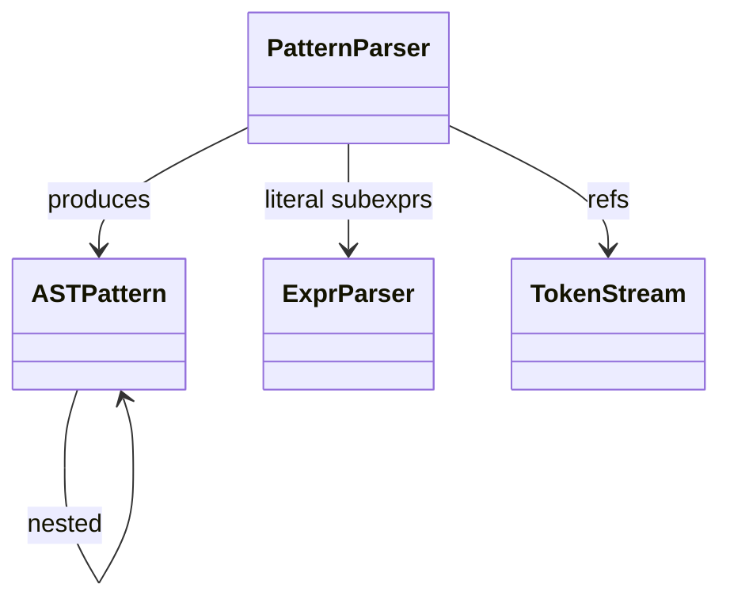
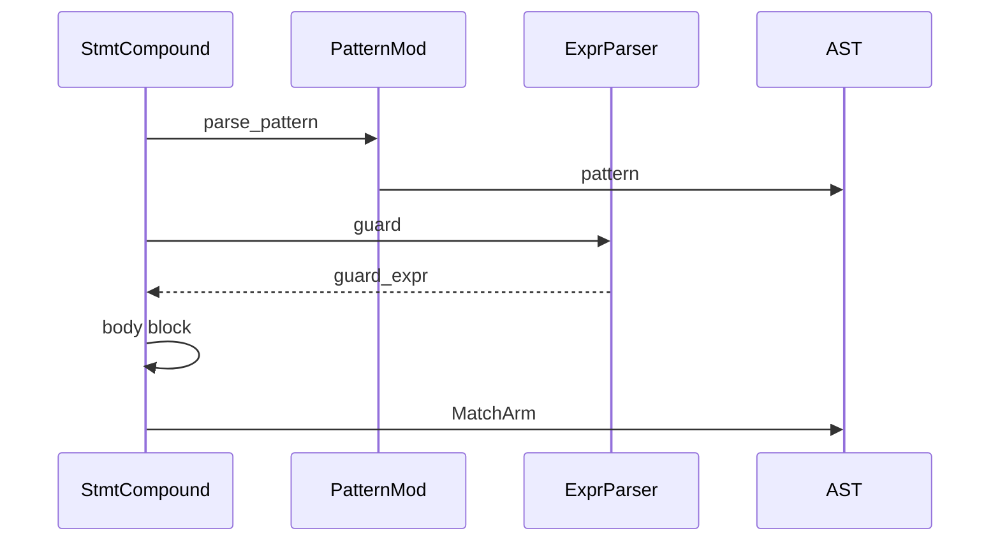

# Parser — Match-Case Patterns

`parser/pattern.rs` (936 LOC) parses PEP 634 / 635 / 636 structural
pattern matching. The parser builds `Pattern` enum nodes (per
`parser/ast.md`) consumed by `Stmt::Match { subject, arms }`.

Pattern syntax intentionally diverges from expression syntax:
identifiers in patterns are capture bindings (not name lookups), dotted
names are value patterns, `_` is the wildcard, `|` is OR-pattern,
`*name` and `**name` capture rest in sequence / mapping patterns,
`Class(field=pat)` matches class-with-attrs, and literals match by
equality.

Three load-bearing invariants:

1. **Bare identifier in pattern context is `Capture`, NOT `Name`** —
   `case x: ...` binds `x` to subject, not "match if x equals subject".
   The parser must flip its identifier-handling rule when entering a
   pattern context. This is why `Pattern` is a distinct enum, not an
   `Expr` subset.
2. **Dotted name (`A.B`) is `Value`** — these resolve to a class /
   constant; matching uses `==`. `case Color.RED:` matches enum values.
3. **`_` is special** — Wildcard matches anything but does NOT bind.
   Distinct from `Capture("_")` because `_` in patterns is unbindable
   per PEP 634.

## Type model
<!-- type: dependency lang: mermaid -->



## Pattern shape
<!-- type: schema lang: yaml -->

```yaml
$schema: "https://json-schema.org/draft/2020-12/schema"
$id: "pattern-types"
$defs:
  Pattern:
    description: "PEP 634 patterns"
    oneOf:
      - { title: Capture,   properties: { name: { type: string } }, description: "bare identifier — bind subject to name" }
      - { title: Value,     properties: { dotted: { type: array, items: { type: string } } }, description: "Module.Attr.Const — match by ==" }
      - { title: Literal,   properties: { lit: { type: string } }, description: "int / float / str / bool / None — match by ==" }
      - { title: Wildcard,  type: object, description: "_ — match anything; no bind" }
      - title: Sequence
        properties:
          patterns: { type: array, items: { $ref: "#/$defs/Pattern" } }
          star_index:
            oneOf:
              - { type: "null" }
              - { type: integer, minimum: 0 }
            description: "if a Star pattern present, its index in patterns"
      - title: Mapping
        properties:
          entries:
            type: array
            items:
              type: object
              properties:
                key:     { description: "Literal or Value pattern" }
                value:   { $ref: "#/$defs/Pattern" }
              required: [key, value]
          rest:
            oneOf:
              - { type: "null" }
              - { type: string, description: "**name capture" }
      - title: Class
        properties:
          class_path: { type: array, items: { type: string }, description: "dotted class name" }
          pos_args:   { type: array, items: { $ref: "#/$defs/Pattern" } }
          kw_args:
            type: object
            additionalProperties: { $ref: "#/$defs/Pattern" }
      - title: OR
        properties:
          alternatives: { type: array, items: { $ref: "#/$defs/Pattern" } }
      - title: Star
        properties:
          name:
            oneOf:
              - { type: "null" }
              - { type: string }
            description: "*name (Some) or _* (None — anonymous rest)"
      - title: Group
        properties:
          inner: { $ref: "#/$defs/Pattern" }
        description: "(pattern) — parenthesized for grouping"
```

## Pattern parse logic
<!-- type: logic lang: mermaid -->

```mermaid
---
id: pattern-parse
entry: enter
nodes:
  enter:        { kind: start,    label: "parse_pattern" }
  is_lparen:    { kind: decision, label: "leading ( ?" }
  group:        { kind: process,  label: "Pattern::Group { inner } — recurse" }
  is_lbracket:  { kind: decision, label: "leading [ ?" }
  seq:          { kind: process,  label: "Pattern::Sequence — comma-separated, * marks Star" }
  is_lbrace:    { kind: decision, label: "leading { ?" }
  mapping:      { kind: process,  label: "Pattern::Mapping — key: pat, ** rest" }
  is_underscore:{ kind: decision, label: "leading _ ?" }
  wildcard:     { kind: process,  label: "Pattern::Wildcard" }
  is_literal:   { kind: decision, label: "leading int/float/str/bool/None?" }
  literal:      { kind: process,  label: "Pattern::Literal" }
  is_dotted:    { kind: decision, label: "Identifier with following . ?" }
  value_pat:    { kind: process,  label: "Pattern::Value { dotted }" }
  is_call_pat:  { kind: decision, label: "Identifier followed by ( ?" }
  class_pat:    { kind: process,  label: "Pattern::Class { class_path, pos_args, kw_args }" }
  capture:      { kind: process,  label: "Pattern::Capture { name }" }
  is_pipe:      { kind: decision, label: "next token is | ?" }
  or_pat:       { kind: process,  label: "Pattern::OR — collect alternatives" }
  done:         { kind: terminal, label: "return Pattern" }
edges:
  - { from: enter,         to: is_lparen }
  - { from: is_lparen,     to: group,        label: "yes" }
  - { from: is_lparen,     to: is_lbracket,  label: "no" }
  - { from: is_lbracket,   to: seq,          label: "yes" }
  - { from: is_lbracket,   to: is_lbrace,    label: "no" }
  - { from: is_lbrace,     to: mapping,      label: "yes" }
  - { from: is_lbrace,     to: is_underscore, label: "no" }
  - { from: is_underscore, to: wildcard,     label: "yes" }
  - { from: is_underscore, to: is_literal,   label: "no" }
  - { from: is_literal,    to: literal,      label: "yes" }
  - { from: is_literal,    to: is_dotted,    label: "no" }
  - { from: is_dotted,     to: value_pat,    label: "yes" }
  - { from: is_dotted,     to: is_call_pat,  label: "no" }
  - { from: is_call_pat,   to: class_pat,    label: "yes" }
  - { from: is_call_pat,   to: capture,      label: "no" }
  - { from: group,         to: is_pipe }
  - { from: seq,           to: is_pipe }
  - { from: mapping,       to: is_pipe }
  - { from: wildcard,      to: is_pipe }
  - { from: literal,       to: is_pipe }
  - { from: value_pat,     to: is_pipe }
  - { from: class_pat,     to: is_pipe }
  - { from: capture,       to: is_pipe }
  - { from: is_pipe,       to: or_pat,       label: "yes" }
  - { from: is_pipe,       to: done,         label: "no" }
  - { from: or_pat,        to: done }
---
flowchart TD
    enter([parse_pattern]) --> is_lparen{(?}
    is_lparen -->|yes| group[Group inner]
    is_lparen -->|no| is_lbracket{[?}
    is_lbracket -->|yes| seq[Sequence]
    is_lbracket -->|no| is_lbrace{ {? }
    is_lbrace -->|yes| mapping[Mapping]
    is_lbrace -->|no| is_underscore{_?}
    is_underscore -->|yes| wildcard[Wildcard]
    is_underscore -->|no| is_literal{literal?}
    is_literal -->|yes| literal[Literal]
    is_literal -->|no| is_dotted{dotted Name?}
    is_dotted -->|yes| value_pat[Value]
    is_dotted -->|no| is_call_pat{Name followed by paren?}
    is_call_pat -->|yes| class_pat[Class]
    is_call_pat -->|no| capture[Capture]
    group --> is_pipe{|?}
    seq --> is_pipe
    mapping --> is_pipe
    wildcard --> is_pipe
    literal --> is_pipe
    value_pat --> is_pipe
    class_pat --> is_pipe
    capture --> is_pipe
    is_pipe -->|yes| or_pat[OR collect]
    is_pipe -->|no| done([Pattern])
    or_pat --> done
```

## Match arm interaction
<!-- type: interaction lang: mermaid -->



## Acceptance scenarios
<!-- type: scenarios lang: yaml -->

```yaml
scenarios:
  - id: literal-wildcard
    given: language/match_basic.py contains literal and wildcard cases
    when: parse_match parses each case arm
    then: arms contain Pattern::Literal followed by Pattern::Wildcard
  - id: capture-binding
    given: language/match_capture.py contains `case x`
    when: parse_pattern runs in pattern context
    then: the bare identifier is Pattern::Capture and the body can bind x
  - id: class-pattern-kwargs
    given: language/match_class.py contains `case Point(x=0, y=ny)`
    when: class pattern parsing consumes positional and keyword patterns
    then: Pattern::Class contains kw_args with Literal(0) and Capture(ny)
  - id: or-pattern
    given: language/match_or.py contains `case 1 | 2 | 3`
    when: parse_pattern sees pipe-separated alternatives
    then: Pattern::OR contains the literal alternatives in source order
  - id: sequence-star
    given: language/match_sequence.py contains `case [1, *rest]`
    when: sequence pattern parsing sees the star capture
    then: Pattern::Sequence records star_index as 1
```

## Tests
<!-- type: tests lang: yaml -->

```yaml
runner: "cargo test -p mamba --test parser_tests --release -- {name} --test-threads=1"
fixtures:
  - id: literal_wildcard
    name: "test_pattern_literal_and_wildcard"
    description: "case 1 / case _ produce Literal / Wildcard"
  - id: capture
    name: "test_pattern_capture_binds"
    description: "case x: produces Capture(x)"
  - id: class_pattern
    name: "test_pattern_class_with_kwargs"
    description: "case Point(x=0, y=ny) produces Class with pos_args + kw_args"
  - id: or_pattern
    name: "test_pattern_or"
    description: "case 1 | 2 | 3 produces OR alternatives"
  - id: sequence_star
    name: "test_pattern_sequence_with_star"
    description: "case [1, *rest] produces Sequence with star_index"
  - id: mapping_rest
    name: "test_pattern_mapping_with_rest"
    description: "case { 'k': v, **rest } produces Mapping with rest"
  - id: dotted_value
    name: "test_pattern_dotted_value"
    description: "case Color.RED produces Value([Color, RED])"
```

## Changes
<!-- type: changes lang: yaml -->

```yaml
changes:
  - file: crates/mamba/src/parser/pattern.rs
    action: modify
    impl_mode: hand-written
    description: "parse_pattern dispatch + per-pattern variants (Capture / Value / Literal / Wildcard / Sequence / Mapping / Class / OR / Star / Group). Hand-written; PEP 634 syntax is the contract."
```
