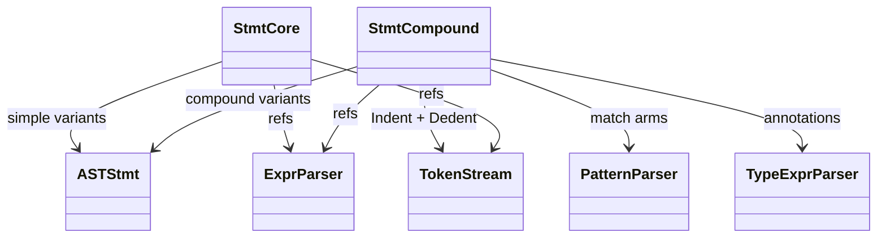
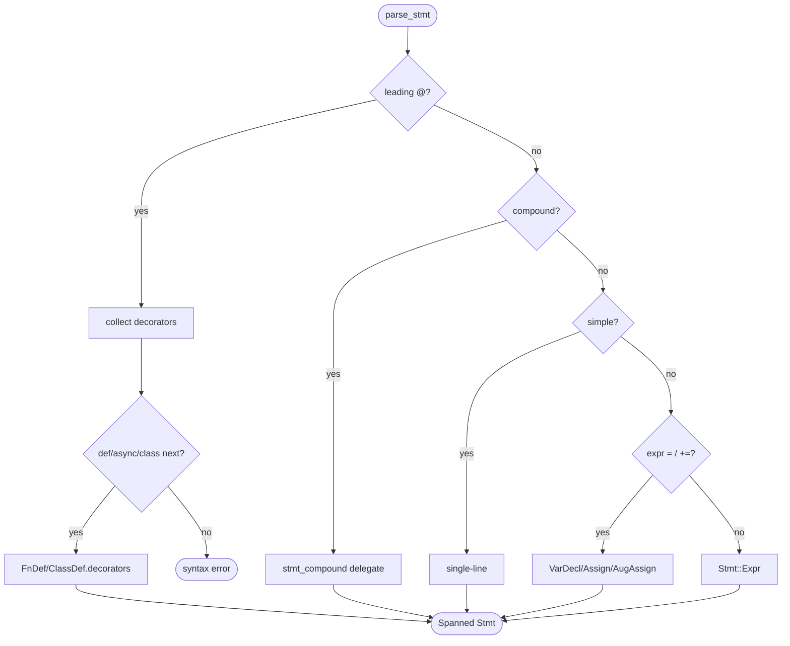
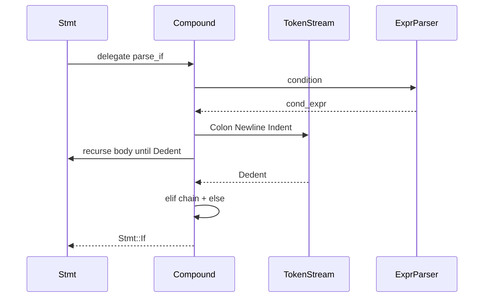
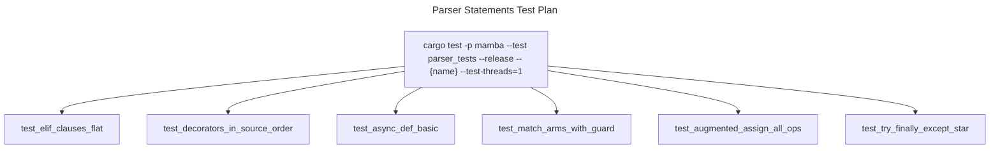

# Parser — Statements

`parser/stmt.rs` (1144 LOC) handles single-line statements
(import, return, raise, pass, break, continue, global, nonlocal,
assert, del, type-alias, simple/aug/var-decl assignments, expression
statements). `parser/stmt_compound.rs` (1220 LOC) handles compound
statements with bodies (def, async def, class, enum, if, while, for,
with, try, match).

`parse_stmt` is the dispatch entry: it inspects the leading token kind
to pick a branch, parses decorators if present, then delegates to a
specific parser. Indent / Dedent tokens come from the lexer and frame
each compound body.

Three load-bearing invariants:

1. **Decorators are parsed exactly once and attached to the next
   def / class / async def** — `@d1 \n @d2 \n def f(): ...` collects
   `[d1, d2]` into `FnDef.decorators`. A bare `@expr` followed by
   anything else is a syntax error.
2. **`async` token is a hard keyword in this language** — unlike
   CPython 3.5–3.6 which had `async` as a soft keyword, Mamba's
   lexer always tokenizes `async` as `Async`. So `async def`,
   `async for`, `async with` parse cleanly without lookahead.
3. **`elif` and `else` chains attach to the most recent open `if`** —
   `If { condition, body, elif_clauses, else_body }` — flat list of
   elif tuples + optional else, NOT recursive nested `If` in else.
   This matches CPython's AST.

## Type model
<!-- type: dependency lang: mermaid -->



## Statement classification shape
<!-- type: schema lang: yaml -->

```yaml
$schema: "https://json-schema.org/draft/2020-12/schema"
$id: "stmt-parse-types"
$defs:
  StatementClass:
    type: string
    enum: [Simple, Compound, Decorated]
    description: "Top-level dispatch tier"
  SimpleLeadingTokens:
    description: "Tokens that mark a single-line statement"
    type: array
    items: { type: string }
    examples:
      - [Pass, Break, Continue, Return, Yield, Raise, Import, From,
         Global, Nonlocal, Assert, Del, Type, Identifier]
  CompoundLeadingTokens:
    description: "Tokens that introduce a compound body"
    type: array
    items: { type: string }
    examples:
      - [Def, Async, Class, Enum, If, While, For, With, Try, Match]
  DecoratorTrigger:
    description: "@ token starts a decorator chain"
    type: string
    const: At
```

## Statement dispatch logic
<!-- type: logic lang: mermaid -->



## Compound body interaction
<!-- type: interaction lang: mermaid -->



## Acceptance scenarios
<!-- type: scenarios lang: yaml -->

```yaml
scenarios:
  - id: elif-flat
    given: language/elif_chain.py contains if, elif, and else clauses
    when: parse_if builds the statement
    then: Stmt::If stores elif_clauses as a flat list and else_body separately
  - id: decorators-source-order
    given: decorator_full/decorator_full.py stacks multiple decorators before a function
    when: parse_stmt consumes the decorator chain
    then: FnDef.decorators preserves source order for later right-to-left application
  - id: async-def
    given: async_await/gather.py defines async functions with await expressions
    when: compound statement parsing runs
    then: AsyncFnDef statements are produced and their bodies contain Await expressions
  - id: match-arms
    given: language/match_basic.py contains match and case clauses
    when: parse_match runs
    then: Stmt::Match contains ordered MatchArm entries with patterns and optional guards
  - id: augmented-assign
    given: augmented_assign/sequences.py uses augmented assignment targets
    when: simple statement parsing sees += or related operators
    then: AugAssign statements capture target, op, and value
```

## Tests
<!-- type: test-plan lang: mermaid -->



## Changes
<!-- type: changes lang: yaml -->

```yaml
changes:
  - file: crates/mamba/src/parser/stmt.rs
    action: modify
    impl_mode: hand-written
    description: "parse_stmt dispatch + simple-statement parsers (import / return / raise / pass / break / continue / global / nonlocal / assert / del / type / assignments). Hand-written."
  - file: crates/mamba/src/parser/stmt_compound.rs
    action: modify
    impl_mode: hand-written
    description: "Compound-statement parsers (def / async def / class / enum / if / while / for / with / try / match). Hand-written; Indent/Dedent framing is the contract."
```
