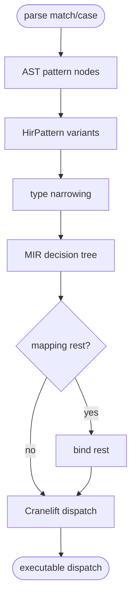
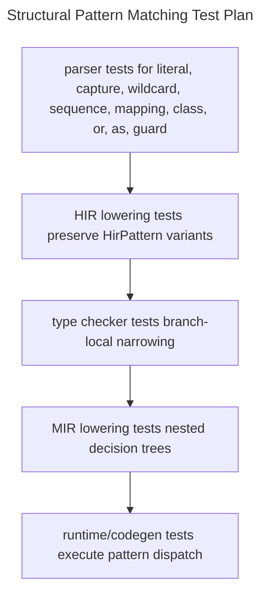

# Structural Pattern Matching

## Overview
<!-- type: overview lang: markdown -->

This specification details the implementation of full structural pattern matching (PEP 634 match/case statements) within the Mamba compiler. The scope encompasses all five compiler layers to ensure complete support: Parser enhancements for all pattern types, formal Pattern representations (including AS patterns and mapping rest captures), Type checker narrowing within case branches, HIR and MIR lowering updates for decision tree compilation and nested patterns, and Cranelift IR code generation for pattern dispatch. The goal is to evolve the current skeletal structure to fully support literal, capture, wildcard, sequence, mapping, class, OR, AS, and guard constructs.

## Requirements

```mermaid
---
id: pattern-matching-requirements
title: Structural Pattern Matching Requirements
---
requirementDiagram

requirement R1 {
  id: R1
  text: "Parser supports literal, capture, wildcard, sequence, mapping, class, OR, AS, and guard patterns"
  risk: high
  verifymethod: test
}
requirement R2 {
  id: R2
  text: "AS patterns bind the matched sub-pattern into a variable after the sub-pattern succeeds"
  risk: high
  verifymethod: test
}
requirement R3 {
  id: R3
  text: "Mapping patterns support rest capture syntax to bind unmatched key-value pairs"
  risk: high
  verifymethod: test
}
requirement R4 {
  id: R4
  text: "Type checking performs flow-sensitive type narrowing inside successful case branches"
  risk: high
  verifymethod: test
}
requirement R5 {
  id: R5
  text: "HIR contains explicit match and pattern nodes instead of wildcard placeholders"
  risk: high
  verifymethod: test
}
requirement R6 {
  id: R6
  text: "AST-to-HIR lowering preserves structural pattern semantics"
  risk: high
  verifymethod: test
}
requirement R7 {
  id: R7
  text: "HIR-to-MIR lowering emits recursive decision trees for nested patterns"
  risk: high
  verifymethod: test
}
requirement R8 {
  id: R8
  text: "Cranelift codegen emits dispatch for tests, captures, and guards"
  risk: high
  verifymethod: test
}
```

<!-- type: requirements lang: mermaid -->


## Pattern Model
<!-- type: schema lang: yaml -->
```yaml
$schema: "https://json-schema.org/draft/2020-12/schema"
$id: "mamba://schemas/pattern-matching"
$defs:
  HirMatch:
    type: object
    properties:
      target: { description: "HIR expression being matched" }
      arms:
        type: array
        items: { $ref: "#/$defs/HirMatchArm" }
    required: [target, arms]
  HirMatchArm:
    type: object
    properties:
      pattern: { $ref: "#/$defs/HirPattern" }
      guard: { description: "Optional guard expression" }
      body: { description: "Case body statements" }
    required: [pattern, body]
  HirPattern:
    type: object
    properties:
      kind:
        type: string
        enum: [literal, capture, wildcard, sequence, mapping, class, or, as]
      rest_capture:
        type: string
        description: "Mapping or sequence rest capture name when present"
      subpatterns:
        type: array
        items: { $ref: "#/$defs/HirPattern" }
    required: [kind]
```

## Decision-Tree Lowering
<!-- type: logic lang: mermaid -->


## Scenarios
<!-- type: scenarios lang: yaml -->
```yaml
scenarios:
  - id: literal-capture
    when: a match statement has literal cases followed by a fallback capture
    then: dispatch compares literal equality and binds the fallback target variable
  - id: class-type-narrowing
    when: a case branch uses a class pattern with positional and keyword fields
    then: the matched value is narrowed to the class type within that branch
  - id: mapping-rest-capture
    when: a mapping pattern includes rest capture syntax
    then: HirPattern::Mapping records fixed keys and binds remaining entries to the rest variable
  - id: nested-or-patterns
    when: a nested sequence pattern contains OR alternatives
    then: MIR lowering builds a recursive decision tree with alternative paths
```

## Test Plan
<!-- type: test-plan lang: mermaid -->


## Changes
<!-- type: changes lang: yaml -->
```yaml
changes:
  - file: crates/mamba/src/parser/
    action: modify
    impl_mode: hand-written
    description: Parse AS patterns and mapping rest captures.
  - file: crates/mamba/src/hir/
    action: modify
    impl_mode: hand-written
    description: Add HirMatch statements and HirPattern variants for PEP 634 forms.
  - file: crates/mamba/src/lower/ast_to_hir.rs
    action: modify
    impl_mode: hand-written
    description: Lower match/case AST constructs into HirMatch and HirPattern.
  - file: crates/mamba/src/types/
    action: modify
    impl_mode: hand-written
    description: Apply case-branch type narrowing for successful pattern matches.
  - file: crates/mamba/src/lower/hir_to_mir.rs
    action: modify
    impl_mode: hand-written
    description: Generate recursive MIR decision trees for nested patterns and guards.
  - file: crates/mamba/src/codegen/
    action: modify
    impl_mode: hand-written
    description: Emit Cranelift dispatch for tests, captures, and guard evaluation.
```
