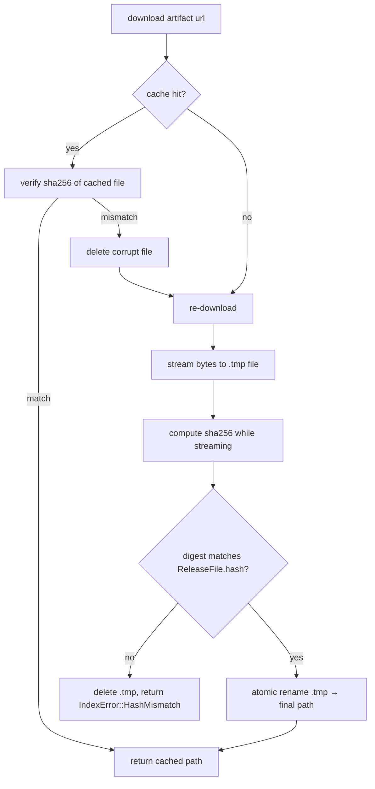
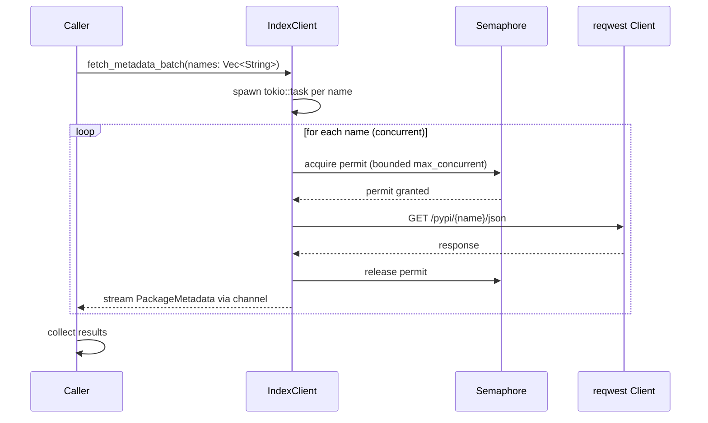

# PyPI Index Client

## Overview
<!-- type: overview lang: markdown -->

Module: `crates/mamba/src/pkgmgr/index.rs` (+ `index/` sub-files as needed).

Provides the `IndexClient` — the single point of contact between mamba's package manager and remote PyPI-compatible indexes. Implements two fetch strategies (JSON API, Simple API), an artifact download pipeline with sha256 verification, bounded parallel metadata fetching, and a disk cache aligned with cclab-jet store conventions.

Index URL resolution order: `pyproject.toml [tool.mamba.index]` → `PIP_INDEX_URL` env var → `https://pypi.org`.

## API Surface
<!-- type: schema lang: yaml -->

```yaml
{
  "$schema": "https://json-schema.org/draft/2020-12/schema",
  "$id": "mamba://schemas/index-client-types",
  "definitions": {
    "FileHash": {
      "$id": "#FileHash",
      "type": "object",
      "description": "Cryptographic digest of a distribution file.",
      "properties": {
        "algorithm": {
          "type": "string",
          "enum": ["sha256", "sha384", "sha512"],
          "description": "Hash algorithm identifier."
        },
        "digest": {
          "type": "string",
          "pattern": "^[0-9a-f]+$",
          "description": "Lowercase hex digest."
        }
      },
      "required": ["algorithm", "digest"],
      "additionalProperties": false
    },
    "ReleaseFile": {
      "$id": "#ReleaseFile",
      "type": "object",
      "description": "One distribution artifact (wheel or sdist) within a release.",
      "properties": {
        "filename": { "type": "string" },
        "url": { "type": "string", "format": "uri" },
        "hash": { "$ref": "#FileHash" },
        "requires_python": {
          "type": ["string", "null"],
          "description": "PEP 440 version specifier, e.g. '>=3.8'."
        },
        "yanked": {
          "type": "boolean",
          "default": false
        },
        "dist_info_metadata": {
          "type": ["boolean", "object", "null"],
          "description": "PEP 658 metadata availability flag or hash object."
        }
      },
      "required": ["filename", "url", "hash"],
      "additionalProperties": false
    },
    "PackageMetadata": {
      "$id": "#PackageMetadata",
      "type": "object",
      "description": "Aggregated metadata for a package fetched from the index.",
      "properties": {
        "name": { "type": "string", "description": "Normalized package name (PEP 503)." },
        "versions": {
          "type": "array",
          "items": { "type": "string" },
          "description": "All available version strings, newest first."
        },
        "releases": {
          "type": "object",
          "description": "Map of version string to list of distribution files.",
          "additionalProperties": {
            "type": "array",
            "items": { "$ref": "#ReleaseFile" }
          }
        },
        "requires_python": {
          "type": ["string", "null"],
          "description": "Minimum Python version constraint from the latest release."
        },
        "source": {
          "type": "string",
          "enum": ["json-api", "simple-api"],
          "description": "Which index protocol produced this record."
        }
      },
      "required": ["name", "versions", "releases", "source"],
      "additionalProperties": false
    },
    "IndexClient": {
      "$id": "#IndexClient",
      "type": "object",
      "description": "Top-level client handle. Constructed once; shared across concurrent fetches.",
      "properties": {
        "index_url": {
          "type": "string",
          "format": "uri",
          "description": "Resolved base URL of the package index."
        },
        "cache_dir": {
          "type": "string",
          "format": "path",
          "description": "Root of the local artifact cache (~/.cache/mamba by default)."
        },
        "max_concurrent": {
          "type": "integer",
          "minimum": 1,
          "default": 16,
          "description": "Semaphore bound for simultaneous in-flight HTTP requests."
        },
        "timeout_secs": {
          "type": "integer",
          "minimum": 1,
          "default": 30,
          "description": "Per-request HTTP timeout."
        },
        "retry_max": {
          "type": "integer",
          "minimum": 0,
          "default": 3,
          "description": "Maximum retry attempts with exponential backoff."
        }
      },
      "required": ["index_url", "cache_dir"],
      "additionalProperties": false
    }
  }
}
```

## JSON API Parsing
<!-- type: schema lang: yaml -->
```yaml
{
  "$schema": "https://json-schema.org/draft/2020-12/schema",
  "$id": "mamba://schemas/pypi-json-response",
  "type": "object",
  "properties": {
    "info": {
      "type": "object",
      "properties": {
        "name":             { "type": "string" },
        "version":          { "type": "string" },
        "requires_python":  { "type": ["string", "null"] }
      },
      "required": ["name", "version"]
    },
    "releases": {
      "type": "object",
      "description": "Version string → array of distribution records.",
      "additionalProperties": {
        "type": "array",
        "items": {
          "type": "object",
          "properties": {
            "filename":           { "type": "string" },
            "url":                { "type": "string", "format": "uri" },
            "digests": {
              "type": "object",
              "properties": {
                "sha256": { "type": "string" },
                "sha384": { "type": ["string", "null"] },
                "sha512": { "type": ["string", "null"] }
              },
              "required": ["sha256"]
            },
            "requires_python":    { "type": ["string", "null"] },
            "yanked":             { "type": "boolean" },
            "dist_info_metadata": {}
          },
          "required": ["filename", "url", "digests"]
        }
      }
    },
    "urls": {
      "type": "array",
      "description": "Latest-release distribution files (same schema as releases items)."
    }
  },
  "required": ["info", "releases"]
}
```

PyPI JSON endpoint: `GET {index_url}/pypi/{name}/json`

Response shape used for deserialization into `PackageMetadata`.

Mapping rules:
- `releases[v][i].digests.sha256` → `ReleaseFile.hash` with `algorithm: "sha256"`
- `releases[v][i].dist_info_metadata` → `ReleaseFile.dist_info_metadata` (pass through; may be `false`, `true`, or `{"sha256": "..."}`)
- Versions are ordered newest-first by semantic version sort after parsing.

## Simple API Parsing
<!-- type: logic lang: mermaid -->

PEP 503 HTML fallback + PEP 691 JSON content-negotiation.

```mermaid
---
id: simple-api-parse
entry: fetch_simple
nodes:
  fetch_simple: { kind: start, label: "fetch simple/{name}/" }
  accept_header: { kind: decision, label: "Accept header selects protocol" }
  json_response: { kind: process, label: "PEP 691 JSON response" }
  html_response: { kind: process, label: "PEP 503 HTML response" }
  parse_json: { kind: process, label: "Parse JSON files array" }
  parse_html: { kind: process, label: "Parse anchor tags, href, and data attributes" }
  extract_fields: { kind: process, label: "Extract filename, url, hash, requires-python, yanked, dist-info metadata" }
  build_files: { kind: process, label: "Build ReleaseFile list" }
  group_versions: { kind: process, label: "Group by version via filename parsing" }
  metadata: { kind: terminal, label: "PackageMetadata source=simple-api" }
edges:
  - { from: fetch_simple, to: accept_header }
  - { from: accept_header, to: json_response, label: "application/vnd.pypi.simple.v1+json" }
  - { from: accept_header, to: html_response, label: "text/html fallback" }
  - { from: json_response, to: parse_json }
  - { from: html_response, to: parse_html }
  - { from: parse_json, to: extract_fields }
  - { from: parse_html, to: extract_fields }
  - { from: extract_fields, to: build_files }
  - { from: build_files, to: group_versions }
  - { from: group_versions, to: metadata }
---
flowchart TD
    A[fetch simple/{name}/] --> B{Accept header}
    B -->|application/vnd.pypi.simple.v1+json| C[JSON response]
    B -->|text/html fallback| D[HTML response]
    C --> E[parse JSON: files array]
    D --> F[parse anchor tags: href + data-* attrs]
    E --> G[extract filename / url / hash fragment / requires-python / yanked / data-dist-info-metadata]
    F --> G
    G --> H[build ReleaseFile list]
    H --> I[group by version via filename parsing]
    I --> J[PackageMetadata source=simple-api]
```

Hash fragment format (PEP 503): `url#sha256=<hex>` — strip fragment from URL, populate `FileHash`.

PEP 691 JSON `files` array fields mapped to `ReleaseFile`:

| JSON field | ReleaseFile field | Notes |
|---|---|---|
| `filename` | `filename` | direct |
| `url` | `url` | strip hash fragment |
| `hashes.sha256` | `hash` | algorithm fixed to sha256 |
| `requires-python` | `requires_python` | optional |
| `yanked` | `yanked` | default false |
| `dist-info-metadata` | `dist_info_metadata` | PEP 658 |

## Cache Layout
<!-- type: logic lang: mermaid -->



Disk layout under `cache_dir`:

```
~/.cache/mamba/
  metadata/
    <normalized-name>/
      json-api.json          # cached JSON API response (TTL: 5 min)
      simple-api.json        # cached PEP 691 response (TTL: 5 min)
  artifacts/
    <normalized-name>/
      <filename>             # wheel or sdist, named exactly as PyPI filename
      <filename>.sha256      # sidecar: stores expected hex digest
```

Name normalization: lowercase, replace `[-_.]+` with `-` (PEP 503).

Metadata TTL: 5 minutes. Artifact files have no TTL (content-addressed by filename + hash sidecar).

## Concurrency Model
<!-- type: interaction lang: mermaid -->



Retry policy (exponential backoff):
- Base delay: 200 ms
- Multiplier: 2×
- Max retries: `IndexClient.retry_max` (default 3)
- Jitter: uniform random ±20%
- Retryable status codes: 429, 500, 502, 503, 504

## Error Types
<!-- type: schema lang: yaml -->

```yaml
{
  "$schema": "https://json-schema.org/draft/2020-12/schema",
  "$id": "mamba://schemas/index-error",
  "description": "IndexError enum variants — each maps to one Rust error variant.",
  "oneOf": [
    {
      "title": "NotFound",
      "description": "Package name returned HTTP 404 from all strategies.",
      "properties": { "name": { "type": "string" } },
      "required": ["name"]
    },
    {
      "title": "HashMismatch",
      "description": "Downloaded artifact digest does not match index-declared hash.",
      "properties": {
        "filename": { "type": "string" },
        "expected":  { "type": "string" },
        "actual":    { "type": "string" }
      },
      "required": ["filename", "expected", "actual"]
    },
    {
      "title": "ParseError",
      "description": "Failed to deserialize JSON API or Simple API response.",
      "properties": {
        "url":    { "type": "string", "format": "uri" },
        "detail": { "type": "string" }
      },
      "required": ["url", "detail"]
    },
    {
      "title": "NetworkError",
      "description": "reqwest transport error after all retries exhausted.",
      "properties": {
        "url":    { "type": "string", "format": "uri" },
        "detail": { "type": "string" }
      },
      "required": ["url", "detail"]
    },
    {
      "title": "Timeout",
      "description": "Request did not complete within IndexClient.timeout_secs.",
      "properties": {
        "url":          { "type": "string", "format": "uri" },
        "timeout_secs": { "type": "integer" }
      },
      "required": ["url", "timeout_secs"]
    },
    {
      "title": "CacheIo",
      "description": "Disk read/write error for metadata or artifact cache.",
      "properties": {
        "path":   { "type": "string", "format": "path" },
        "detail": { "type": "string" }
      },
      "required": ["path", "detail"]
    },
    {
      "title": "YankedRelease",
      "description": "Requested version is marked yanked on the index and no other version satisfies the constraint.",
      "properties": {
        "name":    { "type": "string" },
        "version": { "type": "string" }
      },
      "required": ["name", "version"]
    }
  ]
}
```

## Integration Test Plan
<!-- type: test-plan lang: mermaid -->
```mermaid
---
id: index-client-integration-test-plan
framework: rust-cargo-test
file: crates/mamba/tests/pkgmgr_index_client_test.rs
---
requirementDiagram

requirement IT01 {
  id: IT-01
  text: "requests 2.31.0 JSON API metadata includes wheel and sdist with 64-char sha256"
  verifymethod: integration-test
}
requirement IT02 {
  id: IT-02
  text: "pydantic 2.6.4 JSON API metadata includes cp312 manylinux wheel and requires_python >=3.8"
  verifymethod: integration-test
}
requirement IT03 {
  id: IT-03
  text: "rich Simple API HTML parse returns ReleaseFile entries with valid sha256 fragments"
  verifymethod: integration-test
}
requirement IT04 {
  id: IT-04
  text: "httpx 0.27.0 PEP 691 JSON content negotiation parses files with dist-info metadata"
  verifymethod: integration-test
}
requirement IT05 {
  id: IT-05
  text: "requests wheel download verifies sha256 and second call returns cached path without HTTP"
  verifymethod: integration-test
}
```

All tests are gated behind `#[cfg(feature = "integration")]` and skip if the network is unavailable. They hit real `pypi.org` endpoints.

### Cache-Hit Test (IT-05 detail)

1. First call: file absent — full download, `sha256` sidecar written.
2. Second call: file present — no HTTP request (assert request count == 0 via reqwest mock or counter), sidecar verified, same path returned.
3. Corrupt-file path: overwrite cached file with garbage bytes, call again — `HashMismatch` cleared, file re-downloaded, verification passes.

## Changes
<!-- type: changes lang: yaml -->

```yaml
_sdd:
  id: mamba-pypi-index-client-phase1-changes
changes:
  - path: .aw/tech-design/crates/mamba/logic/pkgmgr/index-client.md
    action: create
    impl_mode: hand-written
  - path: crates/mamba/src/pkgmgr/mod.rs
    action: create
    impl_mode: hand-written
  - path: crates/mamba/src/pkgmgr/index.rs
    action: create
    impl_mode: hand-written
  - path: crates/mamba/src/pkgmgr/cache.rs
    action: create
    impl_mode: hand-written
  - path: crates/mamba/src/pkgmgr/error.rs
    action: create
    impl_mode: hand-written
  - path: crates/mamba/Cargo.toml
    action: modify
    impl_mode: hand-written
    note: add reqwest, sha2, tokio (semaphore), scraper (HTML), serde_json dependencies
```
