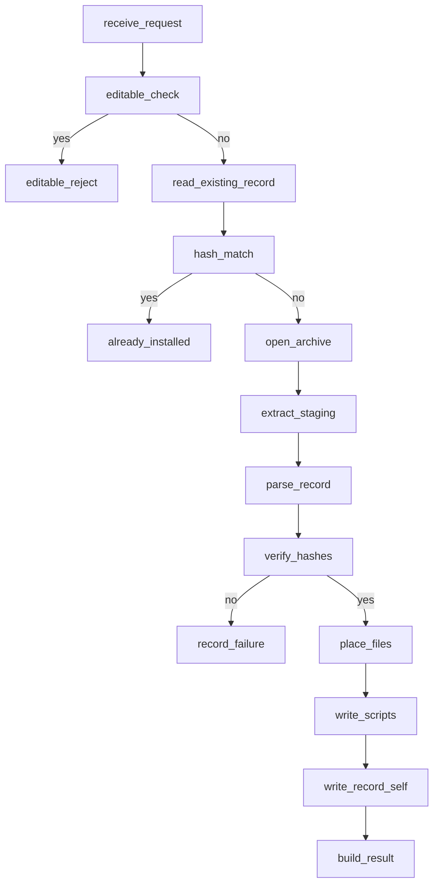

# Mamba Wheel Installer

## Schema
<!-- type: schema lang: yaml -->

```yaml
$schema: https://json-schema.org/draft/2020-12/schema
$id: mamba://schemas/installer-types
definitions:
  InstallMode:
    $id: '#InstallMode'
    type: string
    enum: [purelib, editable]
    description: |
      Installation strategy. `purelib` is the only fully implemented variant in
      Phase-1.3; `editable` is reserved for PEP 660 (P2). The variant exists in
      P1 so call sites compile against the final API.
  InstallRequest:
    $id: '#InstallRequest'
    type: object
    description: One install operation against a single resolved wheel artifact.
    properties:
      artifact_path:
        type: string
        description: 'Absolute path to the cached `.whl` file.'
      site_packages:
        type: string
        description: 'Absolute path to the target site-packages directory.'
      python_executable:
        type: string
        description: 'Absolute path of the Python interpreter that console-script wrappers will exec.'
      mode:
        $ref: '#InstallMode'
    required: [artifact_path, site_packages, python_executable, mode]
    additionalProperties: false
  InstallResult:
    $id: '#InstallResult'
    type: object
    description: Outcome of one install — success carries the RECORD-derived file inventory.
    properties:
      kind:
        type: string
        enum: [installed, already_installed]
      distribution:
        type: string
        description: 'PEP 503-normalised distribution name.'
      version:
        type: string
        description: 'PEP 440 version literal extracted from `*.dist-info/METADATA`.'
      installed_files:
        type: array
        items: { type: string }
        description: 'Paths (relative to site_packages) written for this install. Empty for `already_installed`.'
      console_scripts:
        type: array
        items: { type: string }
        description: 'Names of shebang wrappers written under `bin/`. Empty when entry_points.txt absent.'
    required: [kind, distribution, version, installed_files, console_scripts]
    additionalProperties: false
  RecordEntry:
    $id: '#RecordEntry'
    type: object
    description: One row of `*.dist-info/RECORD` (PEP 376).
    properties:
      path: { type: string, description: 'Path relative to site_packages.' }
      sha256_b64url: { type: ['string', 'null'], description: 'PEP 376 base64url-encoded sha256; null for the RECORD file itself.' }
      size: { type: ['integer', 'null'], description: 'Byte size; null for the RECORD file itself.' }
    required: [path]
    additionalProperties: false
  WheelArchive:
    $id: '#WheelArchive'
    type: object
    description: Result of opening + structurally validating a wheel ZIP.
    properties:
      dist_info_dir: { type: string, description: '`{name}-{version}.dist-info/` prefix inside the archive.' }
      dist_name: { type: string }
      dist_version: { type: string }
      has_entry_points: { type: boolean }
      has_data_dir: { type: boolean }
    required: [dist_info_dir, dist_name, dist_version, has_entry_points, has_data_dir]
  InstallerError:
    $id: '#InstallerError'
    type: object
    description: |
      Tagged error union for installer failures. `kind` is the discriminator;
      `path` and `detail` carry context useful for downstream UX.
    properties:
      kind:
        type: string
        enum:
          - malformed_wheel
          - record_hash_mismatch
          - record_missing_file
          - layout_collision
          - editable_not_supported
          - not_installed
          - io
      path: { type: ['string', 'null'] }
      detail: { type: string }
    required: [kind, detail]
```

## Logic
<!-- type: logic lang: mermaid -->



## Test Plan

```mermaid
---
id: installer-test-plan
title: Mamba Wheel Installer Test Plan
---
requirementDiagram

requirement AC1 {
  id: AC1
  text: "Installer::install on requests-2.31.0-py3-none-any.whl extracts files + RECORD verifies + requests/ tree present"
  verifymethod: test
}
requirement AC2 {
  id: AC2
  text: "Wheel with [console_scripts] httpie=httpie.core:main produces executable bin/httpie with correct shebang + runpy invocation"
  verifymethod: test
}
requirement AC3 {
  id: AC3
  text: "Installer::uninstall removes exactly RECORD-listed files; siblings untouched; dist-info dir removed"
  verifymethod: test
}
requirement AC4 {
  id: AC4
  text: "Re-install with identical sha256 returns AlreadyInstalled; zero new file writes after RECORD compare"
  verifymethod: test
}
requirement AC5 {
  id: AC5
  text: "Three-node ResolvedGraph (requests/urllib3/certifi) installs in topological order; all three present"
  verifymethod: test
}
requirement AC6 {
  id: AC6
  text: "Live: download requests via Phase-1.1 -> install -> python -c 'import requests' exits 0 with version 2.31.0"
  verifymethod: test
}
```

<!-- type: test-plan lang: mermaid -->



## Changes
<!-- type: changes lang: yaml -->

```yaml
changes:
  - path: crates/mamba/src/pkgmgr/installer/mod.rs
    action: create
    impl_mode: hand-written
    description: |
      Public API: `Installer::install(req: InstallRequest) -> Result<InstallResult, InstallerError>`,
      `Installer::uninstall(name: &str, site_packages: &Path) -> Result<(), InstallerError>`,
      and the graph-driven `install_graph(graph: &ResolvedGraph, site_packages, python_exe)`
      orchestrator (R7). Routes to archive/record/layout/scripts/uninstall submodules.
  - path: crates/mamba/src/pkgmgr/installer/archive.rs
    action: create
    impl_mode: hand-written
    description: |
      Wheel ZIP open + structural validation per PEP 427.
      Produces a `WheelArchive` with the dist-info prefix and computed name/version.
      Surfaces malformed-wheel errors (missing WHEEL, missing RECORD, multiple
      dist-info dirs).
  - path: crates/mamba/src/pkgmgr/installer/record.rs
    action: create
    impl_mode: hand-written
    description: |
      RECORD parser + verifier (PEP 376). Reads `path,sha256=...,size` rows,
      decodes base64url with the `base64` crate, recomputes sha256 with `sha2::Sha256`,
      compares to recorded value. Exempts the RECORD file itself from hashing
      (its own row carries blank fields).
  - path: crates/mamba/src/pkgmgr/installer/layout.rs
    action: create
    impl_mode: hand-written
    description: |
      Placement rules per PEP 427. Maps `*.data/{purelib,platlib,scripts,data}/`
      payload to the appropriate site_packages subtree; top-level archive entries
      go to `site_packages/`. Hardlink-vs-copy choice gated on `stat.st_dev`
      equality (R9 P3 optimisation).
  - path: crates/mamba/src/pkgmgr/installer/scripts.rs
    action: create
    impl_mode: hand-written
    description: |
      Console-script wrapper generator. Parses `entry_points.txt` `[console_scripts]`
      group and emits `bin/<name>` files with `#!{python_exe}\nimport runpy; runpy.run_module(...)`
      content. Sets executable bit on Unix.
  - path: crates/mamba/src/pkgmgr/installer/uninstall.rs
    action: create
    impl_mode: hand-written
    description: |
      RECORD-driven removal. Locates `<dist>-<version>.dist-info/RECORD` under
      site_packages, deletes every listed file (idempotent on missing entries),
      removes the dist-info directory. Errors when no dist-info matches the name.
  - path: crates/mamba/Cargo.toml
    action: modify
    impl_mode: hand-written
    description: |
      Add `zip = "0.6"` for archive extraction. `sha2` and `base64` are already
      transitive deps via pkgmgr cache logic.
  - path: crates/mamba/src/pkgmgr/mod.rs
    action: modify
    impl_mode: hand-written
    description: |
      Add `pub mod installer;` and re-export `Installer`, `InstallRequest`,
      `InstallResult`, `InstallMode`, `InstallerError`.
  - path: crates/mamba/tests/pkgmgr_installer_test.rs
    action: create
    impl_mode: hand-written
    description: |
      Integration tests covering AC1-AC6 against synthetic + real wheel fixtures.
      AC6 gated on `PYPI_LIVE=1` env var (offline-safe CI default).
```

# Reviews

### Review 1
**Verdict:** approved

- [schema] InstallRequest/InstallResult shapes cohere; tagged `InstallerError` enum covers every failure mode reachable from the logic flow (malformed_wheel, record_hash_mismatch, record_missing_file, layout_collision, editable_not_supported, not_installed, io). RecordEntry's PEP 376 self-row exemption is correctly modelled via nullable sha256_b64url/size.
- [logic] install-flow is implementable: editable short-circuit, hash-fast-path before extraction, RECORD verification before placement, scripts + RECORD self-write after placement. Mirror flow for Installer::uninstall lives in uninstall.rs (Changes section); not redrawn here because it's a single linear walk over the existing RECORD.
- [test-plan] AC1-AC6 each map to exactly one verifyable test; AC6 PYPI_LIVE-gating preserves offline-safe CI defaults (matches Phase-1.2 convention). AC5 covers the ResolvedGraph→install_graph orchestrator.
- [changes] Sub-module split (archive/record/layout/scripts/uninstall) cleanly mirrors the logic-flow stages; one-to-one with R1-R6. zip 0.6 is the right Phase-1 choice (sync; matches uv reference); sha2/base64 already transitive via cache. Cargo.toml + pkgmgr/mod.rs modify entries are minimal and correct.
