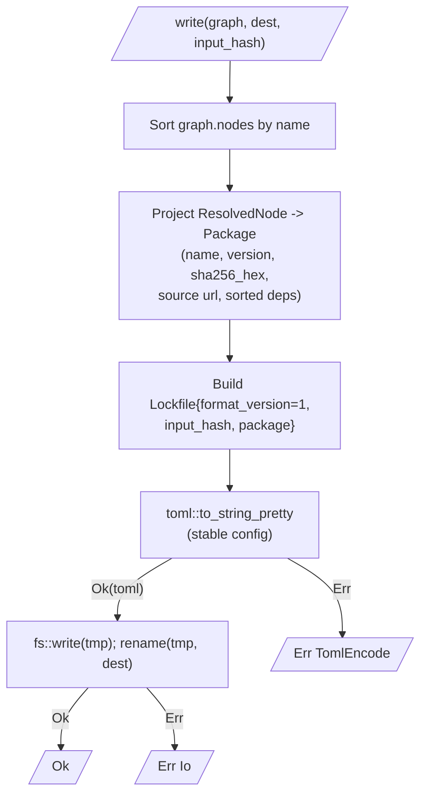
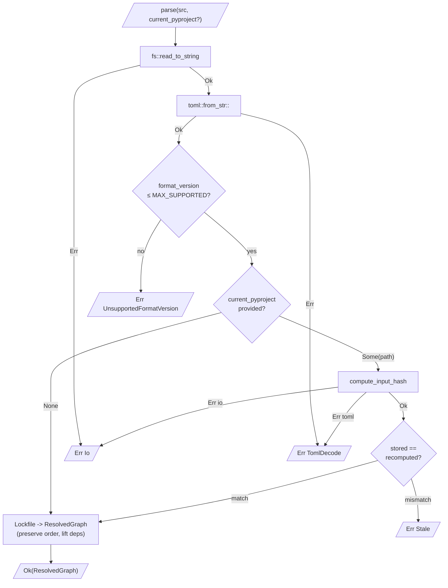
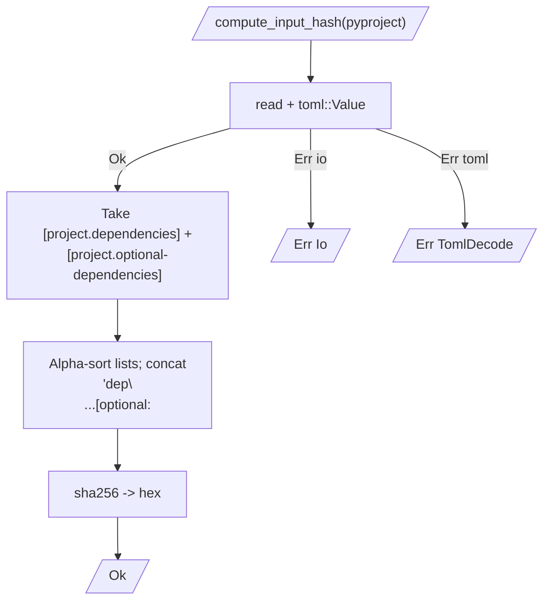

# Mamba Lockfile

## Schema
<!-- type: schema lang: yaml -->

```yaml
$schema: https://json-schema.org/draft/2020-12/schema
$id: mamba://schemas/lockfile-types
definitions:
  Lockfile:
    $id: '#Lockfile'
    type: object
    description: |
      The on-disk TOML document. `format_version` is an integer (start at `1`)
      that bumps on breaking changes; minor field additions remain
      backward-readable. `input_hash` fingerprints the source `pyproject.toml`'s
      dependency tables and detects staleness on read (R3, R4). Top-level
      key order — `format_version`, `input_hash`, `package` — is fixed by
      the serializer to keep R5 byte-determinism.
    properties:
      format_version:
        type: integer
        minimum: 1
        description: 'Lockfile schema version. Start at 1; bump on breaking change.'
      input_hash:
        type: string
        pattern: '^[0-9a-f]{64}$'
        description: 'sha256 hex of the canonical concatenation of pyproject.toml [project.dependencies] + [project.optional-dependencies] tables (R4).'
      package:
        type: array
        description: 'Pinned packages, alphabetical by name (R5 ordering invariant).'
        items: { $ref: '#Package' }
    required: [format_version, input_hash, package]
    additionalProperties: true
  Package:
    $id: '#Package'
    type: object
    description: |
      One pinned package. Mirrors a `ResolvedNode` from the resolver, plus a
      `source` URL for cache lookup and an optional `markers` field reserved
      for R6 platform locking.
    properties:
      name:
        type: string
        description: 'PEP 503 normalised package name.'
      version:
        type: string
        description: 'Exact PEP 440 version (no specifier set).'
      sha256:
        type: string
        pattern: '^[0-9a-f]{64}$'
        description: 'sha256 hex of the artifact bytes. Hex (not base64url) for `git diff` readability and uv.lock parity.'
      source:
        type: string
        description: 'Absolute URL the resolver received from the index client (e.g. `https://files.pythonhosted.org/.../wheel.whl`). Drives cache lookup on parse.'
      dependencies:
        type: array
        description: 'Direct dep names — graph edges, not transitive closure. Alphabetical (R5).'
        items: { type: string }
      markers:
        type: string
        description: 'PEP 508 environment marker reserved for R6 multi-platform locking. P1 emits when present; P2 implements selection.'
      source_ref:
        $ref: '#SourceRef'
        description: 'Reserved for R7 editable / VCS / local-path fingerprinting (architecture only in P1).'
    required: [name, version, sha256, source, dependencies]
    additionalProperties: true
  SourceRef:
    $id: '#SourceRef'
    type: object
    description: |
      Reserved (R7). Discriminated union over alternate provenance: local
      path, git VCS, or registry — used when `sha256` cannot be defined for
      mutable sources. Architecture only in Phase-1.4; deserialiser accepts
      and round-trips the table but no install code consumes it yet.
    properties:
      kind:
        type: string
        enum: [registry, path, git]
      path:
        type: string
        description: 'Set when kind=path. Absolute path to a local checkout.'
      url:
        type: string
        description: 'Set when kind=git. Git remote URL.'
      rev:
        type: string
        description: 'Set when kind=git. Resolved commit SHA.'
    required: [kind]
    additionalProperties: false
  LockfileError:
    $id: '#LockfileError'
    type: object
    description: |
      Typed errors surfaced by `Lockfile::write` and `Lockfile::parse`. Mirrors
      the `thiserror` enum on the Rust side. `Stale` is recoverable — caller
      decides whether to re-resolve. `UnsupportedFormatVersion` is fatal.
    properties:
      kind:
        type: string
        enum:
          - io
          - toml_decode
          - toml_encode
          - unsupported_format_version
          - stale
          - missing_field
          - unknown_source_kind
      stored:
        type: string
        description: 'Set when kind=stale. The `input_hash` recorded in the lockfile.'
      current:
        type: string
        description: 'Set when kind=stale. The `input_hash` recomputed from the present pyproject.toml.'
      found:
        type: integer
        description: 'Set when kind=unsupported_format_version. The `format_version` read from disk.'
      max_supported:
        type: integer
        description: 'Set when kind=unsupported_format_version. Highest version this build understands.'
      detail:
        type: string
        description: 'Free-text context (e.g. underlying io::Error display, missing field name).'
    required: [kind]
    additionalProperties: false
  LockfileDiff:
    $id: '#LockfileDiff'
    type: object
    description: |
      Output of `Lockfile::diff` (R8 — data-layer only in this phase). Three
      buckets: `added` (in new only), `removed` (in old only), `changed`
      (same name, different version). All lists alphabetical.
    properties:
      added:
        type: array
        items: { type: string }
      removed:
        type: array
        items: { type: string }
      changed:
        type: array
        items: { $ref: '#PackageChange' }
    required: [added, removed, changed]
    additionalProperties: false
  PackageChange:
    $id: '#PackageChange'
    type: object
    properties:
      name: { type: string }
      old_version: { type: string }
      new_version: { type: string }
    required: [name, old_version, new_version]
    additionalProperties: false
```

## Logic
<!-- type: logic lang: mermaid -->







## Test Plan
<!-- type: test-plan lang: mermaid -->

```mermaid
---
id: lockfile-test-plan
framework: rust-cargo-test
file: crates/mamba/tests/pkgmgr_lockfile_test.rs
---
requirementDiagram

requirement R1_write {
  id: R1
  text: "Serialize ResolvedGraph -> TOML with [[package]] tables (name, version, sha256, source, dependencies) + format_version + input_hash"
  risk: high
  verifymethod: test
}
requirement R2_parse {
  id: R2
  text: "Parse TOML -> ResolvedGraph; reject newer format_version"
  risk: high
  verifymethod: test
}
requirement R3_format_version {
  id: R3
  text: "format_version integer (start at 1); minor additions backward-readable"
  risk: medium
  verifymethod: test
}
requirement R4_invalidate {
  id: R4
  text: "input_hash sha256 of canonical [project.dependencies] + [project.optional-dependencies]"
  risk: high
  verifymethod: test
}
requirement R5_determinism {
  id: R5
  text: "Round-trip: parse(write(g)) == g; write(parse(toml)) byte-identical"
  risk: high
  verifymethod: test
}

element AC1_round_trip {
  type: cargo-test
  docref: ac1_round_trip_preserves_graph
}
element AC2_invalidation {
  type: cargo-test
  docref: ac2_input_hash_mismatch_returns_stale
}
element AC3_byte_identical {
  type: cargo-test
  docref: ac3_repeated_writes_produce_byte_identical_output
}
element AC4_unknown_field {
  type: cargo-test
  docref: ac4_unknown_field_in_v1_lockfile_is_silently_ignored
}
element AC5_installer_parity {
  type: cargo-test
  docref: ac5_installer_consumes_parsed_lockfile_same_as_resolver_graph
}

AC1_round_trip - satisfies -> R1_write
AC1_round_trip - satisfies -> R2_parse
AC1_round_trip - satisfies -> R5_determinism
AC2_invalidation - satisfies -> R4_invalidate
AC3_byte_identical - satisfies -> R5_determinism
AC4_unknown_field - satisfies -> R3_format_version
AC5_installer_parity - satisfies -> R1_write
AC5_installer_parity - satisfies -> R2_parse
```

Test responsibilities:

- `ac1_round_trip_preserves_graph` — build a `ResolvedGraph` with 3 nodes
  (`requests`, `urllib3`, `certifi`) and one edge each; call
  `Lockfile::write` then `Lockfile::parse(path, None)`; assert returned
  graph equals input (names, versions, file hashes, edges).
- `ac2_input_hash_mismatch_returns_stale` — write a lockfile from
  pyproject A (`requests = ">=2.0"`); mutate to pyproject B
  (`requests = ">=3.0"`); call `Lockfile::parse(path, Some(B))`; assert
  `LockfileError::Stale { stored, current }` with both fields populated
  and unequal.
- `ac3_repeated_writes_produce_byte_identical_output` — call
  `Lockfile::write(graph, path1, hash)` and
  `Lockfile::write(graph, path2, hash)` with the same input; assert
  `sha256(read(path1)) == sha256(read(path2))` AND `read(path1) == read(path2)`
  byte-by-byte.
- `ac4_unknown_field_in_v1_lockfile_is_silently_ignored` — author a TOML
  literal with `format_version = 1`, valid `[[package]]` tables, and an
  extra top-level key (`future_feature = "x"`) plus an extra in-package
  key (`yanked = false`); call `Lockfile::parse`; assert `Ok(graph)` is
  returned.
- `ac5_installer_consumes_parsed_lockfile_same_as_resolver_graph` —
  given a synthetic 2-node `ResolvedGraph` and matching wheel artifacts:
  (a) call `Installer::install_graph(graph, ...)` into site_packages_a;
  (b) `write(graph) -> parse(_) -> graph2`;
  `Installer::install_graph(graph2, ...)` into site_packages_b;
  assert the set of `RECORD` sha256s in `site_packages_a` equals that of
  `site_packages_b`.

## Changes
<!-- type: changes lang: yaml -->

```yaml
spec_id: mamba-pkgmgr-lockfile
target_path: crates/mamba/
language: rust
files:
  - path: crates/mamba/src/pkgmgr/lockfile/mod.rs
    action: create
    impl_mode: hand-written
    description: |
      Public API surface and `Lockfile` newtype + error enum.

      Re-exports: `Lockfile`, `LockfileError`, `LockfileDiff`, `PackageChange`,
      `MAX_SUPPORTED_FORMAT_VERSION` constant.

      Public functions:

      - `Lockfile::write(graph: &ResolvedGraph, dest: &Path, input_hash: &str) -> Result<(), LockfileError>`
      - `Lockfile::parse(src: &Path, current_pyproject: Option<&Path>) -> Result<ResolvedGraph, LockfileError>`
      - `Lockfile::compute_input_hash(pyproject_path: &Path) -> Result<String, LockfileError>`
      - `Lockfile::diff(old: &Lockfile, new: &Lockfile) -> LockfileDiff` (R8 — pure data layer)

      Internal types `Package`, `SourceRef` derive `serde::{Serialize, Deserialize}`
      with `#[serde(deny_unknown_fields = false)]` so AC4 holds.
      `LockfileError` is a `thiserror::Error` enum mirroring the
      `LockfileError.kind` schema.

      Region: `// HANDWRITE-BEGIN gap="codegen-rust-public-api-and-thiserror" tracker="enhancement-mamba-codegen-rust-public-api" reason="No generator emits a multi-fn public API + a thiserror enum from a yaml schema. Closes when sdd-codegen ships rust-api-from-schema."`
  - path: crates/mamba/src/pkgmgr/lockfile/serialize.rs
    action: create
    impl_mode: hand-written
    description: |
      `ResolvedGraph` -> deterministic TOML bytes (R1, R5).

      Internal: `to_toml(graph: &ResolvedGraph, input_hash: &str) -> Result<String, LockfileError>`.

      Steps mirror the `lockfile-write` flowchart:

      1. Project each `ResolvedNode` to a serde-derived `Package`:
         `name`, `version`, `sha256` (hex of `files[0].sha256` — the resolver
         uses base64url internally; this module hex-encodes for the lockfile),
         `source` (the artifact URL from `files[0].url`),
         `dependencies` (sorted alphabetical from `requires.iter().map(|r| r.name.clone())`).
      2. Sort the resulting `Vec<Package>` by `name`.
      3. Wrap into `Lockfile { format_version: 1, input_hash, package }`.
      4. Serialize via `toml::to_string_pretty` with the default
         `toml::ser::PrettyConfig` (array_of_tables format on the `package`
         field — guaranteed by `[[package]]` shape).

      Region: `// HANDWRITE-BEGIN gap="codegen-rust-toml-serializer" tracker="enhancement-sdd-codegen-rust-serde-toml" reason="Generator can emit serde derives but cannot yet emit deterministic-config wrappers around toml::to_string_pretty."`
  - path: crates/mamba/src/pkgmgr/lockfile/parse.rs
    action: create
    impl_mode: hand-written
    description: |
      TOML bytes -> `ResolvedGraph` (R2, R3 enforcement).

      Internal: `from_toml(text: &str) -> Result<ResolvedGraph, LockfileError>`
      and `lift_to_graph(lock: Lockfile) -> ResolvedGraph`.

      Steps mirror the `lockfile-parse` flowchart:

      1. `toml::from_str::<Lockfile>(text)` — `LockfileError::TomlDecode` on
         failure (carries the `toml::de::Error` Display in `detail`).
      2. Reject when `lock.format_version > MAX_SUPPORTED_FORMAT_VERSION`
         with `LockfileError::UnsupportedFormatVersion { found, max_supported }`.
      3. Lift each `Package` to a `ResolvedNode`:
         - `name`, `version` copied;
         - `files = vec![FileHash { url: source, sha256: hex_to_b64url(sha256), filename: filename_from_url(source) }]`;
           the FileHash module exposes a constructor; lockfile re-encodes
           the hash to match the resolver's internal canonical form.
         - `requires` is a list of `Requirement { name, specifier: Specifier::any() }` —
           dependencies in the lockfile are *names only* (graph edges, not
           version constraints; version pinning is the lockfile's job, not
           the requirement's).
      4. `roots` reconstructed as the set of node names that appear in *no*
         other node's `dependencies` list. (Phase-1.4 captures graph edges;
         the resolver-side notion of "user-requested roots" is not strictly
         recoverable, so lockfile defines roots = topological-leaves-toward-user.)

      Region: `// HANDWRITE-BEGIN gap="codegen-rust-toml-deserialize-with-validation" tracker="enhancement-sdd-codegen-rust-serde-toml" reason="Generator does not emit version-bound checks against const MAX_SUPPORTED_FORMAT_VERSION."`
  - path: crates/mamba/src/pkgmgr/lockfile/invalidate.rs
    action: create
    impl_mode: hand-written
    description: |
      `pyproject.toml` canonical fingerprint compute (R4).

      Internal: `compute(pyproject_path: &Path) -> Result<String, LockfileError>`.

      Steps mirror the `lockfile-input-hash` flowchart:

      1. Read pyproject.toml as a `toml::Value`.
      2. Extract `project.dependencies` (array of PEP 508 strings; default to
         empty if missing) and `project.optional-dependencies`
         (table of array-of-string; default to empty).
      3. Canonical bytes:
         ```text
         <dep1>\n<dep2>\n...\n[optional:<groupA>]\n<dep1>\n...\n[optional:<groupB>]\n...
         ```
         All lists sorted alphabetical; optional groups sorted alphabetical
         by group name. Trailing newline.
      4. `Sha256::digest(bytes); hex::encode`.

      Region: `// HANDWRITE-BEGIN gap="codegen-rust-canonical-fingerprint" tracker="enhancement-sdd-codegen-canonical-fingerprint" reason="Generator does not yet emit canonicalisation routines from a YAML schema."`
  - path: crates/mamba/tests/pkgmgr_lockfile_test.rs
    action: create
    impl_mode: hand-written
    description: |
      AC1-AC5 integration tests (see Test Plan section).

      Helper: `synthetic_graph(n: usize) -> ResolvedGraph` builds N nodes with
      deterministic FileHashes (sha256 of `format!("artifact-{name}-{version}")`).
      Helper: `write_pyproject(dir, deps: &[(&str, &str)])` writes a minimal
      `pyproject.toml` with the requested `[project.dependencies]` content.

      AC5 reuses the `build_wheel` helper from `pkgmgr_installer_test.rs`
      (re-exported via `mod common;` — extract the shared helper once and
      `pub use` from both test files).

      Region: `// HANDWRITE-BEGIN gap="codegen-rust-integration-test-fixtures" tracker="enhancement-sdd-codegen-integration-fixtures" reason="Test fixtures (synthetic graph builder, pyproject writer, wheel builder) cannot yet be emitted by the generator."`
  - path: crates/mamba/src/pkgmgr/mod.rs
    action: modify
    impl_mode: hand-written
    description: |
      Add `pub mod lockfile;` and re-export `Lockfile`, `LockfileError`,
      `LockfileDiff`, `PackageChange`. Keeps the lockfile module discoverable
      via `mamba::pkgmgr::Lockfile`.

      Region: `// HANDWRITE-BEGIN gap="codegen-rust-mod-rs-aggregator" tracker="enhancement-sdd-codegen-rust-mod-aggregator" reason="No generator owns mod.rs aggregation across submodules."`
  - path: crates/mamba/Cargo.toml
    action: modify
    impl_mode: hand-written
    description: |
      Add dependencies:
      `toml = "0.8"` (TOML serializer/deserializer; serde-integrated).
      `hex = "0.4"` (hex-encoding for sha256 + input_hash).
      `sha2` is already a workspace dependency (used by Phase-1.3 RECORD
      verification) — reuse via the existing entry.

      Region: `// HANDWRITE-BEGIN gap="codegen-cargo-toml-deps" tracker="enhancement-sdd-codegen-cargo-toml-deps" reason="No generator yet emits Cargo.toml dependency edits."`
```

# Reviews

### Review 1
**Verdict:** needs-revision

- [schema] (checklist-item-4) `Lockfile` and `Package` both declare `additionalProperties: false`, which directly contradicts AC4's requirement that unknown fields in a v1 lockfile are silently ignored (forward-compat tolerance). An implementer reading the schema would configure serde with `deny_unknown_fields = true` (the natural mapping from `additionalProperties: false`), causing AC4's test to fail. The Changes section notes `#[serde(deny_unknown_fields = false)]` as the Rust intent, but the schema must match: change `additionalProperties: false` to `additionalProperties: true` (or remove the property) on both `Lockfile` and `Package`. The schema should describe the minimum required shape, not impose a closed envelope that breaks forward-compat.

- [logic] (checklist-item-5) The `lockfile-parse` flowchart has no error edge from the `recompute` node. `compute_input_hash` can return `Err(Io)` or `Err(TomlDecode)` (clearly shown in the `lockfile-input-hash` flowchart) when the current `pyproject.toml` is missing or malformed. In the parse flow, this error is unreachable from any terminal, meaning an implementer has no specified behavior to follow — the options (propagate as `Io`, propagate as `TomlDecode`, wrap in a new variant) are all valid interpretations. Add an `err_recompute` terminal (or fan out to `err_io` / `err_decode`) with an `Err` edge from `recompute` so the failure path is unambiguous.

### Review 2
**Verdict:** approved

- [schema] (checklist-item-4) Round-1 finding resolved: `Lockfile` and `Package` now carry `additionalProperties: true`, consistent with AC4 and the serde `deny_unknown_fields = false` intent in Changes.
- [logic] (checklist-item-5) Round-1 finding resolved: `lockfile-parse` `recompute` node now fans `Err io → err_io` and `Err toml → err_decode`, matching the error vocabulary of the `lockfile-input-hash` flowchart.
