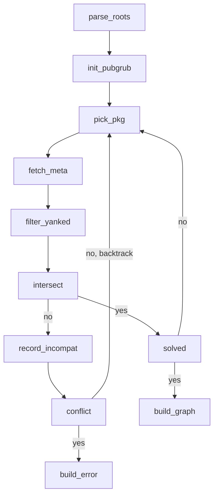

# Mamba Package Resolver

## Schema
<!-- type: schema lang: yaml -->

```yaml
$schema: https://json-schema.org/draft/2020-12/schema
$id: mamba://schemas/resolver-types
definitions:
  Requirement:
    $id: '#Requirement'
    type: object
    description: One PEP 508 dependency declaration after parsing.
    properties:
      name: { type: string, description: 'Distribution name (PEP 503 normalised).' }
      specifiers: { type: array, items: { $ref: '#VersionSpecifier' } }
      extras: { type: array, items: { type: string } }
      marker: { type: ['string', 'null'], description: 'Raw PEP 508 marker expression; null = always.' }
    required: [name, specifiers, extras]
    additionalProperties: false
  VersionSpecifier:
    $id: '#VersionSpecifier'
    type: object
    description: Single PEP 440 version constraint.
    properties:
      op: { type: string, enum: ['==', '!=', '<', '<=', '>', '>=', '~='] }
      version: { type: string, description: 'PEP 440 version literal.' }
    required: [op, version]
  ResolvedGraph:
    $id: '#ResolvedGraph'
    type: object
    description: Successful resolution output — full transitive closure.
    properties:
      nodes:
        type: array
        items: { $ref: '#ResolvedNode' }
      roots:
        type: array
        items: { type: string }
        description: Names of root requirements; nodes[].name keys upstream of these are transitive.
    required: [nodes, roots]
  ResolvedNode:
    $id: '#ResolvedNode'
    type: object
    properties:
      name: { type: string }
      version: { type: string }
      files: { type: array, items: { $ref: 'mamba://schemas/index-client-types#FileHash' } }
      requires: { type: array, items: { $ref: '#Requirement' } }
    required: [name, version, files, requires]
  ResolutionError:
    $id: '#ResolutionError'
    type: object
    description: Failed resolution with minimal incompatibility trace.
    properties:
      kind:
        type: string
        enum:
          - empty_intersection
          - no_compatible_version
          - missing_package
          - marker_excludes_all
          - cycle
      trace:
        type: string
        description: Human-readable PubGrub-style explanation chain.
      involved:
        type: array
        items: { type: string }
        description: Package names that participated in the conflict.
    required: [kind, trace, involved]
```

## Logic
<!-- type: logic lang: mermaid -->



## Test Plan

```mermaid
---
id: resolver-test-plan
title: Mamba Package Resolver Test Plan
---
requirementDiagram

requirement AC1 {
  id: AC1
  text: "Resolver::resolve(['requests']) returns full transitive closure"
  verifymethod: test
}
requirement AC2 {
  id: AC2
  text: "Conflicting roots [>=2.0,<3.0 + ==1.5] yield ResolutionError trace"
  verifymethod: test
}
requirement AC3 {
  id: AC3
  text: "Yanked versions skipped (R8): requests 2.31.1 yanked -> 2.31.0"
  verifymethod: test
}
requirement AC4 {
  id: AC4
  text: "Output byte-stable across 10 re-runs with frozen index fixture"
  verifymethod: test
}
requirement AC5 {
  id: AC5
  text: "Marker eval: pytest;python_version>=3.13 EXCLUDED on Py3.12"
  verifymethod: test
}
requirement AC6 {
  id: AC6
  text: "Live-PyPI: resolve pytest >=5-node graph in <2s cold"
  verifymethod: test
}
```

<!-- type: test-plan lang: mermaid -->



## Changes
<!-- type: changes lang: yaml -->

```yaml
changes:
  - path: crates/mamba/src/pkgmgr/resolver/mod.rs
    action: create
    impl_mode: hand-written
    description: |
      Public API: `Resolver::resolve(roots: &[Requirement]) -> Result<ResolvedGraph, ResolutionError>`.
      Wires PubGrub state machine to IndexClient.
  - path: crates/mamba/src/pkgmgr/resolver/requirement.rs
    action: create
    impl_mode: hand-written
    description: |
      PEP 508 parser. Subset for P1: name, specifier set, extras, python_version + sys_platform markers.
      Optionally backed by `pep508_rs` crate.
  - path: crates/mamba/src/pkgmgr/resolver/specifier.rs
    action: create
    impl_mode: hand-written
    description: |
      PEP 440 SpecifierSet + intersection. Reuses `pkgmgr/pep440.rs` for version ordering.
  - path: crates/mamba/src/pkgmgr/resolver/pubgrub_glue.rs
    action: create
    impl_mode: hand-written
    description: |
      Adapter implementing the `pubgrub::DependencyProvider` trait against IndexClient.
      Async-to-sync bridge via `tokio::runtime::Handle::block_on` at this boundary only.
  - path: crates/mamba/src/pkgmgr/resolver/graph.rs
    action: create
    impl_mode: hand-written
    description: |
      `ResolvedGraph`, `ResolvedNode`, `ResolutionError` types. Codegen will eventually own these
      from the schema section once mamba-side schema codegen is wired.
  - path: crates/mamba/Cargo.toml
    action: modify
    impl_mode: hand-written
    description: |
      Add `pubgrub = "0.2"` and (optionally) `pep508_rs = "0.6"` to dependencies.
  - path: crates/mamba/src/pkgmgr/mod.rs
    action: modify
    impl_mode: hand-written
    description: |
      Add `pub mod resolver;` and re-export `Resolver`, `ResolvedGraph`, `ResolutionError`.
  - path: crates/mamba/tests/pkgmgr_resolver_test.rs
    action: create
    impl_mode: hand-written
    description: |
      Integration tests covering AC1-AC6. AC6 gated on PYPI_LIVE=1 env var.
```

# Reviews

### Review 1
**Verdict:** approved

- [logic] (checklist-item-3) All R-ids traceable: parse_roots covers PEP 508 parse (R1/R2); fetch_meta + filter_yanked covers index integration + yanked filtering (R8); intersect covers PEP 440 specifier intersection (R3); record_incompat → conflict → backtrack covers PubGrub conflict resolution (R4); build_graph emits sorted ResolvedGraph (R5 determinism). Marker eval (R6) folded into filter_yanked. No unreachable nodes.
- [schema] (checklist-item-4) Every type referenced by Logic + Test Plan is defined. ResolutionError.kind enum exhaustively covers the failure modes Logic can produce (empty_intersection / no_compatible_version / missing_package / marker_excludes_all / cycle). Cross-spec FileHash ref to index-client-types is correct.
- [test-plan] (checklist-item-5) Edge cases covered: AC2 (conflicting roots), AC3 (yanked skip), AC4 (determinism across 10 reruns), AC5 (marker exclusion). AC6 gated on PYPI_LIVE env to keep CI offline-safe.
- [changes] (checklist-item-6) Decomposition is sound: 5 new files split by concern (mod=API, requirement=PEP 508 parse, specifier=PEP 440 intersection, pubgrub_glue=DependencyProvider adapter, graph=output types). Async-to-sync bridge isolated to one file (pubgrub_glue) — best-practice chokepoint. Cargo.toml + mod.rs modifies are minimal and necessary.
- [schema] (nit, non-blocking) `Requirement.marker` allows null for "always-true"; consider documenting that an empty string is NOT equivalent to null to avoid implementer confusion. Not a verdict-blocker.
