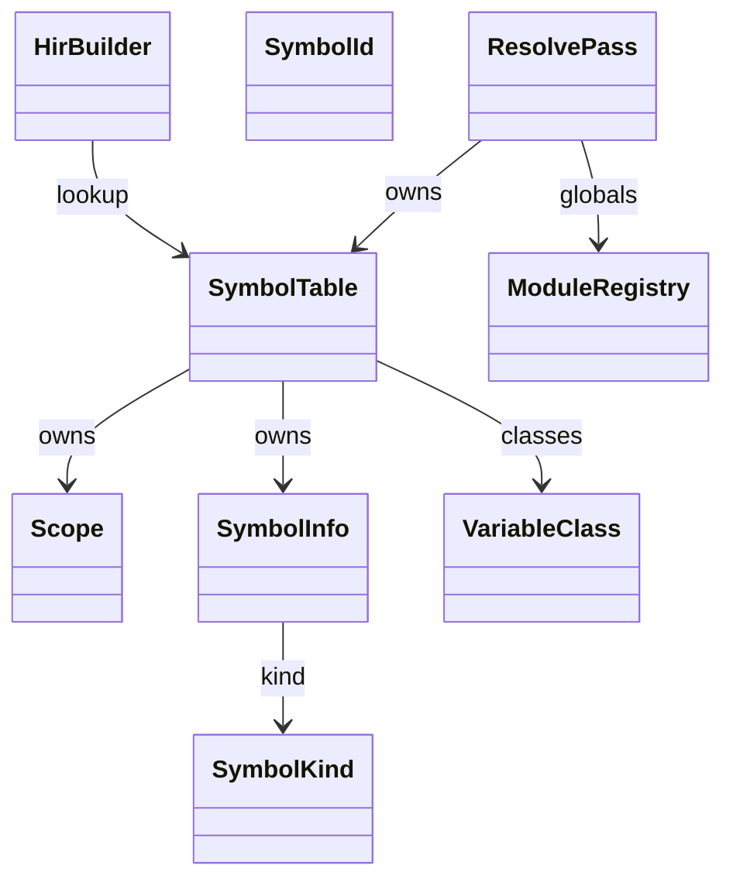
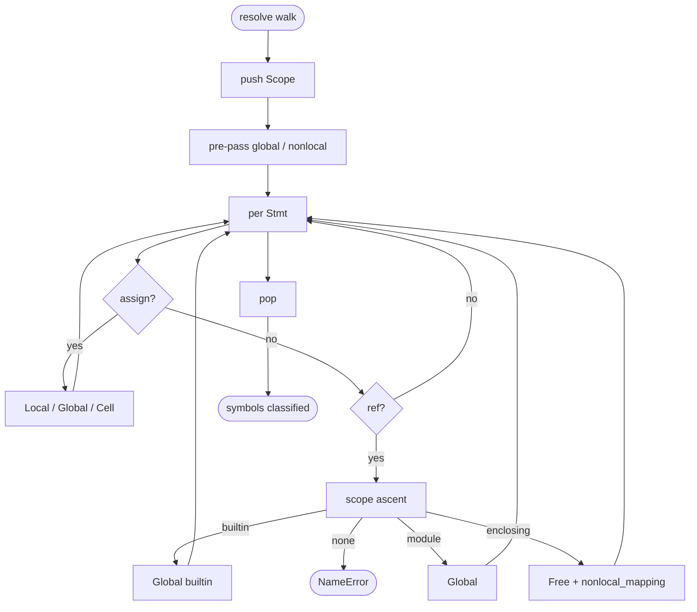
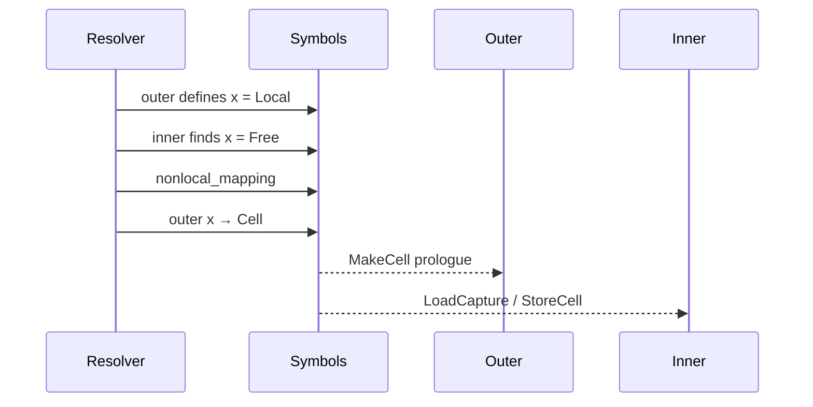
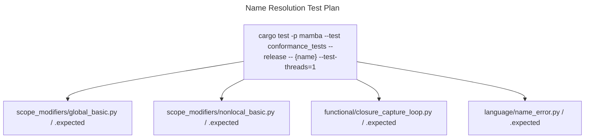

# Name Resolution

`resolve/scope.rs` defines the symbol-table types (`SymbolId`,
`SymbolInfo`, `SymbolKind`, `VariableClass`, `Scope`, `SymbolTable`).
`resolve/pass.rs` (2328 LOC) walks the AST building scopes and
classifying every name into one of `Local` / `Global` / `Free` / `Cell`.

The classification drives MIR emission: `Local` → ordinary
function-local stack slot; `Global` → `LoadGlobal` / `StoreGlobal`;
`Free` → `LoadCapture` from closure environment; `Cell` → enclosing
function allocates a `MakeCell` so the inner `Free` reference can
read / write through it.

Three load-bearing invariants:

1. **`global X` and `nonlocal X` declarations rebind X's class** —
   without them, an assignment in nested scope creates a new local;
   with them, the existing outer binding is targeted. The pass walks
   declarations *before* assignments so the classification is right
   on the first use.
2. **`Cell` is a downgrade from `Local`** — an outer-function variable
   starts as `Local`; if any inner scope captures-and-mutates it,
   the resolver promotes it to `Cell`. The MIR emitter then knows to
   allocate `MakeCell` in the outer prologue.
3. **`nonlocal_mapping` records inner-Free → outer-Cell** — closures
   capture by Cell handle, not by name; the inner `LoadCapture(idx)`
   indirects through the captured cell list using indices set at
   resolution time.

## Type model
<!-- type: dependency lang: mermaid -->



## Symbol shape
<!-- type: schema lang: yaml -->

```yaml
$schema: "https://json-schema.org/draft/2020-12/schema"
$id: "name-resolution-types"
$defs:
  SymbolKind:
    type: string
    enum: [Variable, Function, Parameter, Class, Enum, EnumVariant, Module]
  VariableClass:
    type: string
    enum: [Local, Global, Free, Cell]
    description: "Local: stack slot. Global: GLOBAL_BY_ID. Free: outer-fn capture. Cell: outer-fn local promoted to mutable cell."
  SymbolInfo:
    type: object
    properties:
      id:   { x-rust-type: SymbolId }
      name: { type: string }
      kind: { $ref: "#/$defs/SymbolKind" }
    required: [id, name, kind]
  ResolutionDecision:
    description: "How a name reference is classified"
    type: object
    properties:
      lookup_chain:    { type: array, items: { type: string }, description: "scope ancestors walked" }
      declarator:      { type: string, description: "global / nonlocal / first-use" }
      result_class:    { $ref: "#/$defs/VariableClass" }
      requires_cell:   { type: boolean, description: "outer must MakeCell in prologue" }
    required: [lookup_chain, declarator, result_class, requires_cell]
```

## Classification lifecycle

```mermaid
---
id: variable-class-lifecycle
initial: Unbound
nodes:
  Unbound:    { kind: initial,  label: "name first encountered" }
  Local:      { kind: normal,   label: "first use is assignment in current scope; no global / nonlocal" }
  Global:     { kind: normal,   label: "global X declaration in scope; or top-level binding" }
  Free:       { kind: normal,   label: "name found in enclosing scope; not declared local here" }
  Cell:       { kind: normal,   label: "Local later promoted because inner scope captured-and-mutated" }
  ModuleEnd:  { kind: terminal, label: "all classifications committed; SymbolTable frozen" }
edges:
  - { from: Unbound, to: Local,  event: "first-use is assignment without nonlocal/global" }
  - { from: Unbound, to: Global, event: "global X declaration" }
  - { from: Unbound, to: Global, event: "top-level scope assignment" }
  - { from: Unbound, to: Free,   event: "read-only reference to enclosing-scope name" }
  - { from: Local,   to: Cell,   event: "inner scope captures-and-mutates (nonlocal X with assignment)" }
  - { from: Local,   to: ModuleEnd, event: "resolution complete" }
  - { from: Global,  to: ModuleEnd, event: "resolution complete" }
  - { from: Free,    to: ModuleEnd, event: "resolution complete" }
  - { from: Cell,    to: ModuleEnd, event: "resolution complete" }
---
stateDiagram-v2
    [*] --> Unbound
    Unbound --> Local: first-use assign
    Unbound --> Global: global decl / top-level
    Unbound --> Free: outer-scope ref
    Local --> Cell: captured-and-mutated by inner
    Local --> ModuleEnd: complete
    Global --> ModuleEnd: complete
    Free --> ModuleEnd: complete
    Cell --> ModuleEnd: complete
    ModuleEnd --> [*]
```

<!-- type: state-machine lang: mermaid -->



## Resolution dispatch
<!-- type: logic lang: mermaid -->



## Free + Cell interaction
<!-- type: interaction lang: mermaid -->



## Acceptance scenarios
<!-- type: scenarios lang: yaml -->

```yaml
scenarios:
  - id: global-declaration
    given: scope_modifiers/global_basic.py declares global x inside a function
    when: name resolution classifies assignments to x
    then: the function binding is Global and updates the module binding
  - id: nonlocal-declaration
    given: scope_modifiers/nonlocal_basic.py mutates x from a nested function
    when: name resolution processes nonlocal x
    then: the outer x is promoted to Cell and the inner x is Free
  - id: closure-capture-loop
    given: functional/closure_capture_loop.py captures a loop variable in a closure
    when: the resolver records captures
    then: the loop variable is captured through a cell rather than copied by value
  - id: undefined-name
    given: language/name_error.py references an undefined name
    when: resolution walks the scope chain
    then: it emits a NameError before runtime lowering
```

## Tests
<!-- type: test-plan lang: mermaid -->



## Changes
<!-- type: changes lang: yaml -->

```yaml
changes:
  - file: crates/mamba/src/resolve/pass.rs
    action: modify
    impl_mode: hand-written
    description: "AST walker — pre-pass collects global/nonlocal decls; classifies each binding into Local / Global / Free / Cell; populates SymbolTable. Hand-written; classification rules are the contract for cell allocation in lower::hir_to_mir."
  - file: crates/mamba/src/resolve/scope.rs
    action: modify
    impl_mode: hand-written
    description: "SymbolId / SymbolInfo / SymbolKind / VariableClass / Scope / SymbolTable. Hand-written."
```
