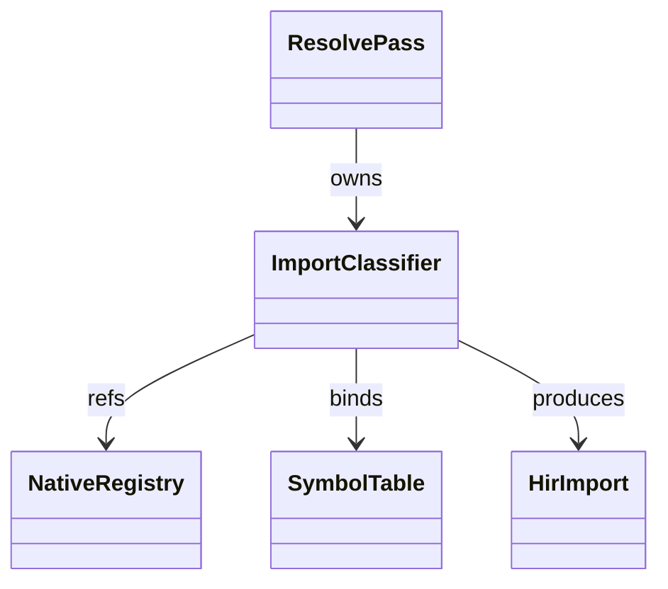
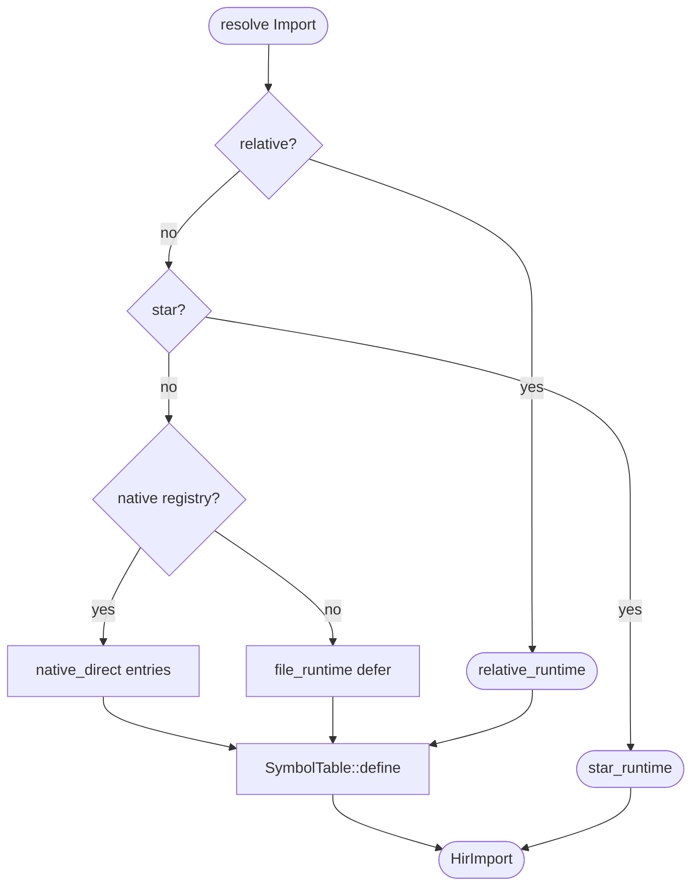
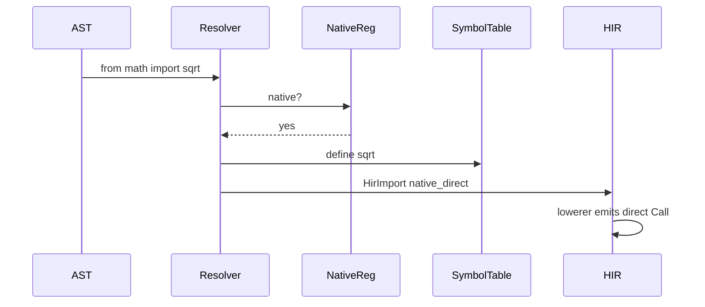
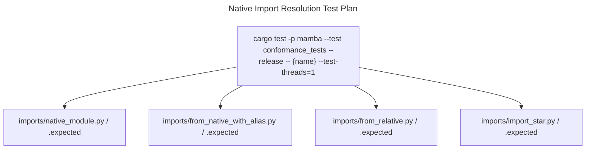

# Native Import Resolution

The resolution pass collaborates with the runtime module registry
(per `runtime/module.md`) to special-case native modules at compile
time. When `import math` parses, the resolver recognises `math` as
native (registered via `mb_register_native_modules`) and emits direct
function-pointer references for `math.sin` / `math.cos` etc., bypassing
the slower `mb_module_getattr` runtime dispatch.

Three load-bearing invariants:

1. **Native module attribute access compiles to direct call** — for
   `math.sin(x)` where `math` is native, the MIR emits
   `Call(SymbolId(mb_math_sin), [x_reg])` rather than the generic
   `mb_module_getattr` + `mb_call_method` chain. This is a 5–10x
   speedup on hot math paths.
2. **Import-from binds names eagerly into the importer's scope** —
   `from math import sqrt as s` adds `s` as a local SymbolId at
   resolution time, NOT at runtime. The runtime sees the symbol
   already bound, just like a local variable.
3. **`from X import *` only fires at runtime** — the resolver can't
   statically know the target module's `__all__` (it might be
   user-defined in the module body). The resolver records a
   star-import marker; the lowerer emits `mb_import_star` which
   populates the local scope at runtime.

## Type model
<!-- type: dependency lang: mermaid -->



## Import classification shape
<!-- type: schema lang: yaml -->

```yaml
$schema: "https://json-schema.org/draft/2020-12/schema"
$id: "native-import-types"
$defs:
  ImportKind:
    type: string
    enum: [native_direct, file_runtime, relative_runtime, star_runtime]
  ImportEntry:
    type: object
    properties:
      kind:        { $ref: "#/$defs/ImportKind" }
      module_path: { type: string }
      bindings:
        type: array
        items:
          type: object
          properties:
            local_name:    { type: string, description: "the name in the importer's scope" }
            module_attr:   { type: string, description: "name in the module" }
            symbol_id:     { x-rust-type: SymbolId }
            direct_target:
              oneOf:
                - { type: "null" }
                - { type: string, description: "for native_direct: mb_X function name" }
          required: [local_name, module_attr, symbol_id, direct_target]
    required: [kind, module_path, bindings]
  NativeModuleList:
    description: "Modules registered via mb_register_native_modules"
    type: array
    items: { type: string }
    examples:
      - [math, os, sys, json, re, datetime, hashlib, struct, csv, io,
         random, itertools, functools, collections, string, urllib,
         pathlib, asyncio]
```

## Classification logic
<!-- type: logic lang: mermaid -->



## Native binding interaction
<!-- type: interaction lang: mermaid -->



## Acceptance scenarios
<!-- type: scenarios lang: yaml -->

```yaml
scenarios:
  - id: native-module-direct-call
    given: imports/native_module.py imports math and calls math.sqrt(4)
    when: resolution sees math in the native registry
    then: it emits native_direct metadata so runtime calls mb_math_sqrt directly
  - id: from-native-alias
    given: imports/from_native_with_alias.py imports sqrt as s from math
    when: import-from resolution runs
    then: s is bound eagerly to the native direct target
  - id: relative-import-runtime
    given: imports/from_relative.py performs from . import sibling inside a package
    when: resolution classifies the import
    then: it records relative_runtime so lowering defers to mb_import_relative
  - id: star-import-runtime
    given: imports/import_star.py performs from mod import *
    when: resolution classifies the import
    then: it records star_runtime so runtime population handles __all__
```

## Tests
<!-- type: test-plan lang: mermaid -->



## Changes
<!-- type: changes lang: yaml -->

```yaml
changes:
  - file: crates/mamba/src/resolve/pass.rs
    action: modify
    impl_mode: hand-written
    description: "Import classification logic — native_direct vs file_runtime vs relative_runtime vs star_runtime; bindings written into SymbolTable + HirImport for downstream lowering. Hand-written; native fast-path is the contract."
```
