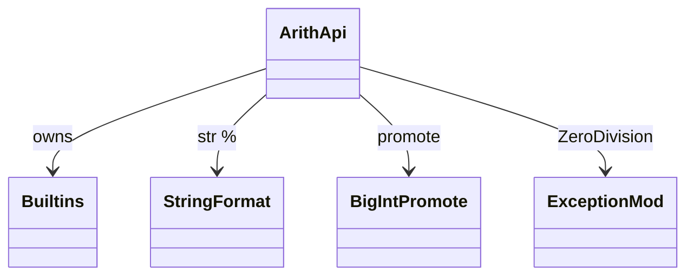
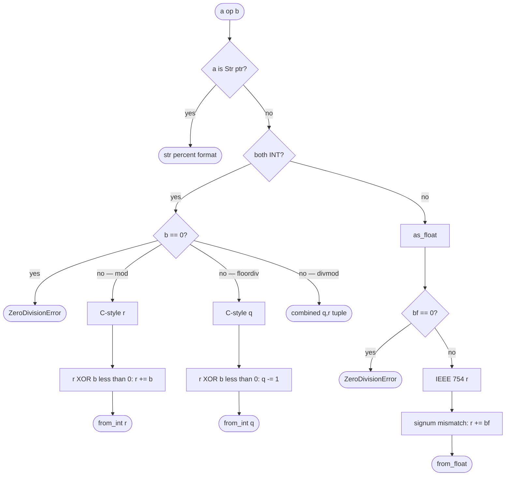
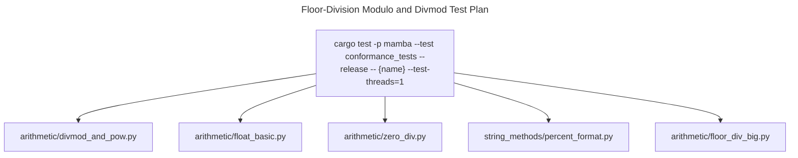

# Floor-Division Modulo and divmod Semantics

Python 3.12's modulo (`%`), floor-division (`//`), and `divmod`
follow **floor-division semantics**: the result of `a // b` is the
largest integer not greater than the true quotient, and `a % b` has
the same sign as `b`. This differs from C-style truncation (Rust's
default `%`) and from Rust's `rem_euclid` (always-positive Euclidean).
This spec records the exact arithmetic so future hand-edits or codegen
do not drift.

This is a focused sub-spec of `runtime/builtins.rs` covering only
`mb_mod`, `mb_floordiv`, `mb_divmod`. General arithmetic
(add/sub/mul/etc.) lives in `builtins.md` (the broader runtime spec)
and `bigint.md` (overflow promotion).

Three load-bearing invariants:

1. **Same-sign-as-divisor for `%`** — `(-7) % 3 == 2` (not `-1`);
   `7 % (-3) == -2` (not `1`). Implemented by adjusting C-style
   remainder: if `r != 0 && sign(r) != sign(b)`, return `r + b`.
2. **Floor for `//`** — `(-7) // 3 == -3` (not `-2`); `7 // (-3) == -3`
   (not `-2`). C-style truncation gives `-2` in both cases; the fix is
   to subtract 1 when `r != 0 && sign(r) != sign(b)`.
3. **`str % X` short-circuits to printf-format** — `mb_mod` checks
   if `a` is a Str ptr first and routes to
   `string_ops::mb_str_percent_format`. This must precede the
   numeric path; otherwise `'%s' % name` would coerce to numeric and
   fail.

## Type model
<!-- type: dependency lang: mermaid -->



## Operator shape
<!-- type: schema lang: yaml -->

```yaml
$schema: "https://json-schema.org/draft/2020-12/schema"
$id: "arith-types"
$defs:
  ModResult:
    description: "a % b — same sign as b"
    type: object
    properties:
      a: { x-rust-type: MbValue }
      b: { x-rust-type: MbValue }
      r: { description: "C-style remainder pre-adjustment" }
      result:
        description: "if r != 0 AND sign(r) != sign(b): r + b; else r"
    required: [a, b, r, result]
  FloorDivResult:
    description: "a // b — floor of true quotient"
    type: object
    properties:
      a: { x-rust-type: MbValue }
      b: { x-rust-type: MbValue }
      q: { description: "C-style truncated quotient" }
      r: { description: "C-style remainder" }
      result:
        description: "if r != 0 AND sign(r) != sign(b): q - 1; else q"
    required: [a, b, q, r, result]
  DivmodResult:
    description: "(q, r) tuple consistent with // and %"
    type: object
    properties:
      a: { x-rust-type: MbValue }
      b: { x-rust-type: MbValue }
      q: { description: "floor-div quotient" }
      r: { description: "matching modulo remainder" }
    required: [a, b, q, r]
```

## Mod / floordiv / divmod logic
<!-- type: logic lang: mermaid -->



## Sign-fixup interaction
<!-- type: interaction lang: mermaid -->

```mermaid
---
id: sign-fixup
actors:
  - { id: User,    kind: actor }
  - { id: Mamba,   kind: system }
  - { id: Mod,     kind: system, label: "mb_mod" }
messages:
  - { from: User,    to: Mamba, name: "(-7) % 3" }
  - { from: Mamba,   to: Mod,   name: "mb_mod(-7, 3)" }
  - { from: Mod,     to: Mod,   name: "C-style: -7 % 3 = -1; sign(-1) != sign(3)" }
  - { from: Mod,     to: Mod,   name: "adjust: -1 + 3 = 2" }
  - { from: Mod,     to: Mamba, name: "from_int(2)", returns: MbValue }
  - { from: Mamba,   to: User,  name: 2 }
  - { from: User,    to: Mamba, name: "7 % (-3)" }
  - { from: Mamba,   to: Mod,   name: "mb_mod(7, -3)" }
  - { from: Mod,     to: Mod,   name: "C-style: 7 % -3 = 1; sign(1) != sign(-3)" }
  - { from: Mod,     to: Mod,   name: "adjust: 1 + (-3) = -2" }
  - { from: Mod,     to: Mamba, name: "from_int(-2)" }
  - { from: Mamba,   to: User,  name: -2 }
---
sequenceDiagram
    actor User
    participant Mamba
    participant Mod
    User->>Mamba: (-7) % 3
    Mamba->>Mod: mb_mod
    Mod->>Mod: C-style -1; mismatch; +b → 2
    Mod-->>Mamba: 2
    Mamba-->>User: 2
    User->>Mamba: 7 % (-3)
    Mamba->>Mod: mb_mod
    Mod->>Mod: C-style 1; mismatch; +b → -2
    Mod-->>Mamba: -2
    Mamba-->>User: -2
```

## Acceptance scenarios
<!-- type: scenarios lang: yaml -->

```yaml
scenarios:
  - id: int-floor-mod-div
    given: arithmetic/divmod_and_pow.py evaluates negative operands
    when: (-7) % 3, (-7) // 3, and divmod(-7, 3) run
    then: results match CPython floor-modulo semantics: 2, -3, and (-3, 2)
  - id: float-floor-mod-div
    given: arithmetic/float_basic.py evaluates floating operands
    when: modulo and floor-division run on f64 values
    then: IEEE remainder is adjusted to Python sign semantics
  - id: zero-division
    given: arithmetic/zero_div.py divides or mods by zero
    when: integer or float zero divisors are passed
    then: ZeroDivisionError is raised with CPython-compatible behavior
  - id: str-percent-format
    given: string_methods/percent_format.py uses string percent formatting
    when: mb_mod receives a Str left operand
    then: it routes to mb_str_percent_format before numeric arithmetic dispatch
```

## Tests
<!-- type: test-plan lang: mermaid -->



## Changes
<!-- type: changes lang: yaml -->

```yaml
changes:
  - file: crates/mamba/src/runtime/builtins.rs
    action: modify
    impl_mode: hand-written
    description: "mb_mod / mb_floordiv / mb_divmod with floor-division sign fixup; ZeroDivisionError on zero divisor; mb_mod short-circuits to mb_str_percent_format on Str ptr. Hand-written; the sign-fixup invariant is the contract."
```
