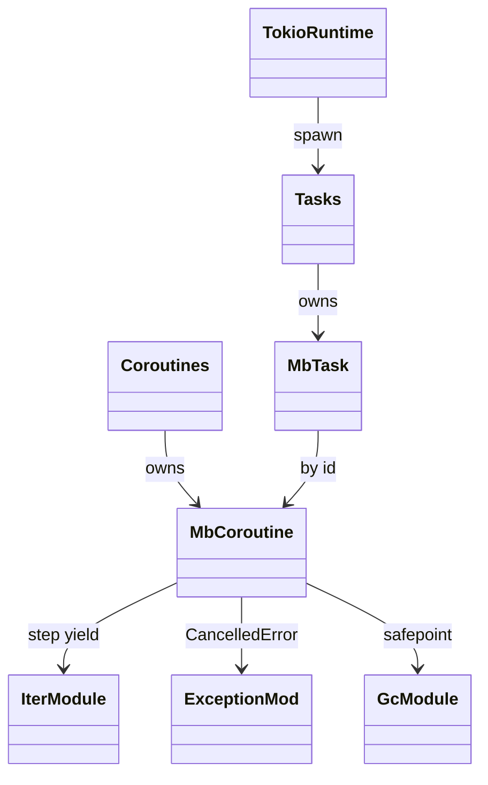
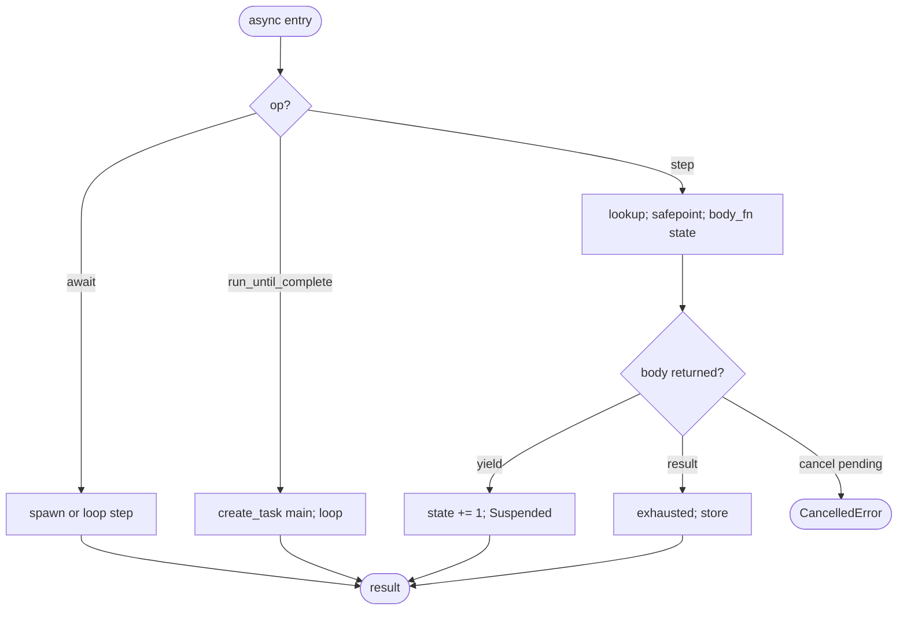
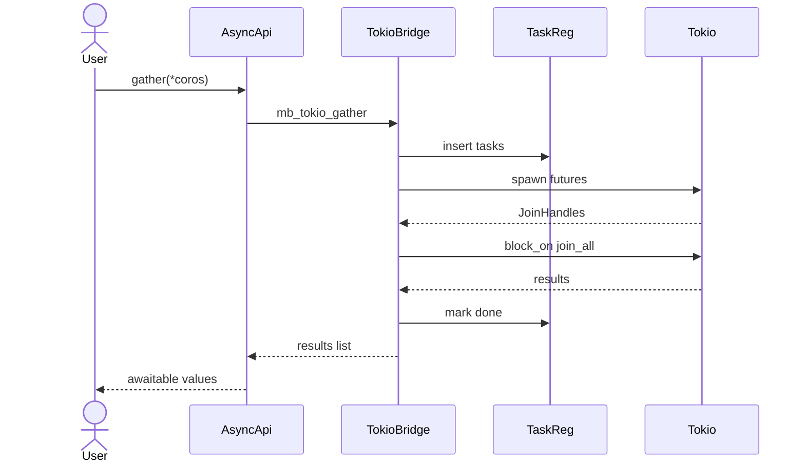
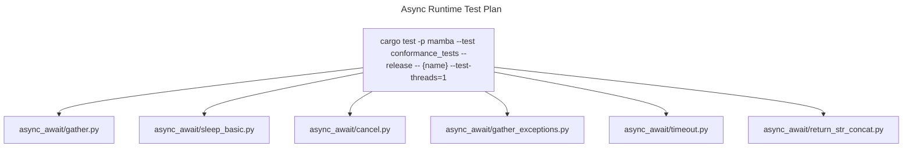

# Async Runtime

Mamba's async surface spans three files:

- `async_rt.rs` — `MbCoroutine` + `MbTask` types, global LazyLock<RwLock<HashMap>>
  registries with monotonic atomic IDs, single-step coroutine execution
  (`mb_coroutine_step`), and cross-test cleanup (`cleanup_all_async`).
- `async_task.rs` — public `mb_create_task` / `mb_task_done` /
  `mb_task_result` / `mb_cancel_task` / `mb_await` / `mb_gather` /
  `mb_sleep` / `mb_run_until_complete`, and a stub GIL acquire/release
  pair kept for compatibility with C extension callers.
- `tokio_exec.rs` — Tokio runtime bridge: `mb_tokio_spawn` /
  `mb_tokio_gather` / `mb_tokio_shutdown`, integrating Mamba coroutines
  into a Tokio multi-thread runtime.

Four load-bearing invariants:

1. **Globally unique coroutine + task IDs across threads** — both
   counters are `AtomicU64` starting at 1; the registries are
   `LazyLock<RwLock<HashMap>>` so any thread can resolve any handle.
   Generator IDs (single-thread coroutines, see `generator.md`) live
   in a *separate* thread-local registry; do not confuse the two.
2. **`cleanup_all_async` is mandatory between test runs on aarch64**
   — stale function pointers from prior test compilations would
   SIGBUS on the next step. The cleanup zeroes both registries and
   resets the ID counters; called from the test harness teardown.
3. **GIL acquire/release are no-ops today** — Mamba runs without a
   global interpreter lock; `mb_gil_release` / `mb_gil_acquire` /
   `mb_gil_held` exist only to keep legacy native-extension
   callers from crashing. Removing them would break the GC safepoint
   contract documented in `gc.md` until callers are audited.
4. **Result-slot retain on both completion and await** —
   `mb_coroutine_complete` calls `retain_if_ptr(result)` before
   storing into `c.result`, and `mb_await` calls `retain_if_ptr` on
   the returned value before handing it to the caller. This makes
   `c.result` and the awaiting caller's reference fully independent.
   Without both retains, an async fn returning a heap value (e.g.
   `return "hello " + name`) shared rc=1 between c.result and the
   caller — caller scope-end release freed the heap object, and
   subsequent reads of c.result hit a dangling pointer (SIGSEGV
   originally documented in commit `32da191f`; fixed in this spec's
   round).

## Type model
<!-- type: dependency lang: mermaid -->



## State shape
<!-- type: schema lang: yaml -->

```yaml
$schema: "https://json-schema.org/draft/2020-12/schema"
$id: "async-types"
$defs:
  MbCoroutine:
    type: object
    x-rust-type: MbCoroutine
    properties:
      name:      { type: string }
      state:     { type: integer, x-rust-type: u32, description: "step counter; 0 = not started" }
      locals:    { type: array, items: { x-rust-type: MbValue } }
      result:
        oneOf:
          - { type: "null" }
          - { x-rust-type: MbValue }
      exhausted: { type: boolean }
      body_fn:
        oneOf:
          - { type: "null" }
          - { x-rust-type: "unsafe extern \"C\" fn(i64) -> i64", description: "deferred execution; set by compiled wrapper" }
    required: [name, state, locals, result, exhausted, body_fn]
  MbTask:
    type: object
    x-rust-type: MbTask
    properties:
      name:         { type: string }
      coroutine_id: { type: integer, x-rust-type: u64 }
      done:         { type: boolean }
      result:       { x-rust-type: MbValue }
    required: [name, coroutine_id, done, result]
```

## Coroutine lifecycle

```mermaid
---
id: coroutine-lifecycle
initial: Pending
nodes:
  Pending:    { kind: initial,  label: "mb_coroutine_new returned id; body not yet started" }
  Running:    { kind: normal,   label: "step in progress; body_fn invoked" }
  Suspended:  { kind: normal,   label: "yielded at await; state += 1" }
  Done:       { kind: terminal, label: "exhausted = true; result populated" }
  Cancelled:  { kind: terminal, label: "mb_cancel_task set CancelledError" }
edges:
  - { from: Pending,   to: Running,   event: "mb_coroutine_step (first)" }
  - { from: Running,   to: Suspended, event: "yield at await; body_fn returned" }
  - { from: Suspended, to: Running,   event: "mb_coroutine_step (subsequent)" }
  - { from: Running,   to: Done,      event: "body returned final result" }
  - { from: Running,   to: Cancelled, event: "mb_cancel_task during step" }
  - { from: Suspended, to: Cancelled, event: "mb_cancel_task while suspended" }
---
stateDiagram-v2
    [*] --> Pending
    Pending --> Running: mb_coroutine_step
    Running --> Suspended: yield at await
    Suspended --> Running: next step
    Running --> Done: body returns
    Running --> Cancelled: cancel_task
    Suspended --> Cancelled: cancel_task
    Done --> [*]
    Cancelled --> [*]
```

<!-- type: state-machine lang: mermaid -->



## Step / await dispatch
<!-- type: logic lang: mermaid -->



## Tokio bridge interaction
<!-- type: interaction lang: mermaid -->



## Acceptance scenarios
<!-- type: scenarios lang: yaml -->
```yaml
scenarios:
  - id: gather
    given: async_await/gather.py awaits two coroutines through asyncio.gather
    when: tokio_gather spawns and joins the tasks
    then: results are returned in input order
  - id: sleep-basic
    given: async_await/sleep_basic.py awaits asyncio.sleep
    when: the Tokio bridge sleeps and resumes the coroutine
    then: elapsed time exceeds the requested duration
  - id: cancel
    given: async_await/cancel.py cancels a task before awaiting it
    when: mb_cancel_task marks the coroutine
    then: CancelledError is raised at the await point
  - id: return-str-retain
    given: async_await/return_str_concat.py returns a heap string from an async function
    when: the caller awaits and later reuses the result
    then: mb_coroutine_complete and mb_await retain independent references
```

## Tests
<!-- type: test-plan lang: mermaid -->


## Changes
<!-- type: changes lang: yaml -->

```yaml
changes:
  - file: crates/mamba/src/runtime/async_rt.rs
    action: modify
    impl_mode: hand-written
    description: "MbCoroutine + MbTask types, global LazyLock<RwLock<HashMap>> registries, atomic ID counters, cleanup_all_async between test runs (mandatory on aarch64). Hand-written; thread-safety contract is load-bearing."
  - file: crates/mamba/src/runtime/async_task.rs
    action: modify
    impl_mode: hand-written
    description: "Public async surface (create_task / await / gather / sleep / run_until_complete / cancel) + GIL acquire/release stub. Hand-written; coroutine step state machine is the contract."
  - file: crates/mamba/src/runtime/tokio_exec.rs
    action: modify
    impl_mode: hand-written
    description: "Tokio runtime bridge: spawn / gather / shutdown. Hand-written; multi-thread runtime singleton."
```
