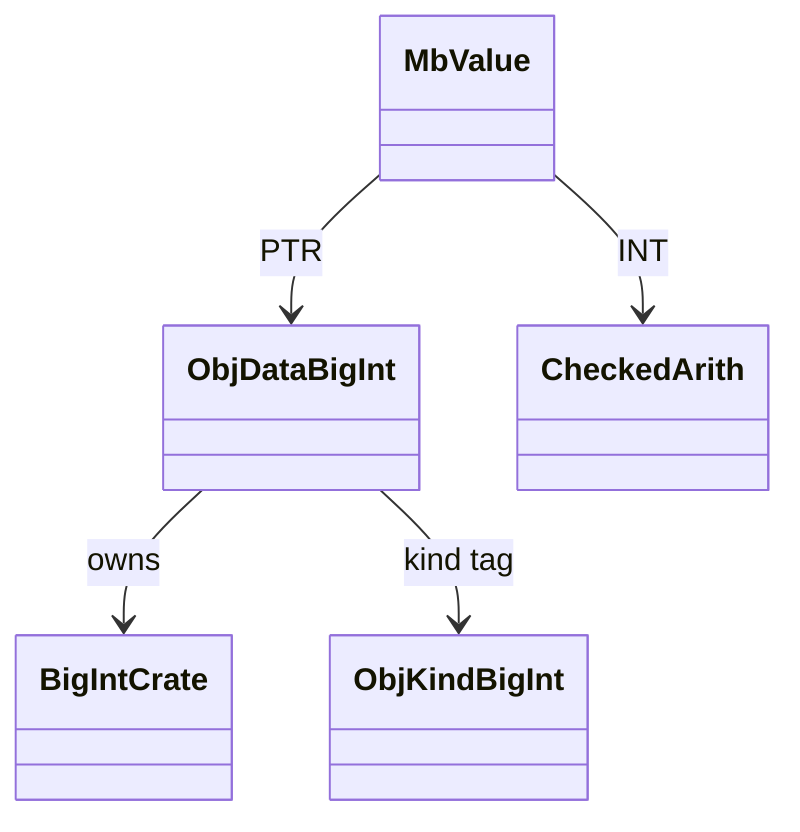
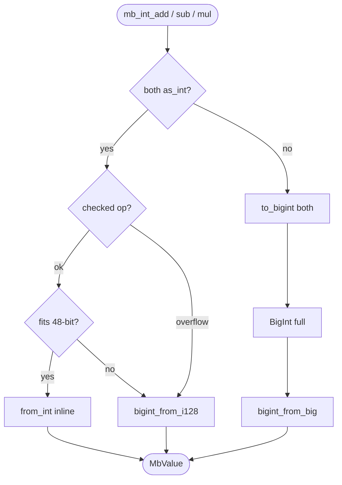
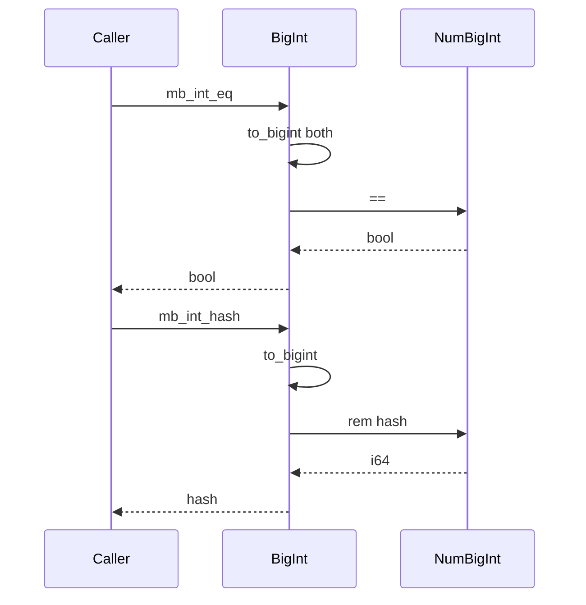
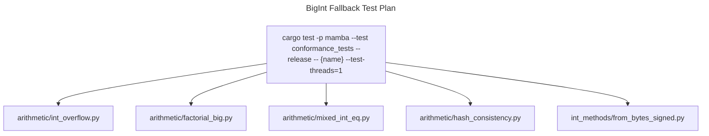

# BigInt Fallback for 48-bit Integer Overflow

`MbValue` integer fast path uses 48-bit signed inline encoding (see
`value-and-rc.md`); anything outside `[-(2^47), 2^47-1]` promotes to a
heap-allocated `num_bigint::BigInt` wrapped in `ObjData::BigInt`.
`bigint_ops.rs` is the bridge: per-op overflow detection (`checked_add`
/ `checked_mul` etc.), i128-widened intermediate results when both
operands fit i64, and full `BigInt` arithmetic when either side is
already heap-promoted.

Three load-bearing invariants:

1. **Promotion is strictly one-way per operation** — `mb_int_add(a, b)`
   never demotes a heap BigInt back to inline even if the result fits;
   demotion would change the `ObjKind` mid-flight and break any caller
   that already type-checked the result. Demotion happens only on
   construction-time fast-path checks (e.g., `int(string)` reading a
   small value).
2. **Mixed inline + heap operands always go through `to_bigint`** —
   the inline operand is widened to a fresh `BigInt` clone; both
   sides converted, then full BigInt arith. Skipping the conversion
   would route through inline-only paths that overflow undetected.
3. **`mb_int_eq` / `mb_int_cmp` convert both sides** — equality and
   comparison ARE allowed across inline/heap because the answer is a
   bool, not an MbValue. CPython makes `1 == 10**100` False; Mamba
   does too via `to_bigint` on both sides.

## Type model
<!-- type: dependency lang: mermaid -->



## Overflow / promotion shape
<!-- type: schema lang: yaml -->

```yaml
$schema: "https://json-schema.org/draft/2020-12/schema"
$id: "bigint-types"
$defs:
  Int48Bounds:
    type: object
    description: "Inline NaN-box integer range"
    properties:
      INT48_MAX: { type: integer, const: 140737488355327, description: "(1 << 47) - 1" }
      INT48_MIN: { type: integer, const: -140737488355328, description: "-(1 << 47)" }
    required: [INT48_MAX, INT48_MIN]
  IntegerMbValue:
    description: "Either inline INT or heap PTR with ObjKind::BigInt"
    oneOf:
      - { title: Inline,  description: "tag=INT, payload sign-extends to i64", x-rust-type: "MbValue (INT)" }
      - { title: Heap,    description: "tag=PTR, ObjData::BigInt(BigInt)",     x-rust-type: "MbValue (PTR-BigInt)" }
  BinopFastPath:
    description: "Decision tree per op (add/sub/mul)"
    type: object
    properties:
      both_inline:           { type: boolean, description: "as_int both operands" }
      checked_op_succeeds:   { type: boolean, description: "i64 checked_*; overflow?" }
      result_fits_inline:    { type: boolean, description: "fits_inline(result)?" }
      action:
        type: string
        enum:
          [from_int_inline, from_i128_promote, to_bigint_both_full_arith]
```

## Promotion / arithmetic logic
<!-- type: logic lang: mermaid -->



## Equality / hash interaction
<!-- type: interaction lang: mermaid -->



## Acceptance scenarios
<!-- type: scenarios lang: yaml -->

```yaml
scenarios:
  - id: int-overflow-promotes
    given: arithmetic/int_overflow.py computes a value outside the 48-bit inline range
    when: checked inline arithmetic overflows or no longer fits
    then: bigint_from_i128 promotes the result without precision loss
  - id: factorial-big
    given: arithmetic/factorial_big.py computes factorial values beyond inline range
    when: operands are heap BigInts or mixed inline/heap
    then: to_bigint converts both sides and full BigInt arithmetic stays exact
  - id: mixed-int-equality
    given: arithmetic/mixed_int_eq.py compares inline and heap integers
    when: mb_int_eq or mb_int_cmp runs
    then: both sides convert to BigInt and produce CPython-compatible booleans
  - id: hash-consistency
    given: arithmetic/hash_consistency.py hashes inline and heap integer representations
    when: mb_int_hash runs
    then: to_bigint normalizes the value and hash remains stable across representations
```

## Tests
<!-- type: test-plan lang: mermaid -->



## Changes
<!-- type: changes lang: yaml -->

```yaml
changes:
  - file: crates/mamba/src/runtime/bigint_ops.rs
    action: modify
    impl_mode: hand-written
    description: "BigInt promotion bridge: fits_inline / bigint_from_i128 / bigint_from_big / extract_bigint / to_bigint, mb_int_add / sub / mul / cmp / eq / hash with checked-then-promote fast path. Hand-written; depends on num_bigint."
```
