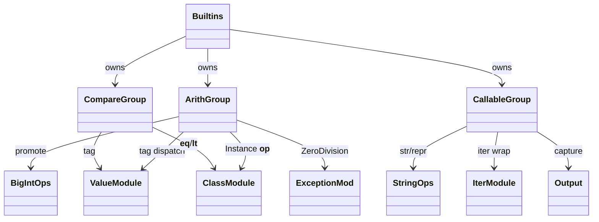
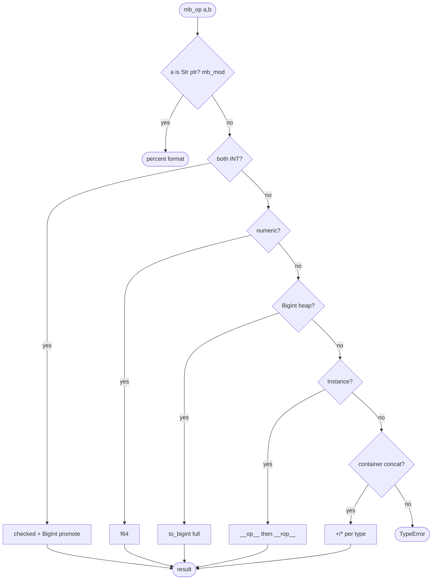
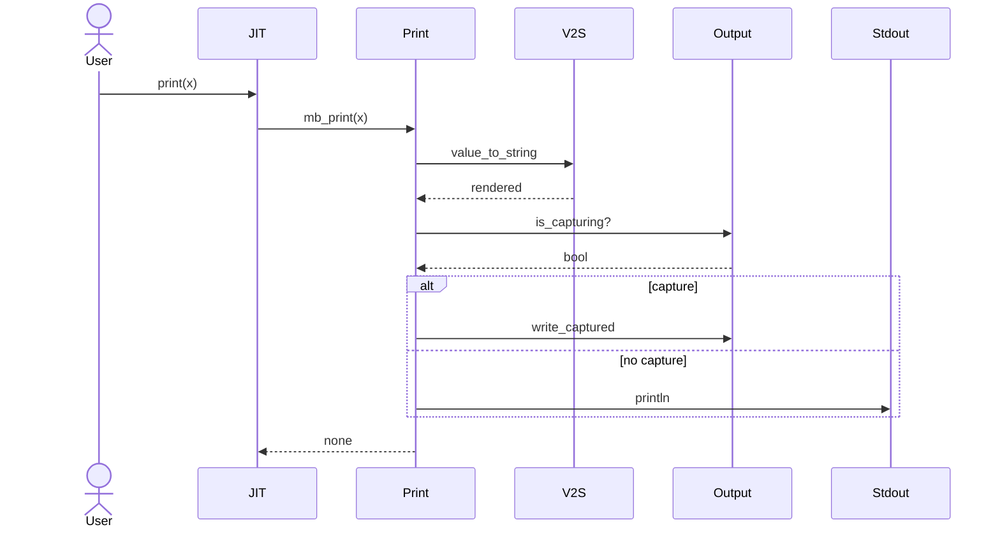
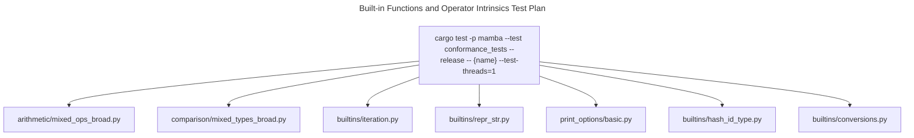

# Built-in Functions and Operator Intrinsics

Mamba's `runtime/builtins.rs` (~4900 LOC) is the runtime side of every
JIT-emitted operator and Python built-in callable. Three groups live
here:

1. **Arithmetic + bitwise operators** — `mb_add` / `mb_sub` / `mb_mul`
   / `mb_truediv` / `mb_floordiv` / `mb_mod` / `mb_pow` / `mb_neg` /
   `mb_pos` / `mb_invert` / `mb_lshift` / `mb_rshift` / `mb_bitand` /
   `mb_bitor` / `mb_bitxor` / `mb_matmul`. These dispatch by tag; INT
   fast path → BigInt fallback (see `bigint.md`); float path; Instance
   path for `__add__` / `__radd__` etc. Modulo/floordiv/divmod
   semantics live in `arithmetic-semantics.md`.
2. **Comparison + identity** — `mb_eq` / `mb_ne` / `mb_lt` / `mb_le` /
   `mb_gt` / `mb_ge` / `mb_not` / `mb_is_truthy`. CPython value-equality
   (numeric coercion across int/float/bool/BigInt; container element-
   wise; Instance dunder dispatch with `NotImplemented` fallback to
   reflected operator).
3. **Built-in callables** — `mb_print` / `mb_len` / `mb_str` /
   `mb_repr` / `mb_int` / `mb_float` / `mb_bool` / `mb_abs` /
   `mb_min` / `mb_max` / `mb_sum` / `mb_sorted` / `mb_reversed` /
   `mb_range` / `mb_enumerate` / `mb_zip` / `mb_map` / `mb_filter` /
   `mb_all` / `mb_any` / `mb_round` / `mb_format` / `mb_input` /
   `mb_chr` / `mb_ord` / `mb_hex` / `mb_oct` / `mb_bin` / `mb_pow` /
   `mb_callable` / `mb_isinstance` / `mb_issubclass` / `mb_hash` /
   `mb_id` / `mb_type`. These are exposed under their bare Python name
   in the global namespace via `runtime::symbols`.

Three load-bearing invariants:

1. **`mb_eq` walks NotImplemented → reflected → identity** —
   Instance `__eq__` returning `NotImplemented` triggers a `__eq__`
   lookup on the right operand; if that also returns `NotImplemented`,
   the answer falls through to `is` identity. Skipping the reflected
   step makes `1 == MyInt(1)` False even when `MyInt.__eq__` would
   have agreed.
2. **`mb_print` honors `output::is_capturing`** — when capture is
   active (test harness, `redirect_stdout`), `mb_print` writes to the
   capture buffer instead of stdout. The check happens once per call;
   doing it at module init only would miss test reconfiguration.
3. **`mb_value_cmp_pub` is the global comparator** — used by
   `list.sort`, `min`, `max`, `sorted`. Does NOT dispatch
   user-defined `__lt__` for primitives (fast path); only switches to
   dunder dispatch on Instance values. Inverting this would slow
   primitive sort by 10x.

## Type model
<!-- type: dependency lang: mermaid -->



## Operator dispatch shape
<!-- type: schema lang: yaml -->

```yaml
$schema: "https://json-schema.org/draft/2020-12/schema"
$id: "builtins-types"
$defs:
  BinopDispatch:
    description: "Two-operand operator dispatch precedence"
    type: object
    properties:
      step1: { description: "both INT → fast path (with BigInt promotion if overflow)" }
      step2: { description: "either is float (or int+float) → f64 path" }
      step3: { description: "either is BigInt heap → to_bigint both; full BigInt op" }
      step4: { description: "either is Instance → dunder dispatch (__add__ / __radd__)" }
      step5: { description: "left is container (List/Tuple/Str/Bytes) and op is + or * → concat/repeat" }
      fallback: { description: "TypeError unsupported operand types" }
    required: [step1, step2, step3, step4, step5, fallback]
  ComparisonDispatch:
    description: "mb_eq / mb_lt walk"
    type: object
    properties:
      step1: { description: "both numeric → coerce + compare" }
      step2: { description: "both same container type → element-wise" }
      step3: { description: "Instance with __eq__/__lt__ → dispatch" }
      step4: { description: "Instance returns NotImplemented → try reflected on RHS" }
      step5: { description: "reflected also NotImplemented → identity (mb_eq) or TypeError (mb_lt)" }
    required: [step1, step2, step3, step4, step5]
  BuiltinCallableSurface:
    description: "Roster of public callables exposed under bare Python names"
    type: array
    items: { type: string }
    examples:
      - [print, len, str, repr, int, float, bool, abs, min, max, sum,
         sorted, reversed, range, enumerate, zip, map, filter, all, any,
         round, format, input, chr, ord, hex, oct, bin, pow,
         callable, isinstance, issubclass, hasattr, getattr, setattr,
         delattr, vars, dir, id, type, hash]
```

## Binary operator dispatch logic
<!-- type: logic lang: mermaid -->



## print and capture interaction
<!-- type: interaction lang: mermaid -->



## Acceptance scenarios
<!-- type: scenarios lang: yaml -->

```yaml
scenarios:
  - id: mixed-operator-dispatch
    given: arithmetic/mixed_ops_broad.py combines numeric, string, and tuple operands
    when: mb_add, mb_mul, and related binary operators run
    then: dispatch chooses numeric, container concat/repeat, or instance dunder paths in priority order
  - id: reflected-comparison
    given: comparison/mixed_types_broad.py compares primitives and user instances
    when: mb_eq receives NotImplemented from the left operand
    then: reflected comparison is attempted before identity fallback
  - id: builtin-iteration
    given: builtins/iteration.py calls range, list, sum, and sorted
    when: callable builtins consume iterables
    then: iter wrappers, numeric accumulation, and mb_value_cmp_pub produce CPython-compatible results
  - id: repr-str
    given: builtins/repr_str.py renders nested containers
    when: mb_repr or mb_str delegates to value_to_string
    then: container rendering and repr-in-container behavior match the runtime string contract
  - id: print-capture
    given: print_options/basic.py calls print with sep and end kwargs
    when: output capture is active
    then: mb_print writes the rendered text to output::write_captured instead of stdout
```

## Tests
<!-- type: test-plan lang: mermaid -->



## Changes
<!-- type: changes lang: yaml -->

```yaml
changes:
  - file: crates/mamba/src/runtime/builtins.rs
    action: modify
    impl_mode: hand-written
    description: "Arithmetic + comparison + ~80 built-in callables; tag-priority dispatch; output-capture aware print; reflected dunder fallback. Hand-written; binop and comparison ladders are the contract; sub-specs in arithmetic-semantics.md (% / // / divmod) and bigint.md (overflow promotion)."
```
