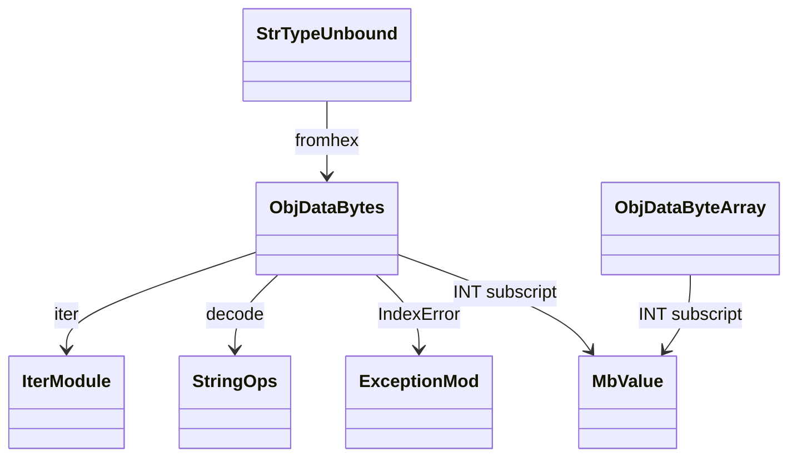
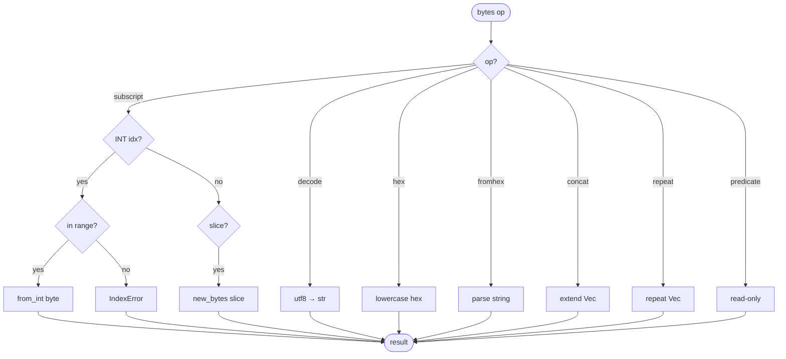
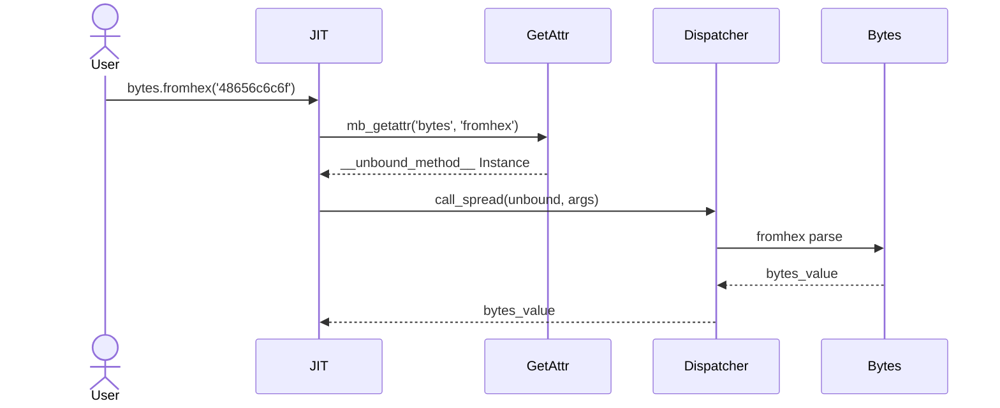
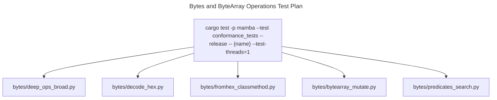

# Bytes and ByteArray Operations

Mamba bytes are immutable `Vec<u8>` (`ObjData::Bytes`); bytearrays are
`RwLock<Vec<u8>>` (`ObjData::ByteArray`). The runtime exposes the
CPython surface (`b'..'` literal construction, `+` / `*` /
indexing / slicing, `.decode` / `.hex` / `.fromhex`, predicate methods,
search/replace). `dispatch_bytes_method` routes per-method calls; most
read paths cover both Bytes and ByteArray uniformly.

Three load-bearing invariants:

1. **`bytes[i]` returns an `int`, not a single-byte bytes** — CPython
   compatibility. `mb_bytes_getitem` uses `MbValue::from_int(b as i64)`
   for single indices; slicing returns a fresh bytes object.
2. **`hex()` accepts no separator argument by default** — three-arg
   form `b.hex(sep, bytes_per_sep)` is a CPython 3.8+ feature; current
   `mb_bytes_hex` is single-arg only. Slicing-then-decode is the
   workaround. Open gap.
3. **`fromhex` is a classmethod, dispatched via the str type-name
   unbound-method path** — `bytes.fromhex(...)` lowers to
   `__unbound_method__(type='bytes', method='fromhex')` via
   `class.rs` getattr (see `class.md`); the dispatcher in
   `string_ops.rs` matches `"fromhex"` and routes to the bytes
   constructor. Same pattern for `bytearray.fromhex`.

## Type model
<!-- type: dependency lang: mermaid -->



## Bytes shape
<!-- type: schema lang: yaml -->

```yaml
$schema: "https://json-schema.org/draft/2020-12/schema"
$id: "bytes-types"
$defs:
  MbBytes:
    type: object
    description: "ObjData::Bytes(Vec<u8>) — immutable"
    properties:
      data: { type: array, items: { type: integer, minimum: 0, maximum: 255 } }
    required: [data]
  MbByteArray:
    type: object
    description: "ObjData::ByteArray(RwLock<Vec<u8>>) — mutable"
    properties:
      lock: { type: array, items: { type: integer, minimum: 0, maximum: 255 } }
    required: [lock]
  BytesSubscriptResult:
    description: "What mb_bytes_getitem returns"
    oneOf:
      - { title: SingleByte, x-rust-type: "MbValue (INT)", description: "from_int(byte as i64)" }
      - { title: SliceBytes, x-rust-type: "MbValue (PTR-Bytes)", description: "MbObject::new_bytes(slice)" }
```

## Subscript / dispatch logic
<!-- type: logic lang: mermaid -->



## fromhex unbound-method interaction
<!-- type: interaction lang: mermaid -->



## Acceptance scenarios
<!-- type: scenarios lang: yaml -->
```yaml
scenarios:
  - id: bytes-basic
    given: bytes/deep_ops_broad.py performs subscript, slice, concat, and repeat
    when: bytes operations run
    then: single subscript returns int while slice, concat, and repeat return bytes
  - id: decode-hex
    given: bytes/decode_hex.py decodes utf-8 bytes and formats raw bytes as hex
    when: decode and hex execute
    then: decode routes to string_ops and hex returns lowercase hexadecimal
  - id: fromhex-classmethod
    given: bytes/fromhex_classmethod.py calls bytes.fromhex
    when: class getattr creates an unbound method
    then: dispatch_str_method routes to bytes_ops fromhex constructor
  - id: predicates-search
    given: bytes/predicates_search.py calls startswith and find
    when: read-only predicate and search paths execute
    then: results match CPython
```

## Tests
<!-- type: test-plan lang: mermaid -->


## Changes
<!-- type: changes lang: yaml -->

```yaml
changes:
  - file: crates/mamba/src/runtime/bytes_ops.rs
    action: modify
    impl_mode: hand-written
    description: "Bytes (Vec<u8>, immutable) + ByteArray (RwLock<Vec<u8>>) surface; dispatch_bytes_method routing; subscript returns int for single index; .fromhex via class.rs unbound-method path. Hand-written; .hex(sep, bytes_per_sep) 3-arg form is an open gap."
```
